## 19. Свободные затухающие колебания.

Как известно из 15 билета, квазиупругая сила имеет следующую формулу: $F_{\text{рез}}=-kx$.

Если добавить туда силу сопротивления с коэффициентом r, получим:

```math
F_{\text{рез}}=-kx-r v_{\text{x}} = m a_{\text{x}}
```

```math
v_{\text{x}}=\frac{dx}{dt} \text{, } a_{\text{x}}=\frac{d^{2}x}{dt^{2}}
```

```math
ma_{\text{x}}+r v_{\text{x}} + kx = 0 |:m
```

```math
\frac{d^{2}x}{dt^{2}} + \frac{r}{m}\cdot\frac{dx}{dt}+\frac{k}{m}\cdot x=0
```

В этом уравнении $\frac{r}{m}$ - это $2\beta$, где $\beta$ - коэффициент затухания, а $\frac{k}{m}$ - это $\omega_{0}^{2}$ (из формулы пружинного маятника).

Подставиви всё это получим *Однородное дифференциальное уравнение второго порядка с постоянными коэффициентами* - уравнение свободных затухающих колебаний.

```math
\boxed{\frac{d^{2}x}{dt^{2}} + 2\beta\cdot\frac{dx}{dt}+\omega_{0}^{2}\cdot x=0}
```

```math
x=A_{0}\cdot e^{-\beta t}\cos{(\omega_{\text{з}} t+\alpha)}
```

Где $\omega_{\text{з}}=\sqrt{\omega_{0}^{2}-\beta^{2}}$ - частота затухающих колебаний.

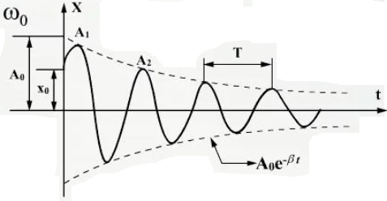

```math
T_{\text{Зат}}=\frac{2\pi}{\sqrt{\omega_{0}^{2}-\beta^{2}}}
```

### Странные характеристики затухающих колебаний

1)  $T_{\text{Зат}}=\frac{2\pi}{\sqrt{\omega_{0}^{2}-\beta^{2}}}$ - период.
2)  $\beta$ - коэффициент затухания, $[\beta]=\frac{1}{\text{с}}$.
3)  Время релаксации $[\tau]=1\text{ с}$. Время, за которое амплитуда колебаний уменьшается в $e$ раз.

```math
\frac{A(t)}{A(t+\tau)}=e
```

```math
\frac{A_{0}\cdot e^{-\beta t}}{A_{0}\cdot e^{-\beta(t+\tau)}}=e^{-\beta t+\beta t+\beta\tau}=e^{\beta\tau}=\{\beta\tau=1\}=e
```

```math
\boxed{\tau=\frac{1}{\beta}}
```

4)  Декремент затухания - отношение амплитуд колебаний, для которых момент времени отличается на период.

```math
\frac{A(t)}{A(t+T)}=e
```

```math
\frac{A_{0}\cdot e^{-\beta t}}{A_{0}\cdot e^{-\beta(t+T)}}=\boxed{e^{\beta T}}
```

5) Логарифмический декремент затухания:

```math
\lambda=\ln{e^{\beta T}}=\boxed{\beta T=\lambda}
```

## 20. Вынужденные колебания. Резонанс.

### Вынужденные колебания

Добавим в уравнение свободных затухающих колебаний вынуждающую внешнюю силу $F_{0}\cos{\omega t}$, которая действует с определенной чаастотой.

$\omega$ в данном уравнении - частота внешней переодически действующей силы.

```math
F_{\text{рез}}=-kx-r v_{\text{x}}+F_{0}\cos{\omega t} = ma_{\text{x}}
```

Как и в прошлом билете, получим дифур.

Неоднородное дифференциальное уравнение второго порядка с постоянными коэффициентами - уравнение вынужденных незатухающих (если сила сильная) колебаний. От прошлого отличается лишь правой частью.

```math
\boxed{\frac{d^{2}x}{dt^{2}} + 2\beta\cdot\frac{dx}{dt}+\omega_{0}^{2}\cdot x=\frac{F_{0}}{m}\cdot\cos{\omega t}}
```

Решение этого страшного дифура состоит из двух частей - решения однородной части (левой) и неоднородной (правой), которые просто складываются, если сравнивать с предыдущим билетом, то добавилась лишь решение неоднородной части, которое после знака "+":

```math
x=A_{0}\cdot e^{-\beta t}\cos{(\omega_{\text{з}} t+\alpha)} + A\cos{(\omega t - \phi)}
```

### Резонанс

Резонанс - явление резкого увеличения амплитуды колебаний при совпадении собственной частоты колебаний системы с частотой внешней вынуждающей силы.

Резонансная частота:

```math
\omega_{\text{рез}}=\sqrt{\omega_{0}^{2}-2\beta^{2}}
```

Для разных резонансных частот и разных $\beta$ справедлив график:


## 21. Волновое движение. Уравнение плоской незатухающей бегущей волны.

### Волны

Волны - процесс распространения колебаний в среде с конечной скоростью.

Нет переноса вешества, но есть перенос энергии и состояния.

`Волны`

1)  Одиночные (импульс) - происходят однократно.

    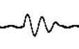

2)  Цуг волн

    

3)  Гармоническая волна.

    

`Волны`

1) На поверхности жидкостей.
2) Электромагнитные волны.
3) Упругие волны.

**Упругая волна** - механическое возмущение, распространяющееся в упругой среде с течением времени с конечной скоростью.

### Упругие волны

Упругие волны разделяют на продольные и поперечные на основании направлений возмущений относительно направления распространения волны.

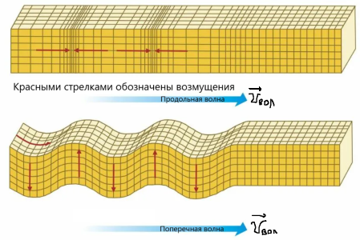

Не все волны могут распространяться во всех средах, составим таблицу:

|                                   | Твердое тело                      | Жидкость                                                 | Газ                                                                                                            |
| --------------------------------- | --------------------------------- | -------------------------------------------------------- | -------------------------------------------------------------------------------------------------------------- |
| **Движение молекул**              |  | 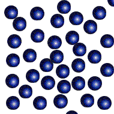                         |                                                                               |
| **Характер движения молекул**     | Трясутся на месте                 | Могут перемещаться, если есть энергия. Почти несжимаемы. | Движутся постоянно, толкаются и меняют скорость. Хорошо сжимаются. Если хорошо сжать, превращаются в жидкость. |
| **Какие волны распространяются?** | Продольные и поперечные           | Только продольные                                        | Только продольные                                                                                              |

**Звук** - продольная волна.

В твердых телах скорость звука максимальна.

$\xi$ - маленькая греческая буква кси, ей обозначают смещение волны.

```math
\xi=\xi (x, y, z, t)
```

Эту уравнение сферической волны, исходящей из точки, если же в этом уравнении y и z - константы, то: $\xi=\xi(x, t)$ - плоская волна (вдоль оси ОХ).

Рассмотрим два графика, график смещения от времени и график смещения от расстояния.

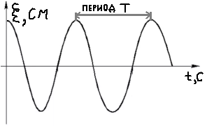


Длина волны обозначается маленькой греческой буквой $\lambda$ (лямбда) и измеряется в метрах.

Важные формулы связи физических величин:

```math
\nu=\frac{1}{T} \text{, } \lambda=v\cdot T \text{, } \boxed{v=\lambda\cdot\nu}
```

**Уравнение смещения упругой волны**

Пусть x = 0, $\xi=A\cos{(\omega t +\alpha)}$, в какой-то точке B. Тогда время, за которое возмущение дойдет до этой точки B: $\tau=\frac{x}{v}$.

```math
\begin{align*} \xi=A\cos{(\omega (t-\tau)+\alpha)}=A\cos{(\omega t - \omega \tau +\alpha)} = \\ = A\cos{(\omega t - \frac{\omega x}{v}+\alpha)} = [\omega=2\pi\nu \text{, } k=\frac{2\pi}{\lambda} \text{ - волновое число}] \\ \boxed{\xi=A\cos{(\omega t-kx+\alpha)}} \text{ - смещение упругой волны} \end{align*}
```

Дифференциальное уравнение для плоской волны (его решением является уравнение смещения упрогой волны):

```math
\frac{\partial^{2}\xi}{\partial x^{2}}=\frac{1}{v^{2}}\cdot\frac{\partial^{2}\xi}{\partial t^{2}}
```

## 22. Термодинамическая система. Параметры состояния термодинамической системы. Основные положения молекулярно-кинетической теории газов.

### Молекулярно-кинетическая теория (МКТ)

Основные положения МКТ:

1. Все тела состоят из мельчайших частиц - атомов и молекул, что подтверждается следующими явлениями:

    - Диффузия.
    - Испарение/конденсация.
    - Дробление.
    - Теневые методы (просвечивание капли).
    - Смешивание жидкостей с разными молекулами (вода и спирт, песок и гравий).

2. Частицы находятся в постоянном непрерывном движении, что подтверждается следующими явлениями:

    - Диффузия.
    - Движение пыльцы в водном растворе.

3. Между частицами действуют силы притяжения и отталкивания.

`Атом` - наименьшая частица данного химического элемента.

`Молекула` - совокупность атомов - наименьшая частица, сохраняющая свойства вещества.

$m_{\text{и}}$ - атомная единица массы, равная $\frac{1}{12}\cdot m_{\text{атома углерода}} = \frac{1}{12} \cdot {}^{12}_{6}\text{C} \approx 1,66\cdot 10^{-27} \text{ кг.} = 1 \text{ а.е.м.}$

$A_{\text{r}}$ - относительная атомная масса.

$[\nu] = 1$ моль - количество вещества - количество структурных элементв - молекул или атомов, из которых состоит вещество.

1 моль = 0,012 кг углерода. Сколько же там атомов?

$N_{\text{A}} = 6,02\cdot 10^{23} \left(\frac{1}{\text{моль}}\right)$ - число Авогадро - сколько атомов в одном моле вещества.

$\mu$ - молярная масса, $\mu = A_{\text{r}}\cdot 10^{-3} \left( \frac{\text{кг}}{\text{моль}} \right)$

$[\mu] = 1$ кг/моль

$m_{0}$ - масса одной молекулы, $m_{\text{вещества}}=m_{0}\cdot N$, где N - количество молекул.

$\mu = m_{0}\cdot N_{\text{A}}$ - молярная масса.

Важная формула связи всех этих величин:

```math
\boxed{\nu=\frac{m}{\mu}=\frac{N}{N_{\text{A}}}}
```

### Идеальный газ

1) Газ, внутри которого частицы взаимодействуют только при столкновении, удар абсолютно упругий.
2) Газ состоит из одинаковых частиц, $d_{\text{частиц}} \ll V_{\text{сосуда}}$.
3) Количество частиц в сосуде мало. $V_{\text{частиц}} \ll V_{\text{сосуда}}$ - разряженный газ.

### Параметры состояния

```math
P, V, T, \rho, n
```

1) Давление P; [P] = 1 Па. (Паскаль). $1 \text{ Атм.} \approx 10^{5} \text{ Па}$.
2) V - объём $[V] = 1\text{ м}^{3}$, переводы: ${(1\text{ см})}^{3}={(10^{-2}\text{ м})}^{3}$, $1\text{ см}^{3}=10^{-6}\text{ м}^{3}$, $1\text{ л}=1\text{ дм}^{3}=10^{-3}\text{ м}^{3}$.
3) Температура T. Измеряется в Кельвинах (К), Кельвин численно равен градусу цельсия 1К = 1C, но точка отсчета другая, поэтому: $T=273+t^{\text{C}^{\circ}}$. Точка отсчета взята не с проста, 273К = 0С - вода превращается в лед, 373К = 100С - вода превращается в пар, 0K - абсолютный ноль, молекулы перестают двигаться.
4) $\rho$ - плотность объемная $\text{кг}/\text{м}^{3}$, $\rho = \frac{m}{V}$.
5) n - концентрация - какое количество частиц в этом объёме, $n=\frac{N}{V}$, $[n]=\text{ м}^{-3}$.

### Уравнения состояний

```math
\boxed{P=\frac{1}{3}nmv_{\text{ср.кв.}}^{2}}
```

Это уравнение Клаузиуса, основное уравнение состояния идеального газа. В нём: m - масса одно молекулы, $v_{\text{ср.кв.}}$ - средняя квадратичная скорость молекул.

```math
v_{\text{ср.кв.}}^{2}=\frac{v_{1}^{2}+v_{2}^{2}+v_{3}^{2} \text{ ... } v_{\text{n}}^{2}}{N}
```

$\frac{1}{3}$ в уравнении отвечает за то, что мы берем давление только по какой-то одно оси из трёх (OX, OY, OZ).

Зная формулу кинетической энергии поступательного движения материальной точки, можно записать среднюю кинетическую энергию поступательного движения одной молекулы через эту среднюю скорость:

```math
\left< E_{\text{кин.пост.движ.1мол.}}\right> = \frac{m_{0}v_{\text{ср.кв.}}^{2}}{2} = \left< \varepsilon\right>
```

Еще одна формула давления:

```math
P=\frac{2}{3}n\frac{m_{0}v_{\text{ср.кв.}}^{2}}{2} = \left< \varepsilon\right> \quad P=\frac{2}{3}n\left< \varepsilon\right>
```

Заменим n формулой из определения, потом заменим одну энергию, умноженную на кол-во молекул энергией всех молекул:

```math
P=\frac{2}{3}\frac{N}{V}\left< \varepsilon\right>
```

```math
PV=\frac{2}{3}\left< W_{\text{полн.кин.эн.пост.дв.всех мол.}}\right>
```

Если m = const, то $\frac{PV}{T} = \text{const}$.

Нормальными условия в физике: $P_{\text{н.у.}}=10^{5}\text{ Па.} \quad T_{\text{н.у.}}=273\text{K}$. При нормальных условиях 1 моль вещества занимает молярный объем: $V_{\mu}=22,4\text{л}=22,4\cdot 10^{-3}\text{м}^3$.

Для удобства счета вводят следующую константу - универсальную газовую постоянную:

```math
\nu=1\text{моль} \quad R=\frac{P_{\text{н.у.}}\cdot V_{\mu}}{T_{\text{н.у.}}}=8,31 \left( \frac{\text{Дж}}{\text{Моль}\cdot\text{K}}\right)
```

С использованием этой постоянной можно прийти к уравнению Менделеева-Клайперона:

```math
\frac{PV_{\mu}\nu}{T}=R\nu\quad\frac{PV}{T}=R\nu
```

```math
\boxed{PV=\nu RT} \quad PV=\frac{m}{\mu} RT
```

Продолжая издеваться над этой формулой можно получить ~~по заслугам~~ еще одно уравнение для давления:

```math
p=\frac{m}{V}\cdot\frac{RT}{\mu}\quad P=\frac{\rho RT}{\mu}
```

```math
PV=\frac{N}{N_{\text{A}}}RT
```

```math
P=\frac{N}{V}\frac{RT}{N_{\text{A}}}
```

Произведем некоторую замену: $\frac{N}{V} = n$, $\frac{R}{N_{\text{A}}}=k$, где k - постоянная Больцмана, равная: $k=1,38\cdot 10^{-23}\left(\frac{\text{Дж}}{\text{K}}\right)$. Получим:

```math
\boxed{p=nkT}
```

Теперь издеваемся над этой формулой и получаем ~~тюремный срок~~ формулу среднеквадратичной скорости:

```math
P=nkT\quad P=\frac{1}{3}n m_{0} v_{\text{ср.кв.}}^{2}
```

```math
nkT=\frac{1}{3}n m_{0} v_{\text{ср.кв.}}^{2}
```

```math
\boxed{v_{\text{ср.кв.}}=\sqrt{\frac{3kT}{m_{0}}}}=\left[k=\frac{R}{N_{\text{A}}}; \mu=m_{0}N_{\text{A}}\right]
```

```math
\boxed{v_{\text{ср.кв.}}=\sqrt{\frac{3RT}{\mu}}}
```

### Закон Дальтона

Закон Дальтона рассматривает смеси газов:

Допустим, есть колбы обинакового объёма, но в каждой из них свое давление, концентрация и тип газа, чему же тогда будет равно давление смеси этих газов в такой же колбе?

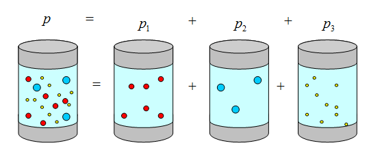

```math
P=nkT
```

$P_{1}$ и $P_{2}$ - парциальные давления.

```math
\begin{cases} P_{1}=n_{1}kT \\ P_{2}=n_{2}kT \\ P_{\text{Смеси}}=n_{\text{Смеси}}kT \\ n_{\text{Смеси}} = n_{1}+n_{2} \end{cases}
```

```math
P_{\text{Смеси}}=(n_{1}+n_{2})kT = \{P=nkT\}=P_{1}+P_{2}
```

Вот и сам закон Дальтона:

```math
P_{\text{Смеси}}=P_{1}+P_{2}+P_{3}+\text{ ... }+P_{\text{n}}
```

А вот его формулировка: Давление смеси газов равняется сумме парциальных давлений этих газов.

### О степенях свободы

Рассмотрим рисунок и поясним за ~~базар~~ него:

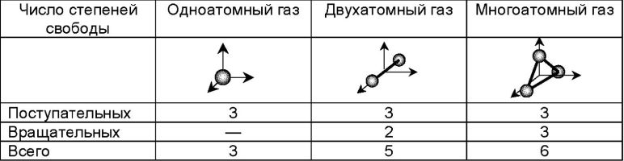

Одноатомная молекула может двигаться поступательно по всем трём осям, поэтому у неё количество степеней свободы равно трём. Вращаться она не может.

Двухатомная молекула также движется поступательно по всем осям, но также может вращаться вокруг двух осей (почему так происходит можно посмотреть в конце билета \#\# 7. Вращение твердого тела относительно неподвижной оси. Основной закон динамики вращательного движения абсолютно твердого тела. Момент инерции.), поэтому суммарное количество степеней свободы равно 5.

Все, что имеет больше двух атомов (3 и более) считается многоатомным. Такие молекулы движутся и вращаются как хотят, поэтому их суммарное количество степеней свободы равно 6.

Так как движение и вращение тесно связаны с кинетической энергией, можно вывести формулу, мы уже знаем, что:

```math
\left< \varepsilon_{\text{Кин.эн.пост.дв.1 мол.}}\right> = \frac{m_{0}v_{\text{ср.кв.}}^{2}}{2}
```
```math
\text{Теперь возьмем также знакомые } P=nkT \text{ и } P=\frac{2}{3}n\left< \varepsilon\right>\text{:}
```

```math
nkT=\frac{2}{3}n\left< \varepsilon\right>
```

```math
\left< \varepsilon\right>=\frac{3}{2}kT
```

Так как это была поступательная энергия, число 3 в числителе - количество степеней свободы, поэтому окончательный вид формулы таков:

```math
\boxed{\left< \varepsilon_{i}\right>=\frac{i}{2}kT}
```

## 23. Закон равномерного распределения энергии по степеням свободы молекул. Основное уравнение молекулярно-кинетической теории газов (уравнение Клаузиуса).

Основное уравнение молекулярно-кинетической теории газов (уравнение Клаузиуса). Смотреть в \#\# 22. Термодинамическая система. Параметры состояния термодинамической системы. Основные положения молекулярно-кинетической теории газов. ПРЕДЫДУЩИЙ БИЛЕТ, в его начале.

Распределение энергии по степеням свободы в том же билете - почти в его конце, перед термодинамикой.

Чтобы здесь хоть что-то было, напишем про закон Максвелла.

### Закон Максвелла: распределение молекул идеального газа по скоростям

И тут мимо, он в \#\# 25. Закон Максвелла распределения молекул по скоростям теплового движения. Барометрическая формула. Распределение Больцмана.


## 24. Уравнение состояния идеального газа.

Похоже их как-то криво разбили, это все опять есть в \#\# 22. Термодинамическая система. Параметры состояния термодинамической системы. Основные положения молекулярно-кинетической теории газов., возможно так произошло, потому что там надо было только положения, а выписали все.

## 25. Закон Максвелла распределения молекул по скоростям теплового движения. Барометрическая формула. Распределение Больцмана.

### Закон Максвелла: распределение молекул идеального газа по скоростям

Напомним, в МКТ газ разряженный, молекулы взаимодействуют только при столкновении, молекулы одинаковые, объем молекул сильно меньше объема сосуда.

Пусть f(v) - функция распределения молекул идеального газа по скоростям (сколько молекул какую скорость имеют), функция Максвелла.


Функция Максвелла показывает относительное количество частиц, скорости которых лежат в интервале $[v; v+dv]$, пусть P - вероятность, тогда:

```math
dP=\frac{dN}{N}=f(v)dv
```

Функция Максвелла имеет вид:

```math
\Large f(v)=A\cdot v^{2} \cdot e^{-\frac{m_{0}v^{2}}{2kT}}\quad A=\text{const}
```

Условие нормировки:

```math
P=\int^{\infty}_{0}f(v)\cdot dv = 1
```

```math
A=4\pi{\left( \frac{m}{2\pi kT}\right)}^{\frac{3}{2}}=\text{const}
```

Найдем максимум функции через производую: $f'(v)=0$

```math
f'(v)=A\cdot 2v\cdot e^{-\frac{m_{0}v^{2}}{2kT}}+Av^{2}\cdot e^{-\frac{m_{0}v^{2}}{2kT}} \cdot \left( -\frac{m_{0}v^{2}}{2kT}\right) = 0
```

```math
2v-\frac{v^3\cdot m_{0}}{kT}=0
```

Корень v = 0 не удовлетворяет условию, ведь молекулы всегда в движении, поэтому максимум функции Максвелла (наиболее вероятная скорость) имеет следующий вид:

```math
v_{\text{Н.в.}}=\sqrt{\frac{2kT}{m_{0}}}
```

Такой скоростью обладает больше всего частиц. Возьмем другой вид наиболее вероятной скорости, среднюю квадратичную скорость и среднюю скорость, получим формулы всех скоростей с графика выше:

```math
v_{\text{Н.в.}}=\sqrt{\frac{2RT}{\mu}}
```

```math
v_{\text{ср.кв.}}=\sqrt{\frac{3kT}{m_{0}}}=\sqrt{\frac{3RT}{\mu}}
```

```math
\left< v_{\text{ср.}}\right> =\sqrt{\frac{8kT}{\pi m_{0}}}=\sqrt{\frac{8RT}{\pi\mu}}
```

Также существует формула для подсчета частиц $\delta N$ в определенном интервале скоростей $[v_{1}; v_{2}]$:

```math
\Delta N=N_{\text{всего}}\cdot\int^{v_{2}}_{v_{1}}f(v)\cdot dv
```

### Распределение Больцмана. Барометрическая формула.

Представим себе столб газа. Давление внизу как-будто бы больше, чем вверху, ведь давит весь столб, при этом сдавленный газ нагревается, и став легче идет к верху.


Взаимодецствие двух механизмов, описанных ранее, приводит к тому, что газ находится в равновесии.

dh > 0, dP < 0

```math
P-(P+dP)=\frac{P_{\text{вес}}}{S}=\frac{mg}{S}=\frac{\rho v g}{S}=\frac{\rho s dh g}{S}=\rho g dh
```

```math
-dP=\rho g dh
```

Выразим плотность из уравнения Менделеева-Клайперона:

```math
PV=\frac{m}{\mu}RT
```

```math
P=\frac{m}{V}\cdot\frac{RT}{\mu}=\frac{\rho RT}{\mu}
```

```math
\rho =\frac{P\cdot\mu}{RT}
```

Вернемся к ранее выведенной формуле давления и подставим туда полученную плотность:

```math
-dP=\frac{P\mu}{RT} g dh
```

Разделим переменные и проинтегрируем:

```math
\int_{P_{0}}^{P}-\frac{dP}{P}=\int_{0}^{h}\frac{\mu g}{RT}\cdot dh
```

```math
\left. \ln{P}\right| _{P_{0}}^{P}=\left. -\frac{\mu g h}{RT}\right| _{0}^{h}
```

```math
\ln{P}-\ln{P_{0}}=-\frac{\mu g h}{RT}
```

```math
\ln{\frac{P}{P_{0}}}=-\frac{\mu g h}{RT}
```

```math
e^{\ln{\frac{P}{P_{0}}}}=e^{-\frac{\mu g h}{RT}}
```

```math
\frac{P}{P_{0}}=e^{-\frac{\mu g h}{RT}}
```

В конце концов барометрическая формула принимает вид:

```math
\large \boxed{P=P_{0}\cdot e^{-\frac{\mu g h}{RT}}=P_{0}\cdot e^{-\frac{m_{0}gh}{kT}}}
```

Используя $P=nkT$ можно найти концентрацию (именно её и её вариации называют этим вашим Больцманом):

```math
n=n_{0}\cdot e^{-\frac{\mu g h}{RT}}=n_{0}\cdot e^{-\frac{m_{0}gh}{kT}}
```

## 26. Средняя длина свободного пробега молекулы. Явления переноса. Диффузия, вязкость, теплопроводность.

$\left<\lambda\right>$ - `Средняя длина свободного пробега молекул` - расстояние, которое преодолевают молекулы между соседними соударениями.

$[\left<\lambda\right>] = 1$ м. Эта длина измерется в метрах, и находится по формуле:

```math
\left< \lambda\right> =\frac{1}{\sqrt{2}\pi d^{2}n}
```

Где d - характерный размер молекулы, если не дано в задаче, то $d=10^{-10}$ м.

Если долго не трогать сосуд с газом, там всё стаёт равномерным.

В `явлениях переноса` мы намеренно что-то делаем не равномерно, греем, давим, смешиваем и т.п.

**Явление переноса** - процесс, при котором происходит выравнивание термодинамических характеристик системы.

| Явление                        | Неоднородность | Перенос                 |
| ------------------------------ | -------------- | ----------------------- |
| 1) Диффузия                    | $$\rho$$       | $$m$$                   |
| 2) Теплопроводность            | $$T$$          | $$E$$                   |
| 3) Вязкость, внутреннее трение | $$v$$          | $$P_{\text{импульс}}$$  |

1) `Диффузия` (закон Фика) - явление проникновения молекул одного вещества в межмолекулярные расстояния другого. Наблюдается перенос массы.

$J$ - поток.

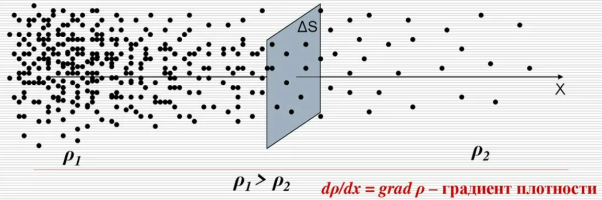

```math
J_{\text{m}_{\text{x}}}=-D\cdot \frac{d\rho}{dx}
```

В этом уравнении: $J_{\text{m}_{\text{x}}}$ - поток массы по оси ОХ, $\frac{d\rho}{dx}$ - градиент плотности, знак "-" говорит о том, что масса уходит в противоположном направении от направления, где плотность максимальная, $D$ - коэффициент диффузии, $D=\frac{1}{3}\left<\lambda\right>\left<v\right>$, $[D]=1\text{ м}^{2}\text{/с}$.

Если масса проходит через что-то с площадью поперечного сечения $\Delta S$ за время $\Delta t$:

```math
J_{\text{m}_{\text{x}}}=\frac{\Delta m}{\Delta S_{\perp}\Delta t}
```

2) `Теплопроводность` (закон Фурье) - явление переноса энергии от молекул, у которых она высокая, к молекулам с более низкой энергией, что позволяет доставлять тепло из одной точки в другую.

$J$ - поток.

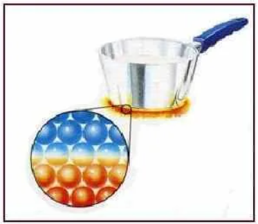

```math
J_{\text{E}_{\text{x}}}=-\chi\cdot \frac{dT}{dx}
```

В этом уравнении: $J_{\text{E}_{\text{x}}}$ - поток энергии по оси ОХ, $\frac{dT}{dx}$ - градиент температуры, знак "-" говорит о том, что энергия уходит в противоположном направении от направления, где температура максимальная, $\chi$ - коэффициент теплопроводности, 

```math
\chi=\frac{1}{3}\left< \lambda\right> \left< v\right> \rho\cdot c_{\text{уд.V}}
```

```math
[\chi]=1\frac{\text{Вт}}{\text{м}\cdot\text{К}}
```

```math
c_{\text{уд.V}}
```

 - удельная изохорная теплоёмкость.

Если энергия проходит через что-то с площадью поперечного сечения $\Delta S$ за время $\Delta t$:

```math
J_{\text{E}_{\text{x}}}=\frac{\Delta E}{\Delta S_{\perp}\Delta t}
```

3) `Внутреннее трение, вязкость` - молекулы, движущиеся с низкой скоростью тормозят быстрые молекулы, находящиеся рядом, а быстрые, в свою очередь, ускоряют медленные. Наблюдается перенос импульса.

$J$ - поток.

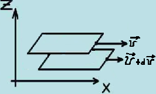

```math
J_{\text{пот.имп.}}=-\eta\cdot \frac{d\overrightarrow{v}}{dx}
```

В этом уравнении: $J_{\text{пот.имп.}}$ - плотность потока импульса, $\frac{d\overrightarrow{v}}{dx}$ - градиент скорости, знак "-" говорит о том, что импульс передается от быстрых к медленным, $\eta$ - динамическая вязкость, $\eta=\frac{1}{3}\left<\lambda\right>\left<v\right>\rho$, $[\eta]=1\text{Па}\cdot\text{с}$.

Если импульс передается через что-то с площадью поперечного сечения $\Delta S$ за время $\Delta t$:

```math
J_{\text{пот.имп.}_{\text{x}}}=\frac{\Delta (mv)}{\Delta S_{\perp}\Delta t}
```

## 27. Первый закон термодинамики. Работа, теплота, теплоемкость, ее виды.

В этот билет засунута вся ТЕРМОДИНАМИКА для удобства понимания и цельности повествования. Также лучше сперва прочитать следующий билет с изопроцессами.

### Основы термодинамики

Объектом исследования является термодинамическая система - совокупность макроскопических тел, способных обмениваться энергией с собой и с окружающей средой.


Например, газ выдавил поршень - работа газа, мы вдавили поршень обратно - работа внешних сил.

Полная энергия в таких системах определяется следующим образом: $E_{\text{полн.}}=E_{\text{кин.}}+E_{\text{пот.}}+E_{\text{внутр.}}$, но, так как системы не движутся, $v=0\rightarrow E_{\text{кин.}}=0$, а так как они еще и находятся вне действия силовых полей, то $E_{\text{пот.}}=0$, осталась только внутренняя энергия газа, для удобства ее обозначают за u:

```math
E_{\text{полн.}}=E_{\text{внутр.}}=u
```

В эту внутреннюю энергию уже включено много всего интересного, как в фонарик из телемагазина:

* Кинетическая энергия поступательного движения атомов и молекул.
* Кинетическая энергия колебательного движения атомов в молекуле.
* Потенциальная энергия взаимодействия атомов в молекуле и молекул между собой - в идеальном газе такое взаимодействие не учитывалось.
* Внутриатомная энергия. С ней взаимодействуют протоны, нейтроны.

Формула у этой энергии довольно простая:

```math
u=\left< \varepsilon_{\text{Полн.1 мол.}}\right> \cdot N= \left\{ \begin{gathered} \left< \varepsilon_{\text{Полн.1 мол.}}\right> =\frac{i}{2}kT \\ N=\nu\cdot N_{\text{A}} \end{gathered} \right\} =\frac{i}{2}kT\cdot \nu \cdot N_{\text{A}}=\frac{i}{2}\nu RT
```

```math
\boxed{u=\frac{i}{2}\nu RT}
```

Изменение этой энергии вообще легко найти:

```math
\boxed{\Delta u=\frac{i}{2}\nu R\Delta T}
```

### Поршень и работа


Газ расширяется от $V_{1}$ до $V_{2}$, чему равна работа?

```math
dA=Fdx \left\{ \begin{gathered} P=\frac{F}{S} \quad F=PS \\ \text{Пусть } p_{1}=P_{2} \end{gathered} \right\} = PSdx=Pdv
```

```math
\boxed{A=\int_{V_{1}}^{V_{2}}P\cdot dv = P\int_{V_{1}}^{V_{2}}dv=P(V_{2}-V_{1})=p\Delta V}
```

Так просто работу можно найти не всегда, а только в подобных случаях:

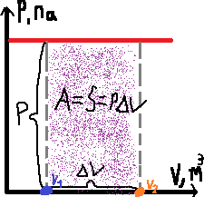

В таких же случаях уже нужно будет искать ранее описанный интеграл, ведь давление не постоянно:

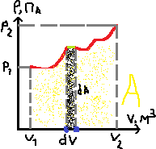

### Первое начало (закон) термодинамики

$[A]=1\text{ Дж}$ - работа, $[u]=1\text{ Дж}$ - внутренняя энергия, $[Q]=1\text{ Дж}$ - Количество теплоты.

Определение:

```txt
Количество теплоты, переданное системе, идёт на увеличение внутренней энергии системы или на совершение работы.
```

Сама формула выглядит следующим образом: $\boxed{Q=\Delta u+A}$.

Исходя из определения, невозможно создать вечный двигатель первого рода, так как работа всегда меньше или равна количеству теплоты, переданному системе, если это не так, то расходуется внутренняя энергия системы, а она не вечная.

### Теплоёмкость

Скалярная физическая величина, связывающая количество теплоты, переданное системе и изменение её температуры. Выделяют три вида теплоёмкости:

1) Полная теплоёмкость системы $C_{\text{тела}}=\frac{dQ}{dT}$, $[C_{\text{тела}}]=$ 1Дж/К.
2) Удельная теплоёмкость $C_{\text{уд}}=\frac{dQ}{mdT}$, $[C_{\text{уд}}]=1 \frac{\text{Дж}}{\text{Кг}\cdot\text{К}}$.
2) Молярная теплоёмкость $C=\frac{dQ}{\nu dT}$, $[C]=1 \frac{\text{Дж}}{\text{моль}\cdot\text{К}}$.

Важные формулы их связи:

```math
\boxed{\begin{align*} C_{\text{моль}}=C_{\text{уд}}\cdot\mu \\ C_{\text{тела}}=C_{\text{моль}}\cdot\nu \\ C_{\text{тела}}=C_{\text{уд}}\cdot m \end{align*}}
```

### Теплоёмкость в изопроцессах

1) Изохорный V = const:

Молярная изохорная теплоёмкость:

```math
\left. C_{\text{V}}=\frac{dQ}{\nu dT}\right| _{v=\text{const}}=\left\{ \begin{gathered} dQ=\delta u+dA=\left\{ \begin{gathered} dA=pdV \\ dA=0 \end{gathered}\right\} =\delta u \\ dQ=du\end{gathered}\right\} =\frac{du}{\nu dt}=\left\{ du=\frac{i}{2}\nu RdT\right\} =\frac{\frac{i}{2}\nu RdT}{\nu dT}=\frac{i}{2}R
```

```math
\boxed{C_{\text{V}}=\frac{i}{2}R}
```

Внутренняя энергия: $u=\nu C_{\text{V}}T$.

2) Изобарный P = const:

Молярная изобарная теплоёмкость:

Начнем с дифференцирования закона Менделеева-Клайперона: $d(PV)=d(\nu RT)$

```math
PdV=\nu RdT
```

```math
dA = PdV = \nu RdT
```

```math
\left. C_{\text{P}}=\frac{dQ}{\nu dT}\right| _{P=\text{const}}=\frac{du+dA}{\nu dT}=\frac{du}{\nu dT}+\frac{dA}{\nu dT}=C_{\text{V}}+\frac{\nu RdT}{\nu dT}=C_{\text{V}}+R
```

Полученное уравнение для молярной изобарной теплоёмкости $\boxed{C_{\text{P}}=C_{\text{V}}+R}$ называют уравнением Майера.

Формула через i: $\boxed{C_{\text{P}}=\frac{i+2}{2}R}$

3) Изотермический T = const.

Молярная изотермическая теплоёмкость: по понятным причинам несуществует, ведь температура константа.

### Коэффициент Пуассона

Основная формула:

```math
\gamma=\frac{C_{\text{P}}}{C_{\text{V}}}=\frac{\frac{i+2}{2}R}{\frac{iR}{2}}=\frac{i+2}{i}
```

Дополнительные:

Так, как $C_{\text{P}}=C_{\text{V}}+R$, разделив на изохорную теплоёмкость получаем в левой части коэффициент Пуассона (по основной формуле выше), это позволяет получить ещё одну формулу этого коэффициента $\gamma=1+\frac{R}{C_{\text{V}}}$, из которой можно выразить изохорную теплоёмкость $C_{\text{V}}=\frac{R}{\gamma-1}$.

Также можно получить ещё одну формулу для внутренней энергии:

```math
u=\nu C_{\text{V}}T=\frac{\nu RT}{\gamma-1}
```

### Адиабатный (адиабатический) процесс

В этом процессе нет обмена теплом с окружающей средой, Q = 0. Любые быстрые процессы могут быть таковыми.


Так как Q = 0, $A=-\Delta u$ - работа совершается за счет убыли внутренней энергии.

```math
dA=-du
```

```math
(PV)'=(\nu RT)' \quad u'v+uv'
```

```math
\begin{cases} dp\cdot V+dV\cdot P=\nu R\cdot dT \\ du=\nu C_{\text{V}}\cdot dT \\ dA=P\cdot dV \\ dA=-du \end{cases}
```

```math
\begin{cases} dPV+dVP=\nu RdT \\ PdV=-\nu C_{\text{V}}dT \end{cases} :
```

```math
\frac{dPV+dVP}{PdV}=-\frac{\nu RdT}{\nu C_{\text{V}}dT}
```

```math
\frac{VdP}{PdV}+\frac{PdV}{PdV}=-\frac{R}{C_{\text{V}}} \quad \frac{R}{C_{\text{V}}}=\gamma-1
```

```math
\frac{VdP}{PdV}+1=-\gamma+1
```

```math
\frac{VdP}{PdV}=-\gamma
```

```math
\int\frac{dP}{P}=-\int\frac{dV}{V}\gamma
```

```math
\ln{P}=-\gamma\ln{V}+\text{const}
```

```math
\ln{P}+\ln{V}^{\gamma}=\text{const}
```

```math
\ln{PV}^{\gamma}=\text{const}
```

И всё это для того, чтобы установить это соотношение:

```math
\boxed{PV^{\gamma}=\text{const}}
```

Из которого можно вывести ещё два, используя $\gamma=\frac{C_{\text{P}}}{C_{\text{V}}}=\frac{i+2}{i}$ и $PV=\nu RT$:
|                                                   |                                                                 |
| ------------------------------------------------- | --------------------------------------------------------------- |
| $$P=\frac{\nu RT}{V}$$                            | $$V=\frac{\nu RT}{P}$$                                          |
| $$\frac{\nu RT}{V}\cdot V^{\gamma}=\text{const}$$ | $$P\cdot\left( \frac{\nu RT}{P}\right) ^{\gamma}=\text{const}$$ |
| Убираем нюр и сливаем с правой                    | частью так как они константы                                    |
| $$\frac{T}{V}\cdot V^{\gamma}=\text{const}$$      | $$P\cdot\left(\frac{T}{P}\right)^{\gamma}=\text{const}$$        |
| $$\boxed{T V^{\gamma-1}=\text{const}}$$           | $$\boxed{P^{1-\gamma}\cdot T^{\gamma}=\text{const}}$$           |

### Работа при изопроцессах и адиабатном процессе

1) Изохорный процесс V = const:

```math
dA=P\cdot dV \quad dV=0\Rightarrow dA=A=0
```

Вспомним график работы и график изохоры (в осях P и V), и поймем, почему работа равна нулю. Под графиком нет площади.


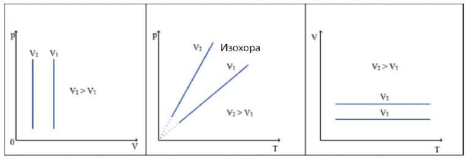

2) Изобарный процесс P = const:


```math
dA=P\cdot dV \quad A=\int dA = P\cdot\Delta V
```

```math
A=P(V_{2}-V_{1})
```

3) Изотермический процесс T = const:

Под изотермой в осях P и V есть площадь, но она является площадью криволинейной трапеции, значит нужен интеграл.

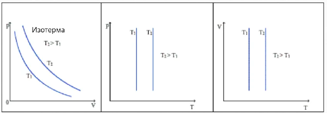

Вот такой случай разбирался в работе:


Начнем находить интеграл:

```math
\begin{align*} A=\int dA=\int P\cdot dV= \\ = \left\{ PV=\nu RT\text{, }P=\frac{\nu RT}{V}\right\} = \\ = \int\frac{\nu RT}{V}\cdot dV=\nu RT\cdot\int_{V_{1}}^{V_{2}}\frac{dV}{V}=\\=\nu RT\left. \ln{V}\right| ^{V_{2}}_{V_{1}}=\nu RT\left( \ln{V_{2}}-\ln{V_{1}}\right) =\\=\nu RT \ln{\frac{V_{2}}{V_{1}}}=\nu RT\ln{\frac{P_{1}}{P_{2}}} \end{align*}
```

```math
\boxed{A=\nu RT\ln{\frac{P_{1}}{P_{2}}}}
```

Пояснение за последнее действие: ${P_{1}}{V_{1}}={P_{2}}{V_{2}}$ (закон Бойля-Мариотта из следующего билета), поэтому вот так можно заменять: $\frac{V_{2}}{V_{1}}=\frac{P_{1}}{P_{2}}$.

4) Адиабатический процесс Q = 0:

В графике адиабаты также есть кривая, но проще находить работу по различным формулам внутренней энергии:

```math
A=-\Delta u=-\left\{ \begin{gathered} \frac{i}{2}\nu R\Delta T \\ \nu C_{\text{V}}\Delta T \\ \frac{P_{2}V_{2}}{\gamma-1}-\frac{P_{1}V_{1}}{\gamma-1} \end{gathered}\right\}
```

Есть также страшные формулы для общего развития, как говорилось на лекции, они нам не очень то нужны, но кто его знает:

```math
A=\frac{P_{1}V_{1}}{\gamma-1}\left( 1-\left( \frac{P_{2}}{P_{1}}\right) ^{\frac{\gamma-1}{\gamma}}\right)
```

```math
A=\frac{P_{1}V_{1}}{\gamma-1}\left( 1-\frac{T_{2}}{T_{1}}\right)
```

```math
A=\frac{P_{1}V_{1}}{\gamma-1}\left( 1-\left( \frac{V_{1}}{V_{2}}\right) ^{\gamma-1}\right)
```

## 28. Изобарный, изотермический, изохорный, адиабатный процессы. ~~Уравнение Пуассона.~~

При всех изопроцессах $\boxed{m=\text{const}}$.

Все изопроцессы исходят из $\frac{PV}{T}=\text{const}$, что было выражено из $PV=\nu RT$, ведь количество вещества (масса постоянна) не меняется, также как и универсальная газовая постоянная.

Работу и теплоёмкость при изопроцессах можно посмотреть в \#\# 28. Изобарный, изотермический, изохорный, адиабатный процессы. ~~Уравнение Пуассона.~~ (предыдущий билет).

### Изотермический процесс

При изотермическом процессе температура постоянна: $T=\text{const}$.

```math
\large \frac{PV}{T}=\text{const} \longrightarrow \begin{cases} PV=\text{const} \\ P_{1}V_{1}=P_{2}V_{2} \end{cases} \left. \begin{gathered} \text{Закон} \\ \text{Бойля-} \\ \text{Мариотта} \end{gathered}\right.
```


### Изобарный процесс

При изобарном процессе давление постоянно: $P=\text{const}$.

```math
\large \frac{PV}{T}=\text{const} \longrightarrow \begin{cases} \frac{V}{T}=\text{const} \\ \frac{V_{1}}{T_{1}}=\frac{V_{1}}{T_{1}} \end{cases} \left. \begin{gathered} \text{Закон} \\ \text{Гей-} \\ \text{Люссака} \end{gathered}\right.
```


### Изохорный процесс

При изохорном процессе объем постоянный: $V=\text{const}$.

```math
\large \frac{PV}{T}=\text{const} \longrightarrow \begin{cases} \frac{P}{T}=\text{const} \\ \frac{P_{1}}{T_{1}}=\frac{P_{1}}{T_{1}} \end{cases} \left. \begin{gathered} \text{Закон} \\ \text{Шарля} \end{gathered}\right.
```


При рисовании любого графика, оси подписываются следующим образом: по оси ОХ откладывается то, что мы изменяем/можем изменять/меняется.

Мы можем изменять объём, либо температуру, давление мы менять не можем. Давление НЕ откладывается по горизонтальной оси. В случае графика с объёмом и температурой, температура откладывается по горизонтали.

### Адиабатный процесс

Он не относится к изопроцессам, поэтому имеет другую логику и законы. Он совсем ни на что не похож, для удобства понимания он находится в \#\# 27. Первый закон термодинамики. Работа, теплота, теплоемкость, ее виды. - предыдущем билете, куда засунута вся термодинамика, адиабатный процесс имеет заголовок \#\#\# третьего уровня.

## 29. Тепловые двигатели и холодильные машины. Цикл Карно.

Для понимания, сперва прочитайте про изопроцесс и термодинамику - два предыдущих билета.

### Круговые процессы

Как мы уже знаем, работа газа положительна, когда объем растет, и отрицательна, когда он уменьшается. В круговых процессах на некоторых этапах он растет, а на некоторых уменьшается.


Прямым называется цикл, работа которого больше 0, а обратным - когда работа меньше 0. По прямым циклам работают ДВС и другие тепловые машины, превращающие тепловую энергию в какую-нибудь другую, а по обратным работают холодильные машины и тепловые насосы.

Для того, чтобы определить работу по графику, достаточно из площади под графиком с увеличением объема вычесть площадь под графиком с его уменьшением.

`Тепловая машина` (двигатель) - переодически действующий механизм, совершающий работу за счет полученного из вне количества теплоты.

Состоит из:

* Нагреватель (термостат с большой температурой $T_{1}$).
* Рабочее тело (например, газ под поршнем).
* Холодильник (термостат с низкой температурой $T_{2}$).


Q2 помогает телу остыть и перейти обратно в точку 1.

```math
A=Q_{1}-Q_{2}
```

Коэффициент полезного действия (КПД) машины может быть найден как отношение полезной работы к затраченному на неё количеству теплоты. Он не имеет размерности и не может быть больше 1, также он может быть найден в процентах:

```math
\eta=\frac{A}{Q_{1}}=\frac{Q_{1}-Q_{2}}{Q_{1}}\cdot 100\% = 1-\frac{Q_{2}}{Q_{1}}\cdot 100\%
```

`Цикл Карно` - идеальная тепловая машина, с которой можно сравнить свою, чтобы представить, какой максимальный КПД можно получить в идеальных условиях с такой конструкцией.

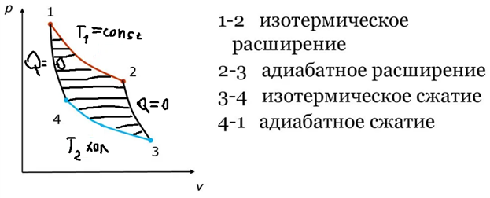

```math
\eta=\frac{T_{1}-T_{2}}{T_{1}}\cdot 100\%
```

## 30. Электрический заряд и его свойства. Закон сохранения электрического заряда. Закон Кулона. ~~Диэлектричеекая пропицаемость и ее физичеекий смысл.~~

Электрический заряд - физическая величина, характеризующая свойства тел или частиц вступать в элекртомагнитные взаимодействия.

$[q]=1$ Кл (Кулон). Заряд обладает следующими свойствами:

1) Заряды с одинаковыми знаками отталкиваются, а с разными - притягиваются.
2) В атомах есть элементарные частицы: нейтроны ($q_{\text{n}} = 0$), протоны ($q_{\text{p}}=1,6\cdot 10^{-19} \text{ Кл}$) и электроны ($q_{\text{e}}=-1,6\cdot 10^{-19} \text{ Кл}$). В нейтральных атомах количество протонов и электронов равно, поэтому суммарный заряд атома равен нулю. Но атомы могут получить чужие электроны, или отдать свои, в таком случае атом получает отрицательный или положительный заряд соответственно. Заряд электрнона/протона называют **элементарным зарядом**. Ниже показана схема нейтрального атома.

    

3) Все величины можно разделить на непрерывные и дискретные:

    | Дискретные                                                                        | Непрерывные                                                                 |
    | --------------------------------------------------------------------------------- | --------------------------------------------------------------------------- |
    |                                                       |                                                  |
    | 1 - кирпичик, который добавляем (шаг)                                             | Нет кирпичика, можем брать любое число с любым кол-вом знаков после запятой |
    | **Пример**: заряд, заряд тела кратен элементарному, элементарный заряд - кирпичик | **Пример**: сила, скорость, сила, как и скорость может быть абсолютно любой |

### Закон сохранения заряда

Суммарный заряд электрически изолированной системы не изменяется.

### Точечный заряд

Заряженное тело или частица, размером и формой которого можно пренебречь по сравнению с расстоянием до других зарядов.

### Кулонова сила

Как говорилось ранее, заряды могут взаимодействовать - отталкиваться или притягиваться, а с какой силой они этим занимаются? Как и в силе всемирного тяготения, существует формула, но заряды в ней берут по модулю, ведь направление вектора смотрят по рисунку. В этой формуле $k=\text{const}=\frac{1}{4\pi\varepsilon}=9\cdot 10^{9} \frac{\text{Н}\cdot\text{м}^{2}}{\text{Кл}^{2}}$ - константа, справедливая для вакуума с диэлектрической проницаемостью $\varepsilon=8,85\cdot 10^{-12} \text{Фр/м (Фарад на метр)}$. Сила кулона, как и все силы (кроме силы тока), измеряется в ньютонах. Сама формула силы Кулона:

```math
\overrightarrow{F}_\text{кул.}=k\frac{|q_{1}|\cdot |q_{2}|}{r^{2}}\cdot \overrightarrow{e} \quad \overrightarrow{e}=\frac{\overrightarrow{r}}{r}
```

### Изображение зарядов и принцип суперпозиции

При взаимодействии зарядов силы создаются попарно: равны по модулю и имеют противоположное направление.


Для кулоновой силы справедлив принцип суперпозиции:

```math
\overrightarrow{F}_\text{рез.}=\overrightarrow{F}_\text{1}+\overrightarrow{F}_\text{2}+\text{ ... }+\overrightarrow{F}_\text{n}
```

Результирующая сила, действующаяя на заряд равна ВЕКТОРНОЙ сумме всех сил, действующих на этот заряд.


## 31. Электрическое поле. Напряженность поля. Поле точечного заряда. Графическое изображение электростатических полей. Принцип суперпозиции полей. Поле системы зарядов.

### Электрическое поле

`Электрическое поле` - Особый вид материи, возникающий вблизи или вокруг заряженных тел или частиц, и обнаруживающийся по действию на заряженные тела или частицы.

Заряд, которым прощуываем поле, называется **пробным**, и он всегда имеет элементарный положительный заряд, если не указано другое.

### Напряженность

Возьмём формулу кулоновой силы, и заменим один заряд на пробный, а другой будет создавать поле:

```math
\overrightarrow{F}=k\frac{q}{r^{2}}\cdot \overrightarrow{e} \cdot q'
```

По определению, `Напряженность` - векторная силовая характеристика электрического поля, она показывает, с какай силой поле действует на пробный заряд, помещенный в данную точку электрического поля.

```math
\overrightarrow{E}=k\frac{q}{r^{2}}\cdot \overrightarrow{e}
```

Тогда, сила через напряженность: $\overrightarrow{F}=\overrightarrow{E}\cdot q'$. Напряженность измеряется в вольтах на метр (В/м).

Напряженность поля, созданного точечным зарядом, изображают следующим образом:


Для напряженности также справедлив принцип суперпозиции - чтобы найти напряженность в конкретной точке, нужно ВЕКТОРНО сложить все вектора напряженности, действующие в этой точке:

```math
\overrightarrow{E}_\text{рез.}=\overrightarrow{E}_\text{1}+\overrightarrow{E}_\text{2}+\text{ ... }+\overrightarrow{E}_\text{n}
```


### Изображение полей

Желательно перед этим посмотреть два следующих билета, чтобы все понять.

При изображении полей используют `силовые линии` - воображаемые линии, касательные к которым в любой точке поля совпадают с вектором напряженности поля. Они обладают следующими свойствами:

1) Не замкнутые.
2) Начинаются и заканчиваются на зарядах или на бесконечностях.
3) Густота линий показывает величину поля.


## 32. Энергетическая характеристика электростатического поля - потенциал. Потенциал поля точечного заряда и системы зарядов. Связь между напряженностью электрического поля и потенциалом.

Смотрите следующий билет, оно там ближе к концу.

## 33. Работа сил электростатического поля по перемещению зарядов. Циркуляция вектора напряженности. Потенциальный характер электростатического поля.


$dr$ - расстояние, на которое отодвинулся $q'$ при перемещении $dS$. Работа поля:

```math
dA=\overrightarrow{F}_\text{кул.}d\overrightarrow{S}$, $\overrightarrow{e}_{\text{r}}\cdot d\overrightarrow{S}=dR
```

```math
\begin{align*} A=\int\overrightarrow{F}_\text{кул.}d\overrightarrow{S}=\int k\frac{qq'}{r^{2}}\overrightarrow{e}_{\text{r}}\cdot d\overrightarrow{S}= \\ = kqq'\int_{r_{1}}^{r_{2}}\frac{dr}{r^{2}}=kqq'\frac{r^{-1}}{-1}= \\ = -k\left. \frac{qq'}{r}\right| _{r_{1}}^{r_{2}}=-k\frac{qq'}{r_{2}}+k\frac{qq'}{r_{1}}= \\ =k\frac{qq'}{r_{1}}-k\frac{qq'}{r_{2}} \end{align*}
```

Сила кулона - консервативная сила.

1) A = убыли потенциальной энергии. $W_{\text{пот.}}=k\frac{qq'}{r}$ - потенциальная энергия поля в джоулях.
2) Работа по замкнутой траектории равна нулю (A=0), так как при возвращении в ту же точку потенциальная энергия тоже возвращается, и в итоге убыли нет.

Теорема о циркуляции. `Циркуляция вектора напряженности` вдоль замкнутой траектории L равна 0.

```math
A=\oint_{L}\overrightarrow{F}_\text{кул.}d\overrightarrow{L}=\boxed{\oint_{L}\overrightarrow{E}q'd\overrightarrow{L}=0}
```

### Потенциал

Так как по определению `потенциал` показывает, какую энергию сообщает электрическое поле пробному положительному заряду, помещенному в данную точку электрического поля, можно взять формулу потенциальной энергии и переделать её под это определение, после чего вывести потенциал.

```math
W_{\text{пот.}}=k\frac{q}{r}q'
```

```math
\phi=k\frac{q}{r}
```

Потенциал обозначается маленькой греческой буквой фи и измеряется в вольтах (В), справедлива формула связи: $W=\phi q'$.

Для потенциала выполняется принцип суперпозиции - результирующий потенциал равен АЛГЕБРАИЧЕСКОЙ сумме всех потенциалов в этой точке.

### Напряжение

```math
A=W_{1}-W_{2}=q\phi_{1}-q\phi_{2}=-q(\phi_{2}-\phi_{1})=-q\Delta\phi
```

$u=\phi_{1}-\phi_{2}$ - напряжение, также в вольтах.

### Работа, потенциал, напряжение, напряженность

$A=q\phi$ - если фи меньше нуля, то заряд улетает далеко, если фи меньше нуля, то заряд втягивается в конечную точку. Чтобы сдвинуть заряд далеко с отрицательным потенциалом, нужно совершить работу из вне.

```math
A=du
```

```math
dA=\overrightarrow{F}_\text{кул.}dL=E\cdot q\cdot dL
```

```math
A=\overrightarrow{F}_\text{кул.}=EqL
```

```math
dA=-qd\phi
```

```math
dA=EqdL
```

```math
-qd\phi=EqdL
```

```math
\boxed{E=-\frac{d\phi}{dL}}
```

Для однородного поля, где E = const формула имеет вид:

```math
\boxed{E=-\frac{\Delta\phi}{\Delta L}}
```

## Бонус

Тема "Силы в жидкости" не вошла ни в один из билетов, поэтому она здесь.

### Силы в жидкости

| Объемные                                   | Поверхностные                                                     |
| ------------------------------------------ | ----------------------------------------------------------------- |
| Силы, пропорциональные объёму, массе       | Силы, распределенные по поверхности вещества определенным образом |
| Объемная плотность силы:                   | Механическое напряжение:                                          |
| $$f=\frac{F}{V}$$                          | $$\sigma=\frac{dF}{dS}$$                                          |
| $$[f]=1\frac{\text{Н}}{\text{м}^{3}}$$     | $$[\sigma]=1\frac{\text{Н}}{\text{м}^{2}}$$                       |
| Объемная плотность:                        | Поверхностная плотность:                                          |
| $$\rho=\frac{m}{V}$$                       | $$\delta=\frac{m}{S}$$                                            |
| $$[\rho]=1\frac{\text{кг}}{\text{м}^{3}}$$ | $$[\delta]=1\frac{\text{кг}}{\text{м}^{2}}$$                      |

Также есть еще и линейная плотность: $\lambda =\frac{m}{l}$, $[\lambda]=1\frac{\text{кг}}{\text{м}}$.

Выделим в жидкости маленький объем $\Delta V$:


```math
P=\text{Давление}\quad P=\frac{F}{S}\rightarrow F=P\cdot S
```

```math
F_{\text{Слева}}=P\cdot\Delta y\Delta z \quad S=\Delta y\Delta z
```

```math
F_{\text{Справа}}=(P+\Delta P)\cdot\Delta y\Delta z \quad S=\Delta y\Delta z
```

```math
\begin{align*} F_{\text{Резул.}}=F_{\text{Слева}}-F_{\text{Справа}}=P\cdot\Delta y\Delta z-(P+\Delta P)\cdot\Delta y\Delta z= \\ =P\cdot\Delta y\Delta z-P\cdot\Delta y\Delta z-\Delta P\cdot\Delta y\Delta z= \\ = -\Delta P\cdot\Delta y\Delta z\frac{\Delta x}{\partial x}=-\frac{\partial P}{\partial x}\Delta x\Delta y\Delta z= \\ =-\frac{\partial P}{\partial x}\cdot\Delta V \end{align*}
```

```math
\begin{cases} f_{\text{x}}=\frac{F_{text{x}}}{\Delta V}=-\frac{\partial p}{\partial x} \\ f_{\text{y}}=-\frac{\partial p}{\partial y} \\ f_{\text{z}}=-\frac{\partial p}{\partial z} \end{cases}
```

```math
\overrightarrow{f}=-(\frac{\partial p}{\partial x}\overrightarrow{i}+\frac{\partial p}{\partial y}\overrightarrow{j}+\frac{\partial p}{\partial z}\overrightarrow{k})= -\text{grad }p
```

### Три всадника плохой дроби

```txt
\fraq{1}{3}
```

```txt
\frak{2}{3}
```

```txt
\акфс{3}{3}
```

### Качество картинок на протяжении всего этого документа


