# Билеты для экзамена по физике 2024-2025гг. за первый семестр

# ВОПРОСЫ ДЛЯ ПОДГОТОВКИ К ЭКЗАМЕНУ «ФИЗИКА»

1. Кинематика материальной точки. Системы отсчета. Траектория, перемещение, путь, скорость, ускорение. Равномерное и равнопеременное прямолинейные движения.
2. Криволинейное движение. Нормальное и тангенциальное ускорения.
3. Движение точки по окружности. Угловые перемещение, скорость, ускорение. Связь между линейными и угловыми характеристиками.
4. Динамика материальной точки. Инерциальные системы отсчета и первый закон Ньютона.
5. Фундаментальные взаимодействия. Силы различной природы (упругие, гравитационные, трения). Второй закон Ньютона. Масса. Третий закон Ньютона.
6. Момент импульса и момент силы. ~~Уравнение моментов.~~ Закон сохранения момента импульса.
7. Вращение твердого тела относительно неподвижной оси. Основной закон динамики вращательного движения абсолютно твердого тела. Момент инерции.
8. ~~Расчёт момента инерции тел простой формы~~
9. Импульс материальной точки. Закон сохранения импульса. Кинетическая энергия материальной точки.
10. Работа, мощность. ~~Потенциальные и непотенциальные поля.~~ Консервативные и неконсервативные силы. Потенциальная энергия.
11. Закон всемирного тяготения. Поле тяготения и потенциальная энергия гравитационного взаимодействия.❗
12. Работа по перемещению тела в поле тяготения.
13. Упругая деформация твердого тела. Коэффициент упругости. Энергия упругого деформирования.
14. Колебательное движение и его характеристики: смещение, амплитуда, фаза, циклическая частота, период, скорость, ускорение.
15. Векторные диаграммы для представления гармонических колебаний. Дифференциальное уравнение гармонических колебаний. Энергия колебательного движения.❗
16. Математический и физический маятники.
17. Сложение параллельных колебаний одинаковой и разной частоты. Биения.
18. Сложение взаимно перпендикулярных колебаний. Фигуры Лиссажу.
19. Свободные затухающие колебания.
20. Вынужденные колебания. Резонанс.
21. Волновое движение. Уравнение плоской незатухающей бегущей волны.
22. Термодинамическая система. Параметры состояния термодинамической системы. Основные положения молекулярно-кинетической теории газов.
23. Закон равномерного распределения энергии по степеням свободы молекул. Основное
уравнение молекулярно-кинетической теории газов (уравнение Клаузиуса).
24. Уравнение состояния идеального газа.
25. Закон Максвелла распределения молекул по скоростям теплового движения. Барометрическая формула. Распределение Больцмана.
26. Средняя длина свободного пробега молекулы. Явления переноса. Диффузия, вязкость, теплопроводность.
27. Первый закон термодинамики. Работа, теплота, теплоемкость, ее виды.
28. Изобарный, изотермический, изохорный, адиабатный процессы. ~~Уравнение Пуассона.~~
29. Тепловые двигатели и холодильные машины. Цикл Карно.
30. Электрический заряд и его свойства. Закон сохранения электрического заряда. Закон Кулона. ~~Диэлектричеекая пропицаемость и ее физичеекий смысл.~~
31. Электрическое поле. Напряженность поля. Поле точечного заряда. Графическое изображение электростатических полей. Принцип суперпозиции полей. Поле системы зарядов.
32. Энергетическая характеристика электростатического поля - потенциал. Потенциал поля точечного заряда и системы зарядов. Связь между напряженностью электрического поля и потенциалом.
33. Работа сил электростатического поля по перемещению зарядов. Циркуляция вектора напряженности. Потенциальный характер электростатического поля.

## 1. Кинематика материальной точки. Системы отсчета. Траектория, перемещение, путь, скорость, ускорение. Равномерное и равнопеременное прямолинейные движения.

#### Кинематика материальной точки

`Механическое движение` - изменение координаты тела относительно других тел со временем.

`Система отсчета` - это совокупность **тела отсчета**, связанной с ним **системы координат** и **часов**, с помощью которых определяется положение и время движения точки.

`Материальная точка` - тело, размером и формой которого в условиях данной задачи можно пренебречь.

`Траектория` - линия, которую описывает материальная точка при своем движении.

`Путь` - скалярная величина, расстояние, пройденное телом за время $t$. Обозначается $S$ и измеряется в метрах (м). Путь - это длина траектории.

`Перемещение` - векторная величина - вектор соединяющий начальное и конечное положение точки. Обозначается $\Delta \overrightarrow{r}$ и измеряется в метрах.

Путь может быть больше модуля перемещения, а наоборот быть не может.

$$\boxed{S \geq |\Delta \overrightarrow{r}|}$$

`Скорость` - это векторная величина, определяющая скорость изменения координат точки с течением времени. Обозначается $\overrightarrow{v}$ и измеряется в метрах в секунду (м/с).

$$v_{\text{Средняя путевая}} = \frac{S}{t}$$

$$\overrightarrow{v}_{\text{Средняя по перемещению}} = \frac{\Delta \overrightarrow{r} }{\Delta t}$$

$$\overrightarrow{v}_{\text{Мгновенная}} = \frac{d \overrightarrow{r} }{dt} = \overrightarrow{r}_{t}'$$

`Скорость по осям`:

$$v_{\text{x}} = \frac{dx}{dt} \text{, } v_{\text{y}} = \frac{dy}{dt} \text{, } v_{\text{z}} = \frac{dz}{dt}$$

$$|\overrightarrow{v}| = \sqrt{v_{\text{x}}^{2} + v_{\text{y}}^{2} + v_{\text{z}}^{2}}$$

$$\overrightarrow{v} = \overrightarrow{i}v_{\text{x}} + \overrightarrow{j}v_{\text{y}} + \overrightarrow{k}v_{\text{z}}$$

`Ускорение` - это векторная величина, характеризующая быстроту изменения скорости точки с течением времени. Обозначается $\overrightarrow{a}$ и измеряется в метрах на секунду в квадрате $(м/\text{c}^{2})$.

$$\overrightarrow{a} = \frac{d \overrightarrow{v} }{dt} = \frac{d^{2} \overrightarrow{r} }{dt^{2}}$$

`Ускорение по осям`:

$$a_{\text{x}} = \frac{dv_{\text{x}}}{dt} = \frac{d^{2}x}{dt^{2}} \text{, } a_{\text{y}} = \frac{dv_{\text{y}}}{dt} = \frac{d^{2}y}{dt^{2}} \text{, } a_{\text{z}} = \frac{dv_{\text{z}}}{dt} = \frac{d^{2}z}{dt^{2}}$$

$$|\overrightarrow{a}| = \sqrt{a_{\text{x}}^{2} + a_{\text{y}}^{2} + a_{\text{z}}^{2}}$$

$$\overrightarrow{a} = \overrightarrow{i}a_{\text{x}} + \overrightarrow{j}a_{\text{y}} + \overrightarrow{k}a_{\text{z}}$$

`Равномерное прямолинейное движение` - движение, при котором скорость точки постоянна и траектория представляет собой прямую линию.

$$\overrightarrow{v} = const, \text{ } \overrightarrow{a} = 0$$

`Равнопеременное прямолинейное движение` - движение, при котором ускорение точки постоянно, а скорость изменяется линейно. При таком движении траектория - все так же прямая линия.

$$\overrightarrow{v} = \overrightarrow{v}_{0} + \overrightarrow{a} t, \text{ } \overrightarrow{x} = \overrightarrow{x}_{0} + \overrightarrow{v}_{0} t + \frac{\overrightarrow{a} t^{2}}{2}$$

## 2. Криволинейное движение. Нормальное и тангенциальное ускорения.

`Криволиненое движение` - движение по траектории, не являющейся прямой линией. Такую траекторию можно разбить на несколько прямолинейных движений (в разные стороны), иногда, такая траектория имеет еще и участки с движением по окружности.

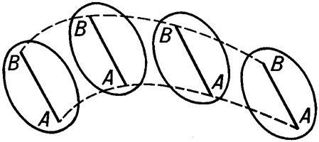

`Поступательное движение` - такой вид движения, при котором линия, проведенная через тело, остается параллельной самой себе (см. рисунок выше). Его можно разбить на много прямолинейных участков, как будто тело движется по ломаной линии, но все еще не вращается.

**Движение по окружности**

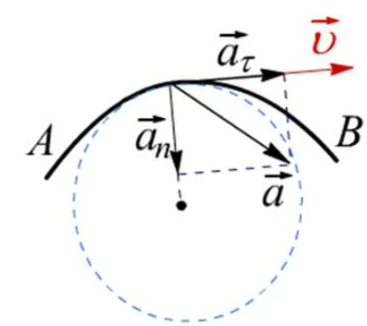

$R$ - `Радиус окружности`

$\overrightarrow{a}_{n}$ - нормальное (`центростремительное ускорение`), отвечает за изменение направления вектора $\overrightarrow{v}$.

$$\overrightarrow{a}_{n} = \frac{\overrightarrow{v}^{2}}{R}$$

$\overrightarrow{a}_{\tau}$ - `тангенциальное ускорение`, отвечает за изменение модуля скорости.

$$\overrightarrow{a}_{\tau} = \frac{d \overrightarrow{v}}{dt}$$

Если $\overrightarrow{v}$ увеличивается, то вектора $\overrightarrow{v}$ и $\overrightarrow{a}_{\tau}$ сонаправлены, если $\overrightarrow{v}$ уменьшается, то векторы направлены в противоположные стороны.

$\overrightarrow{a} = \overrightarrow{a}_{n} + \overrightarrow{a}_{\tau}$ - полное ускорение.

$$|\overrightarrow{a}| = \sqrt{\overrightarrow{a}_{n}^{2} + \overrightarrow{a}_{\tau}^{2}}$$

Движение по окружности - это всегда движение с ускорением.

Стрелки часов движутся с ускорением $\overrightarrow{a}_{n} \ne 0 \text{, } \overrightarrow{a}_{\tau} = 0$

## 3. Движение точки по окружности. Угловые перемещение, скорость, ускорение. Связь между линейными и угловыми характеристиками.

**Кинематика вращательного движения**

$\phi$ - греческая буква ФИ, ей обозначают `угол поворота`. Измеряестя в радианах (рад). $\pi \text{ рад} = 180^{\circ} \text{, } 1 \text{ рад} \approx 57,3^{\circ}$

$\omega$ - маленькая омега - `угловая скорость`, характеризует скорость изменения угла, измеряется в радианах в секунду (рад/с).

$\varepsilon$ - маленький эпсилон - `угловое ускорение`, показывает быстроту изменения угловой скорости, измеряется в радианах на секунду в квадрате $(рад/\text{c}^{2})$.

**Связь с линейными характеристиками**

| Поступательное движение                                                                                                                                                                                                     | Вращательное движение                                                                                                                                                                                                                                                           |
| --------------------------------------------------------------------------------------------------------------------------------------------------------------------------------------------------------------------------- | ------------------------------------------------------------------------------------------------------------------------------------------------------------------------------------------------------------------------------------------------------------------------------- |
| $$[x] = 1 \text{м}$$                                                                                                                                                                                                        | $$[\phi] = 1 \text{рад}$$                                                                                                                                                                                                                                                       |
| $$[v] = 1 \text{м/c}$$                                                                                                                                                                                                      | $$[\omega] = 1 \text{рад/с}$$                                                                                                                                                                                                                                                   |
| $$[a] = 1 \text{м/c}^{2}$$                                                                                                                                                                                                  | $$[\varepsilon] = 1 \text{рад/с}^{2}$$                                                                                                                                                                                                                                          |
| $$v_{\text{x}} = \frac{dx}{dt}$$                                                                                                                                                                                            | $$\omega_{\text{z}} = \frac{d\phi}{dt}$$                                                                                                                                                                                                                                        |
| $$a_{\text{x}} = \frac{dv_{\text{x}}}{dt} = \frac{d^{2}x}{dt^{2}}$$                                                                                                                                                         | $$\varepsilon_{\text{z}} = \frac{d\omega_{\text{z}}}{dt} = \frac{d^{2}\phi}{dt^{2}}$$                                                                                                                                                                                           |
| $$\begin{align*} \textbf{Связь линейных и угловых характеристик:} \\ S = \phi \cdot R \\ v = \omega \cdot R \\ a_{\tau} = \varepsilon \cdot R \\ a_{\text{n}} = \omega^{2} \cdot R \end{align*}$$                           |                                                                                                                                                                                                                                                                                 |
| $$\begin{align*} \textbf{Равномерное:} \\ x = x_{0} + v_{\text{x}} \cdot t \\ \textbf{Равнопеременное:} \\ v = v_{0\text{x}} \pm a_{\text{x}}t \\ x = x_{0} + v_{0\text{x}}t \pm \frac{a_{\text{x}}t^{2}}{2} \end{align*}$$ | $$\begin{align*} \textbf{Равномерное:} \\ \phi = \phi_{0} + \omega_{\text{z}} \cdot t \\ \textbf{Равнопеременное:} \\ \omega = \omega_{0\text{z}} \pm \varepsilon_{\text{z}}t \\ \phi = \phi_{0} + \omega_{0\text{z}}t \pm \frac{\varepsilon_{\text{z}}t^{2}}{2} \end{align*}$$ |

## 4. Динамика материальной точки. Инерциальные системы отсчета и первый закон Ньютона.

**Динамика поступательного движения**

I закон Ньютона об инерциальных системах отсчета (ИСО).

```txt
Существуют такие системы отсчета, в которых, если на тело не действуют силы, или их действие скомпенсировано (Векторная сумма всех сил, действующих на тело, равна нулю.), тело будет покоиться или двигаться равномерно и прямолинейно.
```

Неинерциальные системы отсчета (НИСО) - это системы отсчета, движущиеся с ускорением относительно ИСО, например, лифт, набирающий скорость.

## 5. Фундаментальные взаимодействия. Силы различной природы (упругие, гравитационные, трения). Второй закон Ньютона. Масса. Третий закон Ньютона.

**Масса** - скалярная физическая величина, измеряется в килограммах (кг) и отражает инертность тела - то, насколько трудно телу придать ускорение.

### **II Закон Ньютона:**

```txt
Ускорение тела прямо пропорционально приложенной к нему силе и обратно пропорционально его массе.
```

$$\sum \overrightarrow{F} = m \cdot \overrightarrow{a}$$

$\Sigma$ - большая греческая буква "Сигма", обозначает сумму, в данном случае - векторную, как на рисунке ниже.

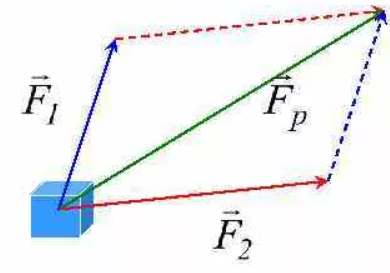

$\overrightarrow{F}$ - сила, векторная величина, измеряемая в Ньютонах (Н).

$m$ - масса, скалярная величина, измеряется в килограммах (кг).

$$\begin{align*} \overrightarrow{a} = \frac{d\overrightarrow{v}}{dt} \\ \overrightarrow{F} = m \cdot \frac{d\overrightarrow{v}}{dt} \\ \overrightarrow{F} \cdot dt = m \cdot d\overrightarrow{v} \end{align*}$$

Где левая часть - импульс силы ($\overrightarrow{F} \cdot t$), а правая - импульс тела ($p = mv$)

В замкнутой системе ($F = 0$):

$$m \cdot \frac{d\overrightarrow{v}}{dt} = 0$$

$$m \cdot \overrightarrow{v} = const \text{ - закон сохранения импульса}$$

### **III Закон Ньютона**

```txt
Силы, с которыми два тела действуют друг на друга, равны по величине и противоположны по направлению.
```

$$\overrightarrow{F}_{12} = - \overrightarrow{F}_{21}$$

### **Силы различной природы**

`1. Сила всемирного тяготения (закон всемирного тяготения):`

$$\overrightarrow{F}_{\text{Всемирного тяготения}} = \Large G \normalsize \cdot \frac{m_{1} \cdot m_{2}}{r^{2}} \cdot \frac{\overrightarrow{r}}{r}$$

$\Large G \normalsize$ - Гравитационная постоянная, равная $6,67 \cdot 10^{-11} (\frac{\text{Н} \cdot \text{м}^{2}}{\text{кг}^{2}})$, $\frac{\overrightarrow{r}}{r}$ - единичный вектор для сохранения направления силы.

`2. Сила тяжести`

Сила тяжести выражается из закона всемирного тяготения и справедлива для тел, находящихся вблизи поверхности Земли, что упрощает расчеты, но делает их менее точными.

$$\overrightarrow{F}_{\text{В.т.}} = \Large G \normalsize \cdot \frac{m_{\text{Земли}} \cdot m_{2}}{r^{2}_{\text{Земли}}}$$

$$\Large G \normalsize \cdot \frac{m_{\text{Земли}}}{r^{2}_{\text{Земли}}} = |\overrightarrow{g}| \approx 9,8 \text{ м/с}^{2}$$

$$\overrightarrow{F}_{\text{Тяжести}} = m \cdot \overrightarrow{g}$$

`3. Вес`

Вес - сила, с которой тело давит на опору или растягивает нить подвеса. Вес действует именно на ОПОРУ, а не на ТЕЛО. Тело, находящееся в невесомости и/или в свободном падении не создает никакого веса. Вес обозначается $\overrightarrow{P}$ и измеряется в ньютонах (Н).

`4. Сила реакции опоры`

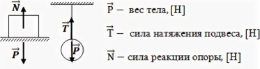

Сила, по III закону Ньютона, появляющаяся вместе с весом, и имеющая противоположное с ним направление и равная ему по модулю $\overrightarrow{P} = - \overrightarrow{N}$. Эта сила, в отличие от веса, действует не на опору или подвес, а на тело. Обозначается $\overrightarrow{N}$ и измеряется в ньютонах (Н).

`5. Сила трения`

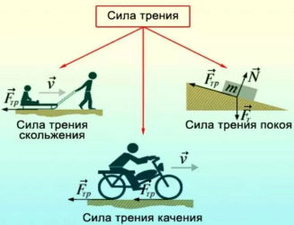

Сила трения направлена против движения/предполагаемого направления движения. Сила действует на тело и измеряется в ньютонах.

$$F_{\text{Трения}} = \mu \cdot N$$

Коэффициент трения $\mu$ уникален почти для каждого случая, зависит от поверхностей, их шершавости, материала, а так же от вида трения (покоя, скольжения, качения). Он не имеет единицы измерения. Трение покоя - самое большое из всех трех.

`6. Сила упругости`

Сила упругости возникает в упруго-деформированных телах.

Деформация - изменение размеров и формы тела.

1) Упругая деформация. При упругой деформации при прикращении внешнего воздействия на тело оно восстанавливает свою исходную форму и размер.
2) Неупругая деформация. После достижения некоторого предела деформации тело теряет свою исходную форму и размер безисходно.

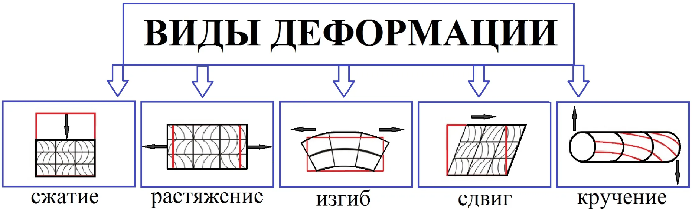

1) Растяжение.
2) Сжатие.
3) Изгиб.
4) Кручение.
5) Сдвиг.

Для 1) и 2) можно найти силу упругости по следующей формуле:

$$F_{\text{Упругости}} = -k \cdot \Delta x$$

$k$ - коэффициент упругости, измеряется в ньютонах на метр (н/м), $\Delta x$ - величина деформации в метрах, $F_{\text{Упругости}}$ - измеряется в ньютонах, и направлена против деформации, о чём говорит знак "-".

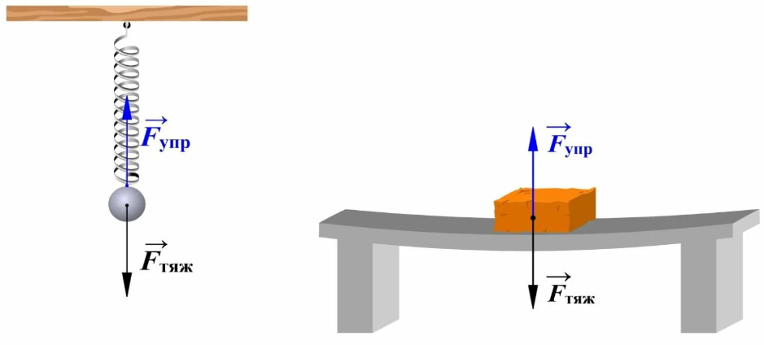

## 6. Момент импульса и момент силы. ~~Уравнение моментов.~~ Закон сохранения момента импульса.

`Момент импульса` (или угловой момент) материальной точки относительно некоторой оси определяется как векторное произведение радиус-вектора $r$, проведенного из начала отсчета к этой точке, на ее импульс $p$:

$$\overrightarrow{L} = \overrightarrow{r} \cdot \overrightarrow{p}$$

где $\overrightarrow{L}$ — момент импульса, $\overrightarrow{r}$ — радиус-вектор, $\overrightarrow{p} = m \cdot \overrightarrow{v}$ — импульс точки (масса умноженная на скорость).

`Момент силы` относительно точки или оси — это векторное произведение радиус-вектора $\overrightarrow{r}$ на силу $\overrightarrow{F}$:

$$\overrightarrow{M} = \overrightarrow{r} \cdot \overrightarrow{F}$$

где $\overrightarrow{M}$ — момент силы, $\overrightarrow{F}$ — радиус-вектор, проведенный из начала отсчета к точке приложения силы, $\overrightarrow{F}$ — сила.

`Закон сохранения момента` импульса гласит, что если сумма внешних моментов сил, действующих на систему, равна нулю, то момент импульса системы остается постоянным:

$$\frac{dL}{dt} = \sum M_{\text{Внешние}} = 0 \Rightarrow \overrightarrow{L} = \text{const}$$

То есть, в отсутствие внешних моментов сил, момент импульса изолированной системы сохраняется.

Другая трактовка:

$$L = I \cdot \omega$$

$$I_{1} \cdot \omega_{1} = I_{2} \cdot \omega_{2}$$

Где I - момент инерции, а $\omega$ - циклическая частота.

## 7. Вращение твердого тела относительно неподвижной оси. Основной закон динамики вращательного движения абсолютно твердого тела. Момент инерции.

**Динамика вращательного движения**

Вращательное движение описывается по-разному в зависимости от расположения тела и оси:

1)  Ось вращения вблизи тела (см. \#\# 2. Криволинейное движение. Нормальное и тангенциальное ускорения.).

    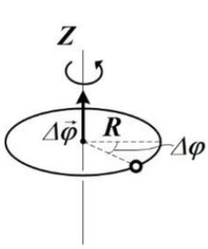

2) Ось вращения проходит через тело (тело вращается вокруг своей оси). 

    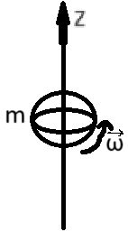

3) Ось на бесконечном расстоянии от тела.

    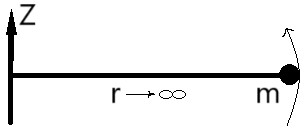

    В таком случае вращательное движение переходит в поступательное, например, люди ходят по Земле.

При переходе к вращательному движению вместо массы $m$ используют момент инерции $I$, который измеряется в килограммах на метр квадратный ($\text{кг} \cdot \text{м}^2$).

Для материальной точке, вращающейся вокруг оси Z на расстоянии r от неё справедлива формула момента инерции:

$$I_{\text{Материалльной точки}} = m \cdot r^{2}$$

Но в реальности практически нет материальных точек, поэтому эта формула редкая. Момент инерции ТЕЛА равен сумме моментов инерции всех материальных точек, составляющих тело.

Чтобы найти момент инерции всей системы, нужно сложить все моменты инерции всех тел.

Моменты инерции тел простой формы (относительно оси, проходящей через центр масс):

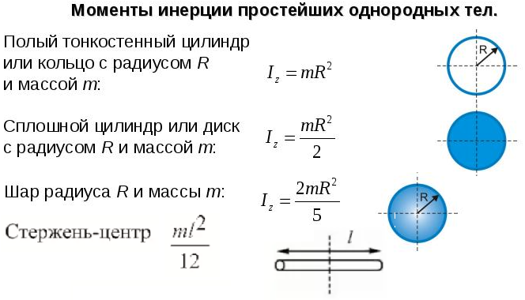

Для удобства копирования формул в формате LaTeX:

1) Тонкостенный циллиндр, обруч, кольцо: $I = m \cdot R^{2}$.
2) Сплошной циллиндр, диск: $I = \frac{m \cdot R^{2}}{2}$.
3) Сплошной шар: $I = \frac{2 \cdot m \cdot R^{2}}{5}$.
4) Стержень: $I = \frac{m \cdot L^{2}}{12}$.

**Теорема Штейнера**

Момент инерции тела относительно произвольной оси равен сумме момента инерции тела относительно оси, проходящей через центр масс и параллельной данной и произведения массы тела на квадрат расстония между осями $mb^{2}$.

$$I_{\text{Общее}} = I_{\text{Системы}} + mb^{2} \text{, где b - расстояние между осями}$$

Для примера, найдем момент инерции стержня массой m и длиной l, относительно оси, проходящей через его конец:

$$\begin{cases}
  I_{\text{Стержня}} = \frac{ml^{2}}{12} \\
  I_{\text{Общее}} = I_{\text{Стержня}} + mb^{2} \\
  b = \frac{l}{2}
\end{cases}$$

$$I_{\text{Общее}} = \frac{ml^{2}}{12} + m(\frac{l}{2})^{2} = \frac{ml^{2}}{12} + \frac{ml^{2}}{4} = \frac{ml^{2}}{3}$$

**Сравнение поступательного и вращательного движения**

| Динамика поступательного движения                                                                                 | Динамика вращательного движения                                                                                                                                         |
| ----------------------------------------------------------------------------------------------------------------- | ----------------------------------------------------------------------------------------------------------------------------------------------------------------------- |
| Основное уравнение динамики поступательного движения $$\sum \overrightarrow{F} = m \cdot \overrightarrow{a}$$     | $$\text{Основное уравнение динамики вращательного движения }\sum M = I \cdot \varepsilon_{\text{z}}$$                                                                   |
| $$[m] = 1 \text{ кг}$$                                                                                            | $$[I] = 1 \text{ кг} \cdot \text{м}^{2}$$                                                                                                                               |
| $$[a] = 1 \text{ м/с}^{2}$$                                                                                       | $$[\varepsilon_{\text{z}}] = 1 \text{ рад/с}^{2}$$                                                                                                                      |
| $$[F] = 1 \text{ Н}$$                                                                                             | $$[M] = 1 \text{ H} \cdot \text{м}$$                                                                                                                                    |
| $$\text{Cила: }\overrightarrow{F} = m \cdot \frac{d \overrightarrow{v}}{dt}$$                                     | $$\text{Момент силы: }M = F \cdot d \text{ Где d - плечо действия силы - кратчайшее расстояние от оси вращения, до прямой, проходящей через продолжение вектора силы.}$$ |
| $$\text{Выражение равенства импульса силы и импульса тела: }\overrightarrow{F}dt = m \cdot d \overrightarrow{v}$$ | $$\text{Выражение равенства момента импульса силы и момента импульса: }Mdt = I \cdot d \omega$$                                                                         |
| $$\text{Импульс: }\overrightarrow{p} = m \cdot \overrightarrow{v} \text{, } [p] = 1 \text{кг} \cdot \text{м/с}$$  | $$\text{Момент импульса: }L = I \cdot \omega \text{, } [L] = 1 \text{кг} \cdot \text{м}^{2}$$                                                                           |
| В замкнутой системе $\sum \overrightarrow{F}_{\text{Внеш.}} = 0$, поэтому:                                        | В замкнутой системе $\sum M_{\text{Внеш.}} = 0$, поэтому:                                                                                                               |
| $$m \cdot \frac{d \overrightarrow{v}}{dt} = 0$$                                                                   | $$I \cdot \frac{d \overrightarrow{\omega}}{dt} = 0$$                                                                                                                    |
| $$\text{Закон сохранения импульса: }m\overrightarrow{v} = \overrightarrow{p} = \text{const}$$                     | $$\text{Закон сохранения момента импульса: }I\overrightarrow{\omega} = \overrightarrow{L} = \text{const Или: }L = p \cdot r = mvr = m \omega rr = I \omega$$            |

При вращении тела вокруг разных осей момент инерции разный, допустим, у нас есть кирпич:

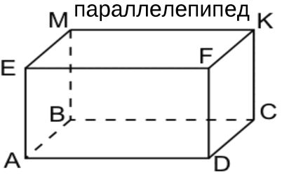

Ось OX параллельна BC и проходит через центр грани CDFK, ось OY параллельна AE, и проходит через центр грани ABCD, а ось OZ параллельна AB и проходит через центр AEFD.

В таком случае $I_{\text{z}} = max(I)$, $I_{\text{x}} = min(I)$.

Есть такое интересное наблюдение, что тело стремится вращаться вокруг осей, дающих минимальный и максимальный I, а вот вокруг оси, дающей средний момент инерции тело не спешит вращаться.

## 8. ~~Расчёт момента инерции тел простой формы~~

## 9. Импульс материальной точки. Закон сохранения импульса. Кинетическая энергия материальной точки.

`Импульс` (или количество движения) материальной точки определяется как произведение массы $m$ точки на ее скорость $v$:

$$\overrightarrow{p} = m \cdot \overrightarrow{v}$$

Где $p$ — импульс, $m$ — масса, $v$ — скорость. $[p] = 1 \text{кг} \cdot \text{м/с}$

`Закон сохранения импульса` гласит: в замкнутой системе суммарный импульс остается постоянным при любых взаимодействиях. Это можно записать следующим образом:

$$\sum \overrightarrow{p}_{\text{до}} = \sum \overrightarrow{p}_{\text{после}}$$

Где $\Sigma p_{\text{до}}$ — суммарный импульс системы до взаимодействия, а $\Sigma p_{\text{после}}$ — после взаимодействия.

Вывод этих двух формул есть в `7 билете`.

`Кинетическая энергия` — это энергия, которой обладает тело благодаря своему движению. Для материальной точки кинетическая энергия определяется как:

$$E_{\text{Кинетическая}} = \frac{mv^{2}}{2}$$

Где $E_{\text{Кин}}$ — кинетическая энергия, $m$ — масса, $v$ — скорость.

## 10. Работа, мощность. ~~Потенциальные и непотенциальные поля.~~ Консервативные и неконсервативные силы. Потенциальная энергия.


За маленькое время $dt$ точка перемещаается на $d\overrightarrow{s} = \overrightarrow{v}dt$. Пусть $\overrightarrow{F} = \Sigma \overrightarrow{F_{\text{n}}} = ma$, тогда:

$$\begin{cases}
  \overrightarrow{F} = m \cdot \frac{d\overrightarrow{v}}{dt} \\
  d\overrightarrow{S} = \overrightarrow{v} \cdot dt
\end{cases}$$

$$\overrightarrow{F}d\overrightarrow{S} = m\overrightarrow{v} \cdot \frac{d\overrightarrow{v}}{dt} \cdot dt$$

$$\overrightarrow{F}d\overrightarrow{S} = m\overrightarrow{v} \cdot d\overrightarrow{v}$$

A - работа, dA - элементарная работа:

$$dA = \overrightarrow{F} \cdot d\overrightarrow{S}$$

$$A = \int dA = \int^{2}_{1} \overrightarrow{F} \cdot d\overrightarrow{S} = \int^{2}_{1} F_{\text{S}} \cdot d\overrightarrow{S}$$

Перейдем к энергии:

$$m\overrightarrow{v} \cdot d\overrightarrow{v} = d(\frac{mv^{2}}{2})$$

$$dA = d(\frac{mv^{2}}{2})$$

$$E_{\text{Кин.}} = \frac{mv^{2}}{2}$$

$$dA = dE_{\text{Кин.}}$$

$$A = \Delta E_{\text{К}}$$

$$[A] = 1 \text{Дж. (Джоуль) или Н} \cdot \text{м}$$

$$[E] = 1 \text{Дж. (Джоуль)}$$

$$E_{\text{К}}\uparrow \Rightarrow E_{\text{2}} > E_{\text{1}} \text{, } A = E_{\text{2}} - E_{\text{1}} \text{, } A > 0$$

$$E_{\text{К}}\downarrow \Rightarrow E_{\text{2}} < E_{\text{1}} \text{, } A = E_{\text{2}} - E_{\text{1}} \text{, } A < 0$$

**CИЛЫ**
| Консервативные                                                                                                                                                                                                  | Неконсервативные                              |
| --------------------------------------------------------------------------------------------------------------------------------------------------------------------------------------------------------------- | --------------------------------------------- |
| Консервативные силы не тратят энергию, работа сил не зависит от траектории и определяется только начальным и конечным положением тела.                                                                          | Тратят энергию системы.                       |
| Примеры: $F_{\text{Тяж.}} \text{, } F_{\text{Упр.}} \text{, } F_{\text{Кул.}} \text{, } N, T$                                                                                                                   | $F_{\text{Трен.}} \text{, } F_{\text{Сопр.}}$ |
| 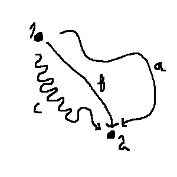                                                                                                                                                                                    |                                               |
| $$\begin{align*} A_{\text{a}}=A_{\text{b}}=A_{\text{c}} \\ \boxed{A^{\text{Конс}}=\oint\overrightarrow{F}\cdot d\overrightarrow{S}} \text{, где}\oint \text{ - интеграл по замкнутой траектории} \end{align*}$$ |                                               |
| $$A^{\text{Конс}} = E_{\text{п1}} - E_{\text{п2}} = -\Delta E_{\text{п}} \text{ - убыль потенциальной энергии}$$                                                                                                |                                               |

**Потенциальная энергия в поле силы тяжести**

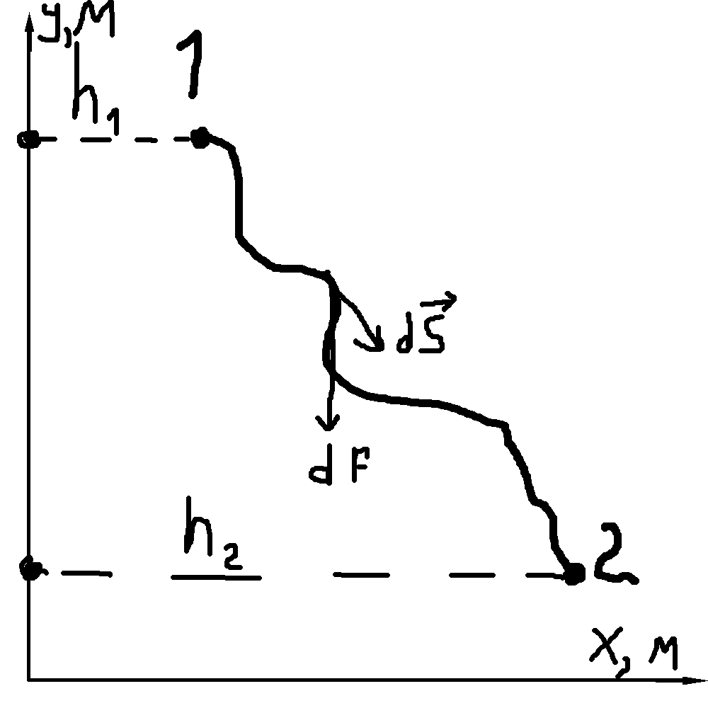

Тело $m$ движется из точки 1 в точку 2.

$$\begin{align*} dA = \overrightarrow{F} \cdot d\overrightarrow{S} \\ A = \int \overrightarrow{F} \cdot d\overrightarrow{S} = \\ = \int m\overrightarrow{g} \cdot d\overrightarrow{S} = \\ = -\int mgdS\cos{\alpha} = \\ = -\int^{h_{2}}_{h_{1}} mgdh = \\ = -mg\int^{h_{2}}_{h_{1}} dh = \\ = -mgh|^{h_{2}}_{h_{1}} = \\ = -mg(h_{2} - h_{1}) = \\ = mgh_{1} - mgh_{2} = \\ = E_{\text{п1}} - E_{\text{п2}} \end{align*}$$

$$\boxed{E_{\text{п}} = mgh + \text{const}}$$

Константа зависит от расстояния до центра Земли, ей обычно пренебрегают, потому что считают энергии, например, двух тел относительно стола или пола, в таком случае константа у них одинаковая, и ее можно убрать.

А работа силы тяжести, как выяснилось, равна убыли потенциальной энергии.

**Энергия упруго-деформированного тела**

$$A = \int \overrightarrow{F} d\overrightarrow{x} = \int -k\overrightarrow{x}d\overrightarrow{x} = -\int kxdx = -k\frac{x^{2}}{2}|^{x_{2}}_{x_{1}} = -\frac{kx^{2}_{2}}{2}- (-\frac{kx_{1}^{2}}{2}) = \frac{kx^{2}_{1}}{2} + \frac{kx^{2}_{2}}{2}$$

$$\boxed{E_{\text{Деф.}} = \frac{kx^{2}}{2}}$$

**Мощность**

Мощность показывает работу, совершенную за единицу времени.

$$P=\frac{A}{\Delta t}=\frac{dA}{dt}=\frac{\overrightarrow{F}d\overrightarrow{S}}{dt}=\overrightarrow{F}\cdot\overrightarrow{v}$$

$$[P] = 1 \text{ Вт (Ватт)}$$

**Закон сохранения энергии**

$$\begin{cases}
  A = A^{\text{Конс}} + A^{\text{Неконс}} \\
  A = \Delta E_{\text{к}} \\
  A = A^{\text{Конс}} = -\Delta E_{\text{п}}
\end{cases}$$

$$\Delta E_{\text{к}} = -\Delta E_{\text{п}} + A^{\text{Неконс}}$$

$$\Delta E_{\text{к}} + \Delta E_{\text{п}} = A^{\text{Неконс}}$$

$$\Delta (E_{\text{к}} + E_{\text{п}}) = A^{\text{Неконс}} \text{ - Сумма кин. и пот. энергии - механическая энергия}$$

$$\Delta E_{\text{мех}} = A^{\text{Неконс}}$$

В замкнутой системе, $A^{\text{Неконс}} = 0$, $\boxed{E_{\text{к}} + E_{\text{п}} = E_{\text{к2}} + E_{\text{п2}}}$ - Закон сохранения энергии.

**Энергия при вращательном движении**

$$\begin{cases}
  \overrightarrow{M}=I\overrightarrow{\varepsilon} \text{ } \overrightarrow{M}=I\frac{d\overrightarrow{\omega}}{dt} \\
  d\overrightarrow{\phi} = \overrightarrow{\omega}dt
\end{cases}$$

$$\overrightarrow{M}\cdot d\overrightarrow{\phi}=I\overrightarrow{\omega}\frac{d\overrightarrow{\omega}}{dt}\cdot dt$$

$$dA=Md\phi \cos{\alpha}$$

$$I\overrightarrow{\omega}d\overrightarrow{\omega} = d(\frac{I\omega^{2}}{2})$$

$$\boxed{E_{\text{к. вращ.}} = \frac{I\omega^{2}}{2}}$$

## 11. Закон всемирного тяготения. Поле тяготения и потенциальная энергия гравитационного взаимодействия.

`1. Сила всемирного тяготения (закон всемирного тяготения):`

$$\overrightarrow{F}_{\text{Всемирного тяготения}} = \Large G \normalsize \cdot \frac{m_{1} \cdot m_{2}}{r^{2}} \cdot \frac{\overrightarrow{r}}{r}$$

$\Large G \normalsize$ - Гравитационная постоянная, равная $6,67 \cdot 10^{-11} (\frac{\text{Н} \cdot \text{м}^{2}}{\text{кг}^{2}})$, $\frac{\overrightarrow{r}}{r}$ - единичный вектор для сохранения направления силы.

`2. Сила тяжести`

Сила тяжести выражается из закона всемирного тяготения и справедлива для тел, находящихся вблизи поверхности Земли, что упрощает расчеты, но делает их менее точными.

$$\overrightarrow{F}_{\text{В.т.}} = \Large G \normalsize \cdot \frac{m_{\text{Земли}} \cdot m_{2}}{r^{2}_{\text{Земли}}}$$

$$\Large G \normalsize \cdot \frac{m_{\text{Земли}}}{r^{2}_{\text{Земли}}} = |\overrightarrow{g}| \approx 9,8 \text{ м/с}^{2}$$

$$\overrightarrow{F}_{\text{Тяжести}} = m \cdot \overrightarrow{g}$$

`3. Поле тяготения` — это область пространства, в которой на каждую массу действует сила гравитации. Вектор напряженности гравитационного поля в данной точке определяется как сила, действующая на единичную массу, помещенную в эту точку:

$$\overrightarrow{g}=\frac{\overrightarrow{F}}{m}$$

Где $\overrightarrow{g}$ — напряженность гравитационного поля, $\overrightarrow{F}$ — сила гравитации, действующая на массу $m$.

`4. Потенциальная энергия гравитационного взаимодействия` двух точечных масс определяется выражением:

$$E_{\text{Пот.}} = - \Large G \normalsize \cdot \frac{m_{\text{1}} \cdot m_{2}}{r}$$

Где $E_{\text{Пот.}}$ — потенциальная энергия, $\Large G \normalsize$ — гравитационная постоянная, $m_{\text{1}}$ и $m_{\text{2}}$ — массы, $r$ — расстояние между ними.

## 12. Работа по перемещению тела в поле тяготения.


Тело $m$ движется из точки 1 в точку 2.

$$\begin{align*} dA = \overrightarrow{F} \cdot d\overrightarrow{S} \\ A = \int \overrightarrow{F} \cdot d\overrightarrow{S} = \\ = \int m\overrightarrow{g} \cdot d\overrightarrow{S} = \\ = -\int mgdS\cos{\alpha} = \\ = -\int^{h_{2}}_{h_{1}} mgdh = \\ = -mg\int^{h_{2}}_{h_{1}} dh = \\ = -mgh|^{h_{2}}_{h_{1}} = \\ = -mg(h_{2} - h_{1}) = \\ = mgh_{1} - mgh_{2} = \\ = E_{\text{п1}} - E_{\text{п2}} \end{align*}$$

$$A = mgh_{1}-mgh_{2}$$

Другими словами $A=-\Delta E_{\text{Пот.}}$ - работа равна убыли потенциальной энергии, если работу совершаем мы, и преодолеваем эту силу тяжести, тогда наоборот будет - прибыль потенциальной энергии.

## 13. Упругая деформация твердого тела. Коэффициент упругости. Энергия упругого деформирования.

**Воздействие на поверхность твердого тела. Упругие деформации.**

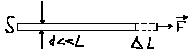

$S$ - площадь поперечного сечения, $L$ - длина, $\Delta L$ - абсолютное удлинение, $\varepsilon = \frac{\Delta L}{L} \cdot 100\%$ - относительное удлинение.

$\sigma = \frac{F}{S}$ - механическое напряжение.

$\sigma \sim \varepsilon$, $\sigma = E \cdot \varepsilon$ - закон Гука, $E$ - модуль Юнга, зависит от тела.

**Работа**

$dA=Pdx \text{, dx-малое удлинение}$, $dA=\sigma\cdot S\cdot dx$

$$dA=E\cdot\varepsilon\cdot S\cdot dx = E\varepsilon SL\text{\{SL=V\}}\cdot d\varepsilon = EV\varepsilon d\varepsilon$$

$$A=\int dA=\int EV\varepsilon d\varepsilon = EV\int \varepsilon d\varepsilon = \boxed{\frac{E\cdot\varepsilon^{2}}{2}\cdot V = W_{\text{Деф.}}}$$

Объемная плотность энергии $W=\frac{W_{\text{Деф.}}}{V} = \frac{E\cdot\varepsilon^{2}}{2}$

**Если заходить с другой стороны...**

Сила упругости возникает в упруго-деформированных телах.

Деформация - изменение размеров и формы тела.

1) Упругая деформация. При упругой деформации при прикращении внешнего воздействия на тело оно восстанавливает свою исходную форму и размер.
2) Неупругая деформация. После достижения некоторого предела деформации тело теряет свою исходную форму и размер безисходно.


1) Растяжение.
2) Сжатие.
3) Изгиб.
4) Кручение.
5) Сдвиг.

Для 1) и 2) можно найти силу упругости по следующей формуле:

$$F_{\text{Упругости}} = -k \cdot \Delta x$$

$k$ - коэффициент упругости, измеряется в ньютонах на метр (н/м), $\Delta x$ - величина деформации в метрах, $F_{\text{Упругости}}$ - измеряется в ньютонах, и направлена против деформации, о чём говорит знак "-".


Энергия в таком случае равна:

$$E_{\text{упр.деф.}}=\frac{kx^{2}}{2}$$

## 14. Колебательное движение и его характеристики: смещение, амплитуда, фаза, циклическая частота, период, скорость, ускорение.

* Колебательное движение является переодическим, T - `период` - время одного полного колебания, $[T] = 1\text{ с}$ (секунда).
* $\nu$ - частота колебаний - сколько колебаний происходит за одну секунду. $[\nu] = 1/\text{с}=\text{с}^{-1}=\text{Гц}$ (Герц).
* Циклическая частота колебаний: $\omega = 2\pi\nu = \frac{2\pi}{T} \text{, } [\omega] = 1/\text{с}$.
* Когда движение описывается по закону `sin` или `cos` оно гармоническое.

**Фазовая диаграмма**

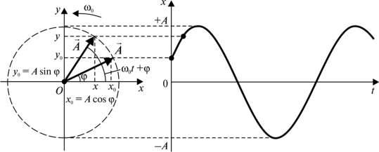

При вращении вектора $\overrightarrow{r}$, координата `x` будет изменяться по закону: $x=A\cos{(\omega t + \alpha)}$, где $A$ - `амплитуда` - максимальное отклонение от положения равновесия, $x$ - координата `смещения`, $\omega t + \alpha = \phi$ - `фаза колебаний`, $\omega$ - `циклическая частота`, $t$ - время (текущее), $\alpha$ - `начальная фаза` колебаний, откуда точка начала колебания.

$\cos{\phi} = \frac{x}{A}$, поэтому косинус, а не синус, но вдоль OY будет sin.

**Скорость и ускорение**

$$v_{\text{x}}=\frac{dx}{dt}=-A\sin{(\omega t + \alpha)} \cdot \omega = -A\omega\sin{(\omega t + \alpha)} \text{ - простая скорость}$$

$$v_{\text{max}}=A\omega \text{ - максимальная скорость}$$

$$v_{\text{x}}=A\omega\cos{(\omega t + \alpha + \frac{\pi}{2})} \text{ - простая скорость для косинуса}$$

$$a_{\text{x}}=\frac{dv}{dt}=-A\omega^{2}\cos{(\omega t + \alpha)} \text{ - простое ускорение}$$

$$a_{\text{max}}=A\omega^{2} \text{ - максимальное ускорение}$$

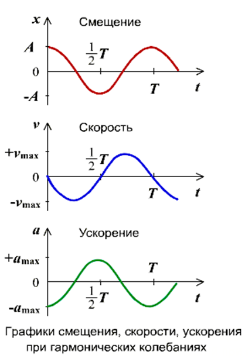

Ускорение опережает скорость по фазе на $\frac{\pi}{2}$, ускорение опережает смещение по фазе на $\pi$.

## 15. Векторные диаграммы для представления гармонических колебаний. Дифференциальное уравнение гармонических колебаний. Энергия колебательного движения.

Фазовая диаграмма из предыдущего билета - практически то же самое, но веткорная проще и нужна, в целом, для сложения колебаний.

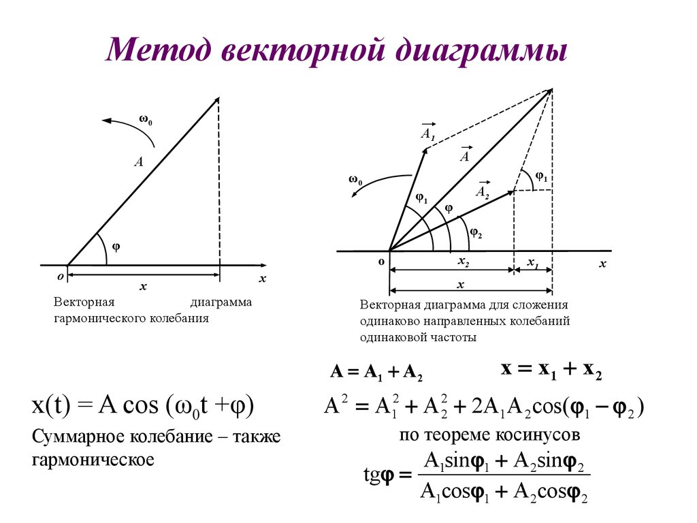

Гармонические колебания описываются дифференциальным уравнением второго порядка:

$$\frac{d^{2}x}{dt^2}+\omega^{2}x=0$$

Его решением является уравнение гармонических колебаний:

$$x=A\cos{(\omega t + \alpha)}$$

Энергия колебательного движения:

Кинетическая энергия, v из предыдущего билета: 

$$E_{\text{кин}}=\frac{1}{2}m(A\omega\sin{(\omega t + \alpha)})^{2}=\frac{1}{2}mA^{2}\omega^{2}\sin^{2}{(\omega t + \alpha)}$$

Потенциальная энергия: 
А вот потенциальная будет разная, в зависимости от типа колебательной системы, для примера возьмем идеальный пружинный маятник:

$$E_{\text{пот}}=\frac{kx^{2}}{2}$$

Для гармонического осциллятора $k=m\omega^{2}$, x из предыдущего билета, тогда:

$$E_{\text{пот}}=\frac{1}{2}m\omega^{2}(A\cos{(\omega t + \alpha)})^{2}=\frac{1}{2}mA^{2}\omega^{2}\cos^{2}{(\omega t + \alpha)}$$

Энергия колебательного движения сохраняется в идеальных условиях, где нет затухания.

Полная энергия является их суммой, а используя основное тригонометрическое тождество, можно получить:

$$E_{\text{полн}}=\frac{1}{2}mA^{2}\omega^{2}$$

Полная механическая энергия гармонического осциллятора остаётся постоянной и зависит только от массы, амплитуды и циклической частоты.

## 16. Математический и физический маятники.

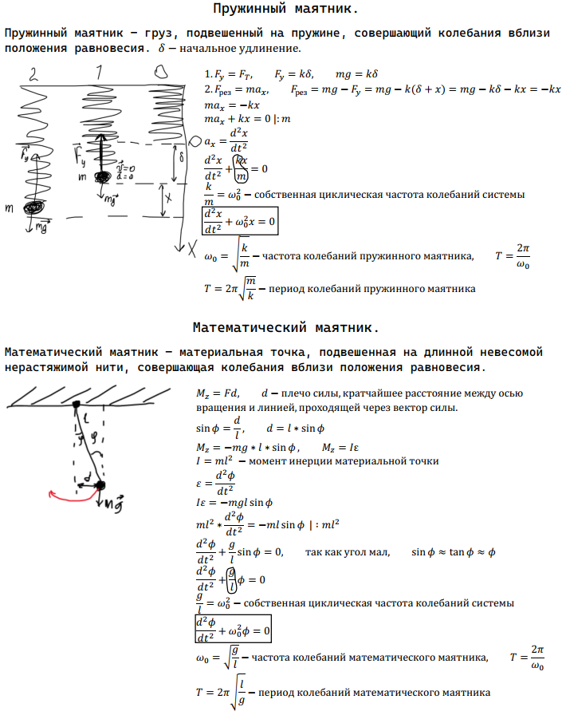

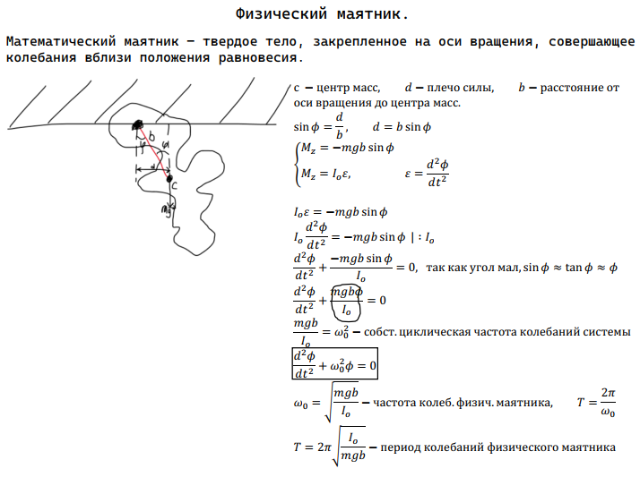

