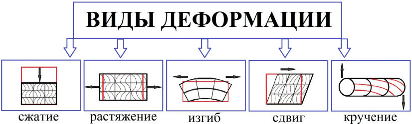
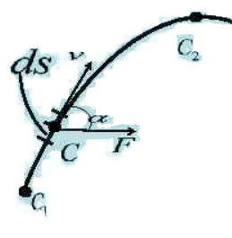
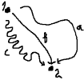

# Билеты для экзамена по физике 2024-2025гг. за первый семестр

# ВОПРОСЫ ДЛЯ ПОДГОТОВКИ К ЭКЗАМЕНУ «ФИЗИКА»

1. Кинематика материальной точки. Системы отсчета. Траектория, перемещение, путь, скорость, ускорение. Равномерное и равнопеременное прямолинейные движения.
2. Криволинейное движение. Нормальное и тангенциальное ускорения.
3. Движение точки по окружности. Угловые перемещение, скорость, ускорение. Связь между линейными и угловыми характеристиками.
4. Динамика материальной точки. Инерциальные системы отсчета и первый закон Ньютона.
5. Фундаментальные взаимодействия. Силы различной природы (упругие, гравитационные, трения). Второй закон Ньютона. Масса. Третий закон Ньютона.
6. Момент импульса и момент силы. ~~Уравнение моментов.~~ Закон сохранения момента импульса.
7. Вращение твердого тела относительно неподвижной оси. Основной закон динамики вращательного движения абсолютно твердого тела. Момент инерции.
8. ~~Расчёт момента инерции тел простой формы~~
9. Импульс материальной точки. Закон сохранения импульса. Кинетическая энергия материальной точки.
10. Работа, мощность. ~~Потенциальные и непотенциальные поля.~~ Консервативные и неконсервативные силы. Потенциальная энергия.
11. Закон всемирного тяготения. Поле тяготения и потенциальная энергия гравитационного взаимодействия.❗
12. Работа по перемещению тела в поле тяготения.
13. Упругая деформация твердого тела. Коэффициент упругости. Энергия упругого деформирования.
14. Колебательное движение и его характеристики: смещение, амплитуда, фаза, циклическая частота, период, скорость, ускорение.
15. Векторные диаграммы для представления гармонических колебаний. Дифференциальное уравнение гармонических колебаний. Энергия колебательного движения.❗
16. Математический и физический маятники.
17. Сложение параллельных колебаний одинаковой и разной частоты. Биения.
18. Сложение взаимно перпендикулярных колебаний. Фигуры Лиссажу.
19. Свободные затухающие колебания.
20. Вынужденные колебания. Резонанс.
21. Волновое движение. Уравнение плоской незатухающей бегущей волны.
22. Термодинамическая система. Параметры состояния термодинамической системы. Основные положения молекулярно-кинетической теории газов.
23. Закон равномерного распределения энергии по степеням свободы молекул. Основное уравнение молекулярно-кинетической теории газов (уравнение Клаузиуса).
24. Уравнение состояния идеального газа.
25. Закон Максвелла распределения молекул по скоростям теплового движения. Барометрическая формула. Распределение Больцмана.
26. Средняя длина свободного пробега молекулы. Явления переноса. Диффузия, вязкость, теплопроводность.
27. Первый закон термодинамики. Работа, теплота, теплоемкость, ее виды.
28. Изобарный, изотермический, изохорный, адиабатный процессы. ~~Уравнение Пуассона.~~
29. Тепловые двигатели и холодильные машины. Цикл Карно.
30. Электрический заряд и его свойства. Закон сохранения электрического заряда. Закон Кулона. ~~Диэлектричеекая пропицаемость и ее физичеекий смысл.~~
31. Электрическое поле. Напряженность поля. Поле точечного заряда. Графическое изображение электростатических полей. Принцип суперпозиции полей. Поле системы зарядов.
32. Энергетическая характеристика электростатического поля - потенциал. Потенциал поля точечного заряда и системы зарядов. Связь между напряженностью электрического поля и потенциалом.
33. Работа сил электростатического поля по перемещению зарядов. Циркуляция вектора напряженности. Потенциальный характер электростатического поля.

## 1. Кинематика материальной точки. Системы отсчета. Траектория, перемещение, путь, скорость, ускорение. Равномерное и равнопеременное прямолинейные движения.

#### Кинематика материальной точки

`Механическое движение` - изменение координаты тела относительно других тел со временем.

`Система отсчета` - это совокупность **тела отсчета**, связанной с ним **системы координат** и **часов**, с помощью которых определяется положение и время движения точки.

`Материальная точка` - тело, размером и формой которого в условиях данной задачи можно пренебречь.

`Траектория` - линия, которую описывает материальная точка при своем движении.

`Путь` - скалярная величина, расстояние, пройденное телом за время $t$. Обозначается $S$ и измеряется в метрах (м). Путь - это длина траектории.

`Перемещение` - векторная величина - вектор соединяющий начальное и конечное положение точки. Обозначается $\Delta \overrightarrow{r}$ и измеряется в метрах.

Путь может быть больше модуля перемещения, а наоборот быть не может.

$$\boxed{S \geq |\Delta \overrightarrow{r}|}$$

`Скорость` - это векторная величина, определяющая скорость изменения координат точки с течением времени. Обозначается $\overrightarrow{v}$ и измеряется в метрах в секунду (м/с).

$$v_{\text{Средняя путевая}} = \frac{S}{t}$$

$$\overrightarrow{v}_{\text{Средняя по перемещению}} = \frac{\Delta \overrightarrow{r} }{\Delta t}$$

```math
\overrightarrow{v}_{\text{Мгновенная}} = \frac{d \overrightarrow{r} }{dt} = \overrightarrow{r}_{t}'
```

`Скорость по осям`:

$$v_{\text{x}} = \frac{dx}{dt} \text{, } v_{\text{y}} = \frac{dy}{dt} \text{, } v_{\text{z}} = \frac{dz}{dt}$$

$$|\overrightarrow{v}| = \sqrt{v_{\text{x}}^{2} + v_{\text{y}}^{2} + v_{\text{z}}^{2}}$$

$$\overrightarrow{v} = \overrightarrow{i}v_{\text{x}} + \overrightarrow{j}v_{\text{y}} + \overrightarrow{k}v_{\text{z}}$$

`Ускорение` - это векторная величина, характеризующая быстроту изменения скорости точки с течением времени. Обозначается $\overrightarrow{a}$ и измеряется в метрах на секунду в квадрате $(м/\text{c}^{2})$.

$$\overrightarrow{a} = \frac{d \overrightarrow{v} }{dt} = \frac{d^{2} \overrightarrow{r} }{dt^{2}}$$

`Ускорение по осям`:

$$a_{\text{x}} = \frac{dv_{\text{x}}}{dt} = \frac{d^{2}x}{dt^{2}} \text{, } a_{\text{y}} = \frac{dv_{\text{y}}}{dt} = \frac{d^{2}y}{dt^{2}} \text{, } a_{\text{z}} = \frac{dv_{\text{z}}}{dt} = \frac{d^{2}z}{dt^{2}}$$

$$|\overrightarrow{a}| = \sqrt{a_{\text{x}}^{2} + a_{\text{y}}^{2} + a_{\text{z}}^{2}}$$

$$\overrightarrow{a} = \overrightarrow{i}a_{\text{x}} + \overrightarrow{j}a_{\text{y}} + \overrightarrow{k}a_{\text{z}}$$

`Равномерное прямолинейное движение` - движение, при котором скорость точки постоянна и траектория представляет собой прямую линию.

$$\overrightarrow{v} = const, \text{ } \overrightarrow{a} = 0$$

`Равнопеременное прямолинейное движение` - движение, при котором ускорение точки постоянно, а скорость изменяется линейно. При таком движении траектория - все так же прямая линия.

```math
\overrightarrow{v} = \overrightarrow{v}_{0} + \overrightarrow{a} t, \text{ } \overrightarrow{x} = \overrightarrow{x}_{0} + \overrightarrow{v}_{0} t + \frac{\overrightarrow{a} t^{2}}{2}
```

## 2. Криволинейное движение. Нормальное и тангенциальное ускорения.

`Криволиненое движение` - движение по траектории, не являющейся прямой линией. Такую траекторию можно разбить на несколько прямолинейных движений (в разные стороны), иногда, такая траектория имеет еще и участки с движением по окружности.


`Поступательное движение` - такой вид движения, при котором линия, проведенная через тело, остается параллельной самой себе (см. рисунок выше). Его можно разбить на много прямолинейных участков, как будто тело движется по ломаной линии, но все еще не вращается.

**Движение по окружности**


$R$ - `Радиус окружности`

$\overrightarrow{a}_{n}$ - нормальное (`центростремительное ускорение`), отвечает за изменение направления вектора $\overrightarrow{v}$.

$$\overrightarrow{a}_{n} = \frac{\overrightarrow{v}^{2}}{R}$$

$\overrightarrow{a}_{\tau}$ - `тангенциальное ускорение`, отвечает за изменение модуля скорости.

$$\overrightarrow{a}_{\tau} = \frac{d \overrightarrow{v}}{dt}$$

Если $\overrightarrow{v}$ увеличивается, то вектора $\overrightarrow{v}$ и $\overrightarrow{a}_{\tau}$ сонаправлены, если $\overrightarrow{v}$ уменьшается, то векторы направлены в противоположные стороны.

Полное ускорение:
```math
\overrightarrow{a} = \overrightarrow{a}_{n} + \overrightarrow{a}_{\tau}
```

```math
|\overrightarrow{a}| = \sqrt{\overrightarrow{a}_{n}^{2} + \overrightarrow{a}_{\tau}^{2}}
```

Движение по окружности - это всегда движение с ускорением.

Стрелки часов движутся с ускорением:

```math
\overrightarrow{a}_{n} \ne 0 \text{, } \overrightarrow{a}_{\tau} = 0
```

## 3. Движение точки по окружности. Угловые перемещение, скорость, ускорение. Связь между линейными и угловыми характеристиками.

**Кинематика вращательного движения**

$\phi$ - греческая буква ФИ, ей обозначают `угол поворота`. Измеряестя в радианах (рад). $\pi \text{ рад} = 180^{\circ} \text{, } 1 \text{ рад} \approx 57,3^{\circ}$

$\omega$ - маленькая омега - `угловая скорость`, характеризует скорость изменения угла, измеряется в радианах в секунду (рад/с).

$\varepsilon$ - маленький эпсилон - `угловое ускорение`, показывает быстроту изменения угловой скорости, измеряется в радианах на секунду в квадрате $(рад/\text{c}^{2})$.

**Связь с линейными характеристиками**

| Поступательное движение                                             | Вращательное движение                                                                 |
| ------------------------------------------------------------------- | ------------------------------------------------------------------------------------- |
| $$[x] = 1 \text{м}$$                                                | $$[\phi] = 1 \text{рад}$$                                                             |
| $$[v] = 1 \text{м/c}$$                                              | $$[\omega] = 1 \text{рад/с}$$                                                         |
| $$[a] = 1 \text{м/c}^{2}$$                                          | $$[\varepsilon] = 1 \text{рад/с}^{2}$$                                                |
| $$v_{\text{x}} = \frac{dx}{dt}$$                                    | $$\omega_{\text{z}} = \frac{d\phi}{dt}$$                                              |
| $$a_{\text{x}} = \frac{dv_{\text{x}}}{dt} = \frac{d^{2}x}{dt^{2}}$$ | $$\varepsilon_{\text{z}} = \frac{d\omega_{\text{z}}}{dt} = \frac{d^{2}\phi}{dt^{2}}$$ |
| **Связь линейных и угловых характеристик:**                         | **Связь линейных и угловых характеристик:**                                           |
| $$S = \phi \cdot R$$                                                | $$a_{\tau} = \varepsilon \cdot R$$                                                    |
| $$v = \omega \cdot R$$                                              | $$a_{\text{n}} = \omega^{2} \cdot R$$                                                 |
| **Равномерное движение**                                            | **Равномерное движение**                                                              |
| $$x = x_{0} + v_{\text{x}} \cdot t$$                                | $$\phi = \phi_{0} + \omega_{\text{z}} \cdot t$$                                       |
| **Равнопеременное движение:**                                       | **Равнопеременное движение:**                                                         |
| $$v = v_{0\text{x}} \pm a_{\text{x}}t$$                             | $$\omega = \omega_{0\text{z}} \pm \varepsilon_{\text{z}}t$$                           |
| $$x = x_{0} + v_{0\text{x}}t \pm \frac{a_{\text{x}}t^{2}}{2}$$      | $$\phi = \phi_{0} + \omega_{0\text{z}}t \pm \frac{\varepsilon_{\text{z}}t^{2}}{2}$$   |

## 4. Динамика материальной точки. Инерциальные системы отсчета и первый закон Ньютона.

**Динамика поступательного движения**

I закон Ньютона об инерциальных системах отсчета (ИСО).

```txt
Существуют такие системы отсчета, в которых, если на тело не действуют силы, или их действие скомпенсировано (Векторная сумма всех сил, действующих на тело, равна нулю.), тело будет покоиться или двигаться равномерно и прямолинейно.
```

Неинерциальные системы отсчета (НИСО) - это системы отсчета, движущиеся с ускорением относительно ИСО, например, лифт, набирающий скорость.

## 5. Фундаментальные взаимодействия. Силы различной природы (упругие, гравитационные, трения). Второй закон Ньютона. Масса. Третий закон Ньютона.

**Масса** - скалярная физическая величина, измеряется в килограммах (кг) и отражает инертность тела - то, насколько трудно телу придать ускорение.

### **II Закон Ньютона:**

```txt
Ускорение тела прямо пропорционально приложенной к нему силе и обратно пропорционально его массе.
```

$$\sum \overrightarrow{F} = m \cdot \overrightarrow{a}$$

$\Sigma$ - большая греческая буква "Сигма", обозначает сумму, в данном случае - векторную, как на рисунке ниже.


$\overrightarrow{F}$ - сила, векторная величина, измеряемая в Ньютонах (Н).

$m$ - масса, скалярная величина, измеряется в килограммах (кг).

$$\overrightarrow{a} = \frac{d\overrightarrow{v}}{dt}$$

$$\overrightarrow{F} = m \cdot \frac{d\overrightarrow{v}}{dt}$$

$$\overrightarrow{F} \cdot dt = m \cdot d\overrightarrow{v}$$

Где левая часть - импульс силы ($\overrightarrow{F} \cdot t$), а правая - импульс тела ($p = mv$)

В замкнутой системе ($F = 0$):

$$m \cdot \frac{d\overrightarrow{v}}{dt} = 0$$

$$m \cdot \overrightarrow{v} = const \text{ - закон сохранения импульса}$$

### **III Закон Ньютона**

```txt
Силы, с которыми два тела действуют друг на друга, равны по величине и противоположны по направлению.
```

```math
\overrightarrow{F}_{12} = - \overrightarrow{F}_{21}
```

### **Силы различной природы**

`1. Сила всемирного тяготения (закон всемирного тяготения):`

```math
\overrightarrow{F}_{\text{Всемирного тяготения}} = G \cdot \frac{m_{1} \cdot m_{2}}{r^{2}} \cdot \frac{\overrightarrow{r}}{r}
```

$G$ - Гравитационная постоянная, равная $6,67 \cdot 10^{-11} (\frac{\text{Н} \cdot \text{м}^{2}}{\text{кг}^{2}})$, $\frac{\overrightarrow{r}}{r}$ - единичный вектор для сохранения направления силы.

`2. Сила тяжести`

Сила тяжести выражается из закона всемирного тяготения и справедлива для тел, находящихся вблизи поверхности Земли, что упрощает расчеты, но делает их менее точными.

```math
\overrightarrow{F}_{\text{В.т.}} = G \cdot \frac{m_{\text{Земли}} \cdot m_{2}}{r^{2}_{\text{Земли}}}
```

$$G \cdot \frac{m_{\text{Земли}}}{r^{2}_{\text{Земли}}} = |\overrightarrow{g}| \approx 9,8 \text{ м/с}^{2}$$

$$\overrightarrow{F}_{\text{Тяжести}} = m \cdot \overrightarrow{g}$$

`3. Вес`

Вес - сила, с которой тело давит на опору или растягивает нить подвеса. Вес действует именно на ОПОРУ, а не на ТЕЛО. Тело, находящееся в невесомости и/или в свободном падении не создает никакого веса. Вес обозначается $\overrightarrow{P}$ и измеряется в ньютонах (Н).

`4. Сила реакции опоры`


Сила, по III закону Ньютона, появляющаяся вместе с весом, и имеющая противоположное с ним направление и равная ему по модулю $\overrightarrow{P} = - \overrightarrow{N}$. Эта сила, в отличие от веса, действует не на опору или подвес, а на тело. Обозначается $\overrightarrow{N}$ и измеряется в ньютонах (Н).

`5. Сила трения`


Сила трения направлена против движения/предполагаемого направления движения. Сила действует на тело и измеряется в ньютонах.

$$F_{\text{Трения}} = \mu \cdot N$$

Коэффициент трения $\mu$ уникален почти для каждого случая, зависит от поверхностей, их шершавости, материала, а так же от вида трения (покоя, скольжения, качения). Он не имеет единицы измерения. Трение покоя - самое большое из всех трех.

`6. Сила упругости`

Сила упругости возникает в упруго-деформированных телах.

Деформация - изменение размеров и формы тела.

1) Упругая деформация. При упругой деформации при прикращении внешнего воздействия на тело оно восстанавливает свою исходную форму и размер.
2) Неупругая деформация. После достижения некоторого предела деформации тело теряет свою исходную форму и размер безисходно.



1) Растяжение.
2) Сжатие.
3) Изгиб.
4) Кручение.
5) Сдвиг.

Для 1) и 2) можно найти силу упругости по следующей формуле:

$$F_{\text{Упругости}} = -k \cdot \Delta x$$

$k$ - коэффициент упругости, измеряется в ньютонах на метр (н/м), $\Delta x$ - величина деформации в метрах, $F_{\text{Упругости}}$ - измеряется в ньютонах, и направлена против деформации, о чём говорит знак "-".


## 6. Момент импульса и момент силы. ~~Уравнение моментов.~~ Закон сохранения момента импульса.

`Момент импульса` (или угловой момент) материальной точки относительно некоторой оси определяется как векторное произведение радиус-вектора $r$, проведенного из начала отсчета к этой точке, на ее импульс $p$:

$$\overrightarrow{L} = \overrightarrow{r} \cdot \overrightarrow{p}$$

где $\overrightarrow{L}$ — момент импульса, $\overrightarrow{r}$ — радиус-вектор, $\overrightarrow{p} = m \cdot \overrightarrow{v}$ — импульс точки (масса умноженная на скорость).

`Момент силы` относительно точки или оси — это векторное произведение радиус-вектора $\overrightarrow{r}$ на силу $\overrightarrow{F}$:

$$\overrightarrow{M} = \overrightarrow{r} \cdot \overrightarrow{F}$$

где $\overrightarrow{M}$ — момент силы, $\overrightarrow{F}$ — радиус-вектор, проведенный из начала отсчета к точке приложения силы, $\overrightarrow{F}$ — сила.

`Закон сохранения момента` импульса гласит, что если сумма внешних моментов сил, действующих на систему, равна нулю, то момент импульса системы остается постоянным:

$$\frac{dL}{dt} = \sum M_{\text{Внешние}} = 0 \Rightarrow \overrightarrow{L} = \text{const}$$

То есть, в отсутствие внешних моментов сил, момент импульса изолированной системы сохраняется.

Другая трактовка:

$$L = I \cdot \omega$$

$$I_{1} \cdot \omega_{1} = I_{2} \cdot \omega_{2}$$

Где I - момент инерции, а $\omega$ - циклическая частота.

## 7. Вращение твердого тела относительно неподвижной оси. Основной закон динамики вращательного движения абсолютно твердого тела. Момент инерции.

**Динамика вращательного движения**

Вращательное движение описывается по-разному в зависимости от расположения тела и оси:

1)  Ось вращения вблизи тела (см. \#\# 2. Криволинейное движение. Нормальное и тангенциальное ускорения.).

    

2) Ось вращения проходит через тело (тело вращается вокруг своей оси). 

    

3) Ось на бесконечном расстоянии от тела.

    

    В таком случае вращательное движение переходит в поступательное, например, люди ходят по Земле.

При переходе к вращательному движению вместо массы $m$ используют момент инерции $I$, который измеряется в килограммах на метр квадратный ($\text{кг} \cdot \text{м}^2$).

Для материальной точке, вращающейся вокруг оси Z на расстоянии r от неё справедлива формула момента инерции:

$$I_{\text{Материалльной точки}} = m \cdot r^{2}$$

Но в реальности практически нет материальных точек, поэтому эта формула редкая. Момент инерции ТЕЛА равен сумме моментов инерции всех материальных точек, составляющих тело.

Чтобы найти момент инерции всей системы, нужно сложить все моменты инерции всех тел.

Моменты инерции тел простой формы (относительно оси, проходящей через центр масс):


Для удобства копирования формул в формате LaTeX:

1) Тонкостенный циллиндр, обруч, кольцо: $I = m \cdot R^{2}$.
2) Сплошной циллиндр, диск: $I = \frac{m \cdot R^{2}}{2}$.
3) Сплошной шар: $I = \frac{2 \cdot m \cdot R^{2}}{5}$.
4) Стержень: $I = \frac{m \cdot L^{2}}{12}$.

**Теорема Штейнера**

Момент инерции тела относительно произвольной оси равен сумме момента инерции тела относительно оси, проходящей через центр масс и параллельной данной и произведения массы тела на квадрат расстония между осями $mb^{2}$.

$$I_{\text{Общее}} = I_{\text{Системы}} + mb^{2} \text{, где b - расстояние между осями}$$

Для примера, найдем момент инерции стержня массой m и длиной l, относительно оси, проходящей через его конец:

$$\begin{cases}
  I_{\text{Стержня}} = \frac{ml^{2}}{12} \\
  I_{\text{Общее}} = I_{\text{Стержня}} + mb^{2} \\
  b = \frac{l}{2}
\end{cases}$$

$$I_{\text{Общее}} = \frac{ml^{2}}{12} + m(\frac{l}{2})^{2} = \frac{ml^{2}}{12} + \frac{ml^{2}}{4} = \frac{ml^{2}}{3}$$

**Сравнение поступательного и вращательного движения**

| Динамика поступательного движения                                                                | Динамика вращательного движения                                                                                            |
| ------------------------------------------------------------------------------------------------ | -------------------------------------------------------------------------------------------------------------------------- |
| **Основное уравнение динамики поступательного движения**                                         | **Основное уравнение динамики вращательного движения**                                                                     |
| $$\sum \overrightarrow{F} = m \cdot \overrightarrow{a}$$                                         | $$\sum M = I \cdot \varepsilon_{\text{z}}$$                                                                                |
| $$[m] = 1 \text{ кг}$$                                                                           | $$[I] = 1 \text{ кг} \cdot \text{м}^{2}$$                                                                                  |
| $$[a] = 1 \text{ м/с}^{2}$$                                                                      | $$[\varepsilon_{\text{z}}] = 1 \text{ рад/с}^{2}$$                                                                         |
| $$[F] = 1 \text{ Н}$$                                                                            | $$[M] = 1 \text{ H} \cdot \text{м}$$                                                                                       |
| **Cила:**                                                                                        | **Момент силы:**                                                                                                           |
| $$\overrightarrow{F} = m \cdot \frac{d \overrightarrow{v}}{dt}$$                                 | $$M = F \cdot d$$                                                                                                          |
|                                                                                                  | Где d - плечо действия силы - кратчайшее расстояние от оси вращения, до прямой, проходящей через продолжение вектора силы. |
| **Выражение равенства импульса силы и импульса тела:**                                           | **Выражение равенства момента импульса силы и момента импульса:**                                                          |
| $$\overrightarrow{F}dt = m \cdot d \overrightarrow{v}$$                                          | $$Mdt = I \cdot d \omega$$                                                                                                 |
| **Импульс:**                                                                                     | **Момент импульса:**                                                                                                       |
| $$\overrightarrow{p} = m \cdot \overrightarrow{v} \text{, } [p] = 1 \text{кг} \cdot \text{м/с}$$ | $$L = I \cdot \omega \text{, } [L] = 1 \text{кг} \cdot \text{м}^{2}$$                                                      |
| В замкнутой системе $\sum \overrightarrow{F}_{\text{Внеш.}} = 0$, поэтому:                       | В замкнутой системе $\sum M_{\text{Внеш.}} = 0$, поэтому:                                                                  |
| $$m \cdot \frac{d \overrightarrow{v}}{dt} = 0$$                                                  | $$I \cdot \frac{d \overrightarrow{\omega}}{dt} = 0$$                                                                       |
| **Закон сохранения импульса:**                                                                   | **Закон сохранения момента импульса:**                                                                                     |
| $$m\overrightarrow{v} = \overrightarrow{p} = \text{const}$$                                      | $$I\overrightarrow{\omega} = \overrightarrow{L} = \text{const}$$                                                           |
|                                                                                                  | $$\text{Или: }L = p \cdot r = mvr = m \omega rr = I \omega$$                                                               |

При вращении тела вокруг разных осей момент инерции разный, допустим, у нас есть кирпич:


Ось OX параллельна BC и проходит через центр грани CDFK, ось OY параллельна AE, и проходит через центр грани ABCD, а ось OZ параллельна AB и проходит через центр AEFD.

В таком случае $I_{\text{z}} = max(I)$, $I_{\text{x}} = min(I)$.

Есть такое интересное наблюдение, что тело стремится вращаться вокруг осей, дающих минимальный и максимальный I, а вот вокруг оси, дающей средний момент инерции тело не спешит вращаться.

## 8. ~~Расчёт момента инерции тел простой формы~~

## 9. Импульс материальной точки. Закон сохранения импульса. Кинетическая энергия материальной точки.

`Импульс` (или количество движения) материальной точки определяется как произведение массы $m$ точки на ее скорость $v$:

$$\overrightarrow{p} = m \cdot \overrightarrow{v}$$

Где $p$ — импульс, $m$ — масса, $v$ — скорость. $[p] = 1 \text{кг} \cdot \text{м/с}$

`Закон сохранения импульса` гласит: в замкнутой системе суммарный импульс остается постоянным при любых взаимодействиях. Это можно записать следующим образом:

```math
\sum \overrightarrow{p}_{\text{до}} = \sum \overrightarrow{p}_{\text{после}}
```

Где $\Sigma p_{\text{до}}$ — суммарный импульс системы до взаимодействия, а $\Sigma p_{\text{после}}$ — после взаимодействия.

Вывод этих двух формул есть в `7 билете`.

`Кинетическая энергия` — это энергия, которой обладает тело благодаря своему движению. Для материальной точки кинетическая энергия определяется как:

$$E_{\text{Кинетическая}} = \frac{mv^{2}}{2}$$

Где $E_{\text{Кин}}$ — кинетическая энергия, $m$ — масса, $v$ — скорость.

## 10. Работа, мощность. ~~Потенциальные и непотенциальные поля.~~ Консервативные и неконсервативные силы. Потенциальная энергия.



За маленькое время $dt$ точка перемещаается на $d\overrightarrow{s} = \overrightarrow{v}dt$. Пусть $\overrightarrow{F} = \Sigma \overrightarrow{F_{\text{n}}} = ma$, тогда:

$$\begin{cases}
  \overrightarrow{F} = m \cdot \frac{d\overrightarrow{v}}{dt} \\
  d\overrightarrow{S} = \overrightarrow{v} \cdot dt
\end{cases}$$

$$\overrightarrow{F}d\overrightarrow{S} = m\overrightarrow{v} \cdot \frac{d\overrightarrow{v}}{dt} \cdot dt$$

$$\overrightarrow{F}d\overrightarrow{S} = m\overrightarrow{v} \cdot d\overrightarrow{v}$$

A - работа, dA - элементарная работа:

$$dA = \overrightarrow{F} \cdot d\overrightarrow{S}$$

```math
A = \int dA = \int^{2}_{1} \overrightarrow{F} \cdot d\overrightarrow{S} = \int^{2}_{1} F_{\text{S}} \cdot d\overrightarrow{S}
```

Перейдем к энергии:

$$m\overrightarrow{v} \cdot d\overrightarrow{v} = d(\frac{mv^{2}}{2})$$

$$dA = d(\frac{mv^{2}}{2})$$

$$E_{\text{Кин.}} = \frac{mv^{2}}{2}$$

$$dA = dE_{\text{Кин.}}$$

$$A = \Delta E_{\text{К}}$$

$$[A] = 1 \text{Дж. (Джоуль) или Н} \cdot \text{м}$$

$$[E] = 1 \text{Дж. (Джоуль)}$$

$$E_{\text{К}}\uparrow \Rightarrow E_{\text{2}} > E_{\text{1}} \text{, } A = E_{\text{2}} - E_{\text{1}} \text{, } A > 0$$

$$E_{\text{К}}\downarrow \Rightarrow E_{\text{2}} < E_{\text{1}} \text{, } A = E_{\text{2}} - E_{\text{1}} \text{, } A < 0$$

**CИЛЫ**
| Консервативные                                                                                                                         | Неконсервативные                              |
| -------------------------------------------------------------------------------------------------------------------------------------- | --------------------------------------------- |
| Консервативные силы не тратят энергию, работа сил не зависит от траектории и определяется только начальным и конечным положением тела. | Тратят энергию системы.                       |
| Примеры: $F_{\text{Тяж.}} \text{, } F_{\text{Упр.}} \text{, } F_{\text{Кул.}} \text{, } N, T$                                          | $F_{\text{Трен.}} \text{, } F_{\text{Сопр.}}$ |
|                                                                                                            |                                               |
| $$A_{\text{a}}=A_{\text{b}}=A_{\text{c}}$$                                                                                             |                                               |
| $$\boxed{A^{\text{Конс}}=\oint\overrightarrow{F}\cdot d\overrightarrow{S}}$$                                                           |                                               |
| $$\text{Где}\oint \text{ - интеграл по замкнутой траектории}$$                                                                       |                                               |
| $$A^{\text{Конс}} = E_{\text{п1}} - E_{\text{п2}} = -\Delta E_{\text{п}} \text{ - убыль потенциальной энергии}$$                       |                                               |

**Потенциальная энергия в поле силы тяжести**


Тело $m$ движется из точки 1 в точку 2.

```math
\begin{align*} dA = \overrightarrow{F} \cdot d\overrightarrow{S} \\ A = \int \overrightarrow{F} \cdot d\overrightarrow{S} = \\ = \int m\overrightarrow{g} \cdot d\overrightarrow{S} = \\ = -\int mgdS\cos{\alpha} = \\ = -\int^{h_{2}}_{h_{1}} mgdh = \\ = -mg\int^{h_{2}}_{h_{1}} dh = \\ = -mgh|^{h_{2}}_{h_{1}} = \\ = -mg(h_{2} - h_{1}) = \\ = mgh_{1} - mgh_{2} = \\ = E_{\text{п1}} - E_{\text{п2}} \end{align*}
```

$$\boxed{E_{\text{п}} = mgh + \text{const}}$$

Константа зависит от расстояния до центра Земли, ей обычно пренебрегают, потому что считают энергии, например, двух тел относительно стола или пола, в таком случае константа у них одинаковая, и ее можно убрать.

А работа силы тяжести, как выяснилось, равна убыли потенциальной энергии.

**Энергия упруго-деформированного тела**

```math
A = \int \overrightarrow{F} d\overrightarrow{x} = \int -k\overrightarrow{x}d\overrightarrow{x} = -\int kxdx = -k\frac{x^{2}}{2}|^{x_{2}}_{x_{1}} = -\frac{kx^{2}_{2}}{2}- (-\frac{kx_{1}^{2}}{2}) = \frac{kx^{2}_{1}}{2} + \frac{kx^{2}_{2}}{2}
```

$$\boxed{E_{\text{Деф.}} = \frac{kx^{2}}{2}}$$

**Мощность**

Мощность показывает работу, совершенную за единицу времени.

$$P=\frac{A}{\Delta t}=\frac{dA}{dt}=\frac{\overrightarrow{F}d\overrightarrow{S}}{dt}=\overrightarrow{F}\cdot\overrightarrow{v}$$

$$[P] = 1 \text{ Вт (Ватт)}$$

**Закон сохранения энергии**

$$\begin{cases}
  A = A^{\text{Конс}} + A^{\text{Неконс}} \\
  A = \Delta E_{\text{к}} \\
  A = A^{\text{Конс}} = -\Delta E_{\text{п}}
\end{cases}$$

$$\Delta E_{\text{к}} = -\Delta E_{\text{п}} + A^{\text{Неконс}}$$

$$\Delta E_{\text{к}} + \Delta E_{\text{п}} = A^{\text{Неконс}}$$

$$\Delta (E_{\text{к}} + E_{\text{п}}) = A^{\text{Неконс}} \text{ - Сумма кин. и пот. энергии - механическая энергия}$$

$$\Delta E_{\text{мех}} = A^{\text{Неконс}}$$

В замкнутой системе, $A^{\text{Неконс}} = 0$, $\boxed{E_{\text{к}} + E_{\text{п}} = E_{\text{к2}} + E_{\text{п2}}}$ - Закон сохранения энергии.

**Энергия при вращательном движении**

$$\begin{cases}
  \overrightarrow{M}=I\overrightarrow{\varepsilon} \text{ } \overrightarrow{M}=I\frac{d\overrightarrow{\omega}}{dt} \\
  d\overrightarrow{\phi} = \overrightarrow{\omega}dt
\end{cases}$$

$$\overrightarrow{M}\cdot d\overrightarrow{\phi}=I\overrightarrow{\omega}\frac{d\overrightarrow{\omega}}{dt}\cdot dt$$

$$dA=Md\phi \cos{\alpha}$$

$$I\overrightarrow{\omega}d\overrightarrow{\omega} = d(\frac{I\omega^{2}}{2})$$

$$\boxed{E_{\text{к. вращ.}} = \frac{I\omega^{2}}{2}}$$

## 11. Закон всемирного тяготения. Поле тяготения и потенциальная энергия гравитационного взаимодействия.

`1. Сила всемирного тяготения (закон всемирного тяготения):`

```math
\overrightarrow{F}_{\text{Всемирного тяготения}} = G \cdot \frac{m_{1} \cdot m_{2}}{r^{2}} \cdot \frac{\overrightarrow{r}}{r}
```

$G$ - Гравитационная постоянная, равная $6,67 \cdot 10^{-11} (\frac{\text{Н} \cdot \text{м}^{2}}{\text{кг}^{2}})$, $\frac{\overrightarrow{r}}{r}$ - единичный вектор для сохранения направления силы.

`2. Сила тяжести`

Сила тяжести выражается из закона всемирного тяготения и справедлива для тел, находящихся вблизи поверхности Земли, что упрощает расчеты, но делает их менее точными.

```math
\overrightarrow{F}_{\text{В.т.}} = G \cdot \frac{m_{\text{Земли}} \cdot m_{2}}{r^{2}_{\text{Земли}}}
```

$$G \cdot \frac{m_{\text{Земли}}}{r^{2}_{\text{Земли}}} = |\overrightarrow{g}| \approx 9,8 \text{ м/с}^{2}$$

$$\overrightarrow{F}_{\text{Тяжести}} = m \cdot \overrightarrow{g}$$

`3. Поле тяготения` — это область пространства, в которой на каждую массу действует сила гравитации. Вектор напряженности гравитационного поля в данной точке определяется как сила, действующая на единичную массу, помещенную в эту точку:

$$\overrightarrow{g}=\frac{\overrightarrow{F}}{m}$$

Где $\overrightarrow{g}$ — напряженность гравитационного поля, $\overrightarrow{F}$ — сила гравитации, действующая на массу $m$.

`4. Потенциальная энергия гравитационного взаимодействия` двух точечных масс определяется выражением:

$$E_{\text{Пот.}} = -G \cdot \frac{m_{\text{1}} \cdot m_{2}}{r}$$

Где $E_{\text{Пот.}}$ — потенциальная энергия, $\Large G \normalsize$ — гравитационная постоянная, $m_{\text{1}}$ и $m_{\text{2}}$ — массы, $r$ — расстояние между ними.

## 12. Работа по перемещению тела в поле тяготения.


Тело $m$ движется из точки 1 в точку 2.

```math
\begin{align*} dA = \overrightarrow{F} \cdot d\overrightarrow{S} \\ A = \int \overrightarrow{F} \cdot d\overrightarrow{S} = \\ = \int m\overrightarrow{g} \cdot d\overrightarrow{S} = \\ = -\int mgdS\cos{\alpha} = \\ = -\int^{h_{2}}_{h_{1}} mgdh = \\ = -mg\int^{h_{2}}_{h_{1}} dh = \\ = -mgh|^{h_{2}}_{h_{1}} = \\ = -mg(h_{2} - h_{1}) = \\ = mgh_{1} - mgh_{2} = \\ = E_{\text{п1}} - E_{\text{п2}} \end{align*}
```

$$A = mgh_{1}-mgh_{2}$$

Другими словами $A=-\Delta E_{\text{Пот.}}$ - работа равна убыли потенциальной энергии, если работу совершаем мы, и преодолеваем эту силу тяжести, тогда наоборот будет - прибыль потенциальной энергии.

## 13. Упругая деформация твердого тела. Коэффициент упругости. Энергия упругого деформирования.

**Воздействие на поверхность твердого тела. Упругие деформации.**


$S$ - площадь поперечного сечения, $L$ - длина, $\Delta L$ - абсолютное удлинение, $\varepsilon = \frac{\Delta L}{L} \cdot 100\%$ - относительное удлинение.

$\sigma = \frac{F}{S}$ - механическое напряжение.

$\sigma \sim \varepsilon$, $\sigma = E \cdot \varepsilon$ - закон Гука, $E$ - модуль Юнга, зависит от тела.

**Работа**

$dA=Pdx \text{, dx-малое удлинение}$, $dA=\sigma\cdot S\cdot dx$

$$dA=E\cdot\varepsilon\cdot S\cdot dx = E\varepsilon SL\text{\{SL=V\}}\cdot d\varepsilon = EV\varepsilon d\varepsilon$$

$$A=\int dA=\int EV\varepsilon d\varepsilon = EV\int \varepsilon d\varepsilon = \boxed{\frac{E\cdot\varepsilon^{2}}{2}\cdot V = W_{\text{Деф.}}}$$

Объемная плотность энергии $W=\frac{W_{\text{Деф.}}}{V} = \frac{E\cdot\varepsilon^{2}}{2}$

**Если заходить с другой стороны...**

Сила упругости возникает в упруго-деформированных телах.

Деформация - изменение размеров и формы тела.

1) Упругая деформация. При упругой деформации при прикращении внешнего воздействия на тело оно восстанавливает свою исходную форму и размер.
2) Неупругая деформация. После достижения некоторого предела деформации тело теряет свою исходную форму и размер безисходно.


1) Растяжение.
2) Сжатие.
3) Изгиб.
4) Кручение.
5) Сдвиг.

Для 1) и 2) можно найти силу упругости по следующей формуле:

$$F_{\text{Упругости}} = -k \cdot \Delta x$$

$k$ - коэффициент упругости, измеряется в ньютонах на метр (н/м), $\Delta x$ - величина деформации в метрах, $F_{\text{Упругости}}$ - измеряется в ньютонах, и направлена против деформации, о чём говорит знак "-".

Выражение k смотреть в \#\# 15. Векторные диаграммы для представления гармонических колебаний. Дифференциальное уравнение гармонических колебаний. Энергия колебательного движения.


Энергия в таком случае равна:

$$E_{\text{упр.деф.}}=\frac{kx^{2}}{2}$$

## 14. Колебательное движение и его характеристики: смещение, амплитуда, фаза, циклическая частота, период, скорость, ускорение.

* Колебательное движение является переодическим, T - `период` - время одного полного колебания, $[T] = 1\text{ с}$ (секунда).
* $\nu$ - частота колебаний - сколько колебаний происходит за одну секунду. $[\nu] = 1/\text{с}=\text{с}^{-1}=\text{Гц}$ (Герц).
* Циклическая частота колебаний: $\omega = 2\pi\nu = \frac{2\pi}{T} \text{, } [\omega] = 1/\text{с}$.
* Когда движение описывается по закону `sin` или `cos` оно гармоническое.

**Фазовая диаграмма**


При вращении вектора $\overrightarrow{r}$, координата `x` будет изменяться по закону: $x=A\cos{(\omega t + \alpha)}$, где $A$ - `амплитуда` - максимальное отклонение от положения равновесия, $x$ - координата `смещения`, $\omega t + \alpha = \phi$ - `фаза колебаний`, $\omega$ - `циклическая частота`, $t$ - время (текущее), $\alpha$ - `начальная фаза` колебаний, откуда точка начала колебания.

$\cos{\phi} = \frac{x}{A}$, поэтому косинус, а не синус, но вдоль OY будет sin.

**Скорость и ускорение**

$$v_{\text{x}}=\frac{dx}{dt}=-A\sin{(\omega t + \alpha)} \cdot \omega = -A\omega\sin{(\omega t + \alpha)} \text{ - простая скорость}$$

$$v_{\text{max}}=A\omega \text{ - максимальная скорость}$$

$$v_{\text{x}}=A\omega\cos{(\omega t + \alpha + \frac{\pi}{2})} \text{ - простая скорость для косинуса}$$

$$a_{\text{x}}=\frac{dv}{dt}=-A\omega^{2}\cos{(\omega t + \alpha)} \text{ - простое ускорение}$$

$$a_{\text{max}}=A\omega^{2} \text{ - максимальное ускорение}$$


Ускорение опережает скорость по фазе на $\frac{\pi}{2}$, ускорение опережает смещение по фазе на $\pi$.

## 15. Векторные диаграммы для представления гармонических колебаний. Дифференциальное уравнение гармонических колебаний. Энергия колебательного движения.

Фазовая диаграмма из предыдущего билета - практически то же самое, но веткорная проще и нужна, в целом, для сложения колебаний.


Гармонические колебания описываются дифференциальным уравнением второго порядка:

$$\frac{d^{2}x}{dt^2}+\omega^{2}x=0$$

Его решением является уравнение гармонических колебаний:

$$x=A\cos{(\omega t + \alpha)}$$

Скорость при колебательном движении:

$$v_{\text{x}}=\frac{dx}{dt}=-A\omega\sin{(\omega t+\alpha)}$$

Ускорение при колебательном движении:

$$a_{\text{x}}=\frac{d v_{\text{x}}}{dt}=-A\omega^{2}\cos{(\omega t+\alpha)}$$

$$a_{\text{x}}=-\omega^{2}\cdot x$$

Исходя из II закона Ньютона и силы упругости можно найти коэффициент k квазиупругой силы:

$$F_{x}=m\cdot a_{\text{x}} = -m\omega^{2}\cdot x = -kx$$

$$k=m\cdot\omega^{2}$$

Энергия колебательного движения:

Кинетическая энергия: 

$$E_{\text{кин}}=\frac{1}{2}m(A\omega\sin{(\omega t + \alpha)})^{2}=\frac{1}{2}mA^{2}\omega^{2}\sin^{2}{(\omega t + \alpha)}$$

Потенциальная энергия: 
А вот потенциальная будет разная, в зависимости от типа колебательной системы, для примера возьмем идеальный пружинный маятник (гармонический осциллятор):

$$E_{\text{пот}}=\frac{kx^{2}}{2}$$

Для гармонического осциллятора $k=m\omega^{2}$, x из предыдущего билета, тогда:

$$E_{\text{пот}}=\frac{1}{2}m\omega^{2}(A\cos{(\omega t + \alpha)})^{2}=\frac{1}{2}mA^{2}\omega^{2}\cos^{2}{(\omega t + \alpha)}$$

Энергия колебательного движения сохраняется в идеальных условиях, где нет затухания.

Полная энергия является их суммой, а используя основное тригонометрическое тождество, можно получить:

$$E_{\text{полн}}=\frac{1}{2}mA^{2}\omega^{2}$$

Полная механическая энергия гармонического осциллятора остаётся постоянной и зависит только от массы, амплитуды и циклической частоты.

Кинетическая и потенциальная энергия противоположны в разных фазах.

Можно найти макисмальную энергию (она получается равной полной):

$$E_{\text{Макс}}=E_{\text{Кин}}+E_{\text{Пот}}=E_{\text{Кин.макс}}=E_{\text{Пот.макс}}=\frac{1}{2}mA^{2}\omega^{2}$$

## 16. Математический и физический маятники.


## 17. Сложение параллельных колебаний одинаковой и разной частоты. Биения.

### **Сложение колебаний одного направления (параллельных) и частоты**

$$x_{1}=A_{1}\cos{(\omega t+\alpha_{1})}$$

$$x_{2}=A_{2}\cos{(\omega t+\alpha_{2})}$$

$$\omega_{1}=\omega_{2}=\omega$$

$$x=x_{1}+x_{2}$$

$$x=A\cos{(\omega t+\alpha)}$$

Векторная диаграмма:


**Теорема косинусов для любых треугольников**


$$с^{2}=a^{2}+b^{2}-2ab\cdot\cos{\alpha}$$

$$A^{2}=A_{1}^{2}+A_{2}^{2}-2\cdot A_{1}\cdot A_{2} \cdot \cos{(180^{\circ}-(\alpha_{2}-\alpha_{1}))}$$


$$A^{2}=A_{1}^{2}+A_{2}^{2}+2A_{1}A_{2} \cdot \cos{(\alpha_{2}-\alpha_{1})}$$

$$\cos{\alpha}=\frac{x}{A}=\frac{x_{1}+x_{2}}{\sqrt{A_{1}^{2}+A_{2}^{2}+2A_{1}A_{2} \cdot \cos{(\alpha_{2}-\alpha_{1})}}}$$

### **Биения (разная частота и одно направление)**

$$A_{1}=A_{2}=A$$

$$\omega_{1}=\omega+\frac{\Delta\omega}{2}$$

$\Delta\omega$ очень мало.

$$\omega_{2}=\omega-\frac{\Delta\omega}{2}$$

$$\alpha_{1}=\alpha_{2}=0$$

$$\begin{cases}
x_{1}=A\cdot\cos{(\omega+\frac{\Delta\omega}{2})}\cdot t \\
x_{2}=A\cdot\cos{(\omega-\frac{\Delta\omega}{2})}\cdot t \\
x_{1}+x_{2}=\text{?}=x
\end{cases}$$

Снова тригонометрия йоу...

$$\cos{\alpha}+\cos{\beta}=2\cos{\frac{\alpha+\beta}{2}}\cos{\frac{\alpha-\beta}{2}}$$

$$\begin{align*} x=x_{1}+x_{2}=A(\cos{(\omega+\frac{\Delta\omega}{2})}\cdot t + \cos{(\omega-\frac{\Delta\omega}{2})}\cdot t)= \\
2A\cos{(\frac{\omega+\frac{\Delta\omega}{2} + \omega-\frac{\Delta\omega}{2}}{2})}\cdot t \cdot \cos{(\frac{\omega+\frac{\Delta\omega}{2} - \omega+\frac{\Delta\omega}{2}}{2})}\cdot t \\
\boxed{x=2A\cos{\omega t}\cdot\cos{\frac{\Delta\omega}{2}}\cdot t}
\end{align*}$$

График биений с периодами:


Маленький период - быстрые:

$$T=\frac{2\pi}{\omega}$$

Большой период - медленные колебания:

$$T=\frac{2\pi}{\Delta\omega}$$

## 18. Сложение взаимно перпендикулярных колебаний. Фигуры Лиссажу.

Сложение взаимоперпендикулярных колебаний:

$$x=A\cos{\omega t}$$

$$y=B\cos{\omega t+\alpha}$$

$$\omega_{1}=\omega_{2}=\omega$$

$$\frac{x^{2}}{A^{2}}+\frac{y^{2}}{B^{2}}-2\frac{x}{A}\cdot\frac{y}{B}\cos{\alpha}=\sin^{2}{\alpha}$$

1) $\alpha = 0$, 

$$\left. \begin{gathered}
\cos{0}=1 \\
\sin{0}=0
\end{gathered} \right]$$

$$\frac{x^{2}}{A^{2}}+\frac{y^{2}}{B^{2}}-2\frac{x}{A}\cdot\frac{y}{B}=0$$

$$(\frac{x}{A}-\frac{y}{B})^{2}=0$$


$y=x\cdot\frac{B}{A}$

2) $\alpha=\frac{\pi}{2}$

$$\left. \begin{gathered}
\cos{\frac{\pi}{2}}=0 \\
\sin{\frac{\pi}{2}}=1
\end{gathered} \right]$$

$$\frac{x^{2}}{A^{2}}+\frac{y^{2}}{B^{2}}=1$$


3) $\alpha=\pi$

$$\left. \begin{gathered}
\cos{\pi}=-1 \\
\sin{\pi}=0
\end{gathered} \right]$$

$$\frac{x^{2}}{A^{2}}+\frac{y^{2}}{B^{2}}+2\frac{x}{A}\cdot\frac{y}{B}=0$$

$$(\frac{x}{A}+\frac{y}{B})^{2}=0$$


Как вы уже догадались, во всех трёх случаях был разный эллипс, который вращается при изменении $\alpha$.

Если $\omega_{1}\ne\omega_{2}$, то можно получать различные фигуры Лиссажу, которые тоже можно вращать. Ниже примеры с разным соотношением частот, которые тоже повращали, один к одному - наш эллипс, разобранный ранее.


## 19. Свободные затухающие колебания.

Как известно из 15 билета, квазиупругая сила имеет следующую формулу: $F_{\text{рез}}=-kx$.

Если добавить туда силу сопротивления с коэффициентом r, получим:

$$F_{\text{рез}}=-kx-r v_{\text{x}} = m a_{\text{x}}$$

$$v_{\text{x}}=\frac{dx}{dt} \text{, } a_{\text{x}}=\frac{d^{2}x}{dt^{2}}$$

$$ma_{\text{x}}+r v_{\text{x}} + kx = 0 |:m$$

$$\frac{d^{2}x}{dt^{2}} + \frac{r}{m}\cdot\frac{dx}{dt}+\frac{k}{m}\cdot x=0$$

В этом уравнении $\frac{r}{m}$ - это $2\beta$, где $\beta$ - коэффициент затухания, а $\frac{k}{m}$ - это $\omega_{0}^{2}$ (из формулы пружинного маятника).

Подставиви всё это получим *Однородное дифференциальное уравнение второго порядка с постоянными коэффициентами* - уравнение свободных затухающих колебаний.

$$\boxed{\frac{d^{2}x}{dt^{2}} + 2\beta\cdot\frac{dx}{dt}+\omega_{0}^{2}\cdot x=0}$$

$$x=A_{0}\cdot e^{-\beta t}\cos{(\omega_{\text{з}} t+\alpha)}$$

Где $\omega_{\text{з}}=\sqrt{\omega_{0}^{2}-\beta^{2}}$ - частота затухающих колебаний.


$$T_{\text{Зат}}=\frac{2\pi}{\sqrt{\omega_{0}^{2}-\beta^{2}}}$$

### Странные характеристики затухающих колебаний

1)  $T_{\text{Зат}}=\frac{2\pi}{\sqrt{\omega_{0}^{2}-\beta^{2}}}$ - период.
2)  $\beta$ - коэффициент затухания, $[\beta]=\frac{1}{\text{с}}$.
3)  Время релаксации $[\tau]=1\text{ с}$. Время, за которое амплитуда колебаний уменьшается в $e$ раз.

$$\frac{A(t)}{A(t+\tau)}=e$$

$$\frac{A_{0}\cdot e^{-\beta t}}{A_{0}\cdot e^{-\beta(t+\tau)}}=e^{-\beta t+\beta t+\beta\tau}=e^{\beta\tau}=\{\beta\tau=1\}=e$$

$$\boxed{\tau=\frac{1}{\beta}}$$

4)  Декремент затухания - отношение амплитуд колебаний, для которых момент времени отличается на период.

$$\frac{A(t)}{A(t+T)}=e$$

$$\frac{A_{0}\cdot e^{-\beta t}}{A_{0}\cdot e^{-\beta(t+T)}}=\boxed{e^{\beta T}}$$

5) Логарифмический декремент затухания:

$$\lambda=\ln{e^{\beta T}}=\boxed{\beta T=\lambda}$$

## 20. Вынужденные колебания. Резонанс.

### Вынужденные колебания

Добавим в уравнение свободных затухающих колебаний вынуждающую внешнюю силу $F_{0}\cos{\omega t}$, которая действует с определенной чаастотой.

$\omega$ в данном уравнении - частота внешней переодически действующей силы.

$$F_{\text{рез}}=-kx-r v_{\text{x}}+F_{0}\cos{\omega t} = ma_{\text{x}}$$

Как и в прошлом билете, получим дифур.

Неоднородное дифференциальное уравнение второго порядка с постоянными коэффициентами - уравнение вынужденных незатухающих (если сила сильная) колебаний. От прошлого отличается лишь правой частью.

$$\boxed{\frac{d^{2}x}{dt^{2}} + 2\beta\cdot\frac{dx}{dt}+\omega_{0}^{2}\cdot x=\frac{F_{0}}{m}\cdot\cos{\omega t}}$$

Решение этого страшного дифура состоит из двух частей - решения однородной части (левой) и неоднородной (правой), которые просто складываются, если сравнивать с предыдущим билетом, то добавилась лишь решение неоднородной части, которое после знака "+":

$$x=A_{0}\cdot e^{-\beta t}\cos{(\omega_{\text{з}} t+\alpha)} + A\cos{(\omega t - \phi)}$$

### Резонанс

Резонанс - явление резкого увеличения амплитуды колебаний при совпадении собственной частоты колебаний системы с частотой внешней вынуждающей силы.

Резонансная частота:

$$\omega_{\text{рез}}=\sqrt{\omega_{0}^{2}-2\beta^{2}}$$

Для разных резонансных частот и разных $\beta$ справедлив график:


## 21. Волновое движение. Уравнение плоской незатухающей бегущей волны.

### Волны

Волны - процесс распространения колебаний в среде с конечной скоростью.

Нет переноса вешества, но есть перенос энергии и состояния.

`Волны`

1)  Одиночные (импульс) - происходят однократно.

    

2)  Цуг волн

    

3)  Гармоническая волна.

    

`Волны`

1) На поверхности жидкостей.
2) Электромагнитные волны.
3) Упругие волны.

**Упругая волна** - механическое возмущение, распространяющееся в упругой среде с течением времени с конечной скоростью.

### Упругие волны

Упругие волны разделяют на продольные и поперечные на основании направлений возмущений относительно направления распространения волны.


Не все волны могут распространяться во всех средах, составим таблицу:

|                                   | Твердое тело                      | Жидкость                                                 | Газ                                                                                                            |
| --------------------------------- | --------------------------------- | -------------------------------------------------------- | -------------------------------------------------------------------------------------------------------------- |
| **Движение молекул**              |  |                          |                                                                               |
| **Характер движения молекул**     | Трясутся на месте                 | Могут перемещаться, если есть энергия. Почти несжимаемы. | Движутся постоянно, толкаются и меняют скорость. Хорошо сжимаются. Если хорошо сжать, превращаются в жидкость. |
| **Какие волны распространяются?** | Продольные и поперечные           | Только продольные                                        | Только продольные                                                                                              |

**Звук** - продольная волна.

В твердых телах скорость звука максимальна.

$\xi$ - маленькая греческая буква кси, ей обозначают смещение волны.

$$\xi=\xi (x, y, z, t)$$

Эту уравнение сферической волны, исходящей из точки, если же в этом уравнении y и z - константы, то: $\xi=\xi(x, t)$ - плоская волна (вдоль оси ОХ).

Рассмотрим два графика, график смещения от времени и график смещения от расстояния.


Длина волны обозначается маленькой греческой буквой $\lambda$ (лямбда) и измеряется в метрах.

Важные формулы связи физических величин:

$$\nu=\frac{1}{T} \text{, } \lambda=v\cdot T \text{, } \boxed{v=\lambda\cdot\nu}$$

**Уравнение смещения упругой волны**

Пусть x = 0, $\xi=A\cos{(\omega t +\alpha)}$, в какой-то точке B. Тогда время, за которое возмущение дойдет до этой точки B: $\tau=\frac{x}{v}$.

```math
\begin{align*} \xi=A\cos{(\omega (t-\tau)+\alpha)}=A\cos{(\omega t - \omega \tau +\alpha)} = \\ = A\cos{(\omega t - \frac{\omega x}{v}+\alpha)} = [\omega=2\pi\nu \text{, } k=\frac{2\pi}{\lambda} \text{ - волновое число}] \\ \boxed{\xi=A\cos{(\omega t-kx+\alpha)}} \text{ - смещение упругой волны} \end{align*}
```

Дифференциальное уравнение для плоской волны (его решением является уравнение смещения упрогой волны):

$$\frac{\partial^{2}\xi}{\partial x^{2}}=\frac{1}{v^{2}}\cdot\frac{\partial^{2}\xi}{\partial t^{2}}$$

## 22. Термодинамическая система. Параметры состояния термодинамической системы. Основные положения молекулярно-кинетической теории газов.

### Молекулярно-кинетическая теория (МКТ)

Основные положения МКТ:

1. Все тела состоят из мельчайших частиц - атомов и молекул, что подтверждается следующими явлениями:

    - Диффузия.
    - Испарение/конденсация.
    - Дробление.
    - Теневые методы (просвечивание капли).
    - Смешивание жидкостей с разными молекулами (вода и спирт, песок и гравий).

2. Частицы находятся в постоянном непрерывном движении, что подтверждается следующими явлениями:

    - Диффузия.
    - Движение пыльцы в водном растворе.

3. Между частицами действуют силы притяжения и отталкивания.

`Атом` - наименьшая частица данного химического элемента.

`Молекула` - совокупность атомов - наименьшая частица, сохраняющая свойства вещества.

$m_{\text{и}}$ - атомная единица массы, равная $\frac{1}{12}\cdot m_{\text{атома углерода}} = \frac{1}{12} \cdot {}^{12}_{6}\text{C} \approx 1,66\cdot 10^{-27} \text{ кг.} = 1 \text{ а.е.м.}$

$A_{\text{r}}$ - относительная атомная масса.

$[\nu] = 1$ моль - количество вещества - количество структурных элементв - молекул или атомов, из которых состоит вещество.

1 моль = 0,012 кг углерода. Сколько же там атомов?

$N_{\text{A}} = 6,02\cdot 10^{23} \left(\frac{1}{\text{моль}}\right)$ - число Авогадро - сколько атомов в одном моле вещества.

$\mu$ - молярная масса, $\mu = A_{\text{r}}\cdot 10^{-3} \left( \frac{\text{кг}}{\text{моль}} \right)$

$[\mu] = 1$ кг/моль

$m_{0}$ - масса одной молекулы, $m_{\text{вещества}}=m_{0}\cdot N$, где N - количество молекул.

$\mu = m_{0}\cdot N_{\text{A}}$ - молярная масса.

Важная формула связи всех этих величин:

$$\boxed{\nu=\frac{m}{\mu}=\frac{N}{N_{\text{A}}}}$$

### Идеальный газ

1) Газ, внутри которого частицы взаимодействуют только при столкновении, удар абсолютно упругий.
2) Газ состоит из одинаковых частиц, $d_{\text{частиц}} \ll V_{\text{сосуда}}$.
3) Количество частиц в сосуде мало. $V_{\text{частиц}} \ll V_{\text{сосуда}}$ - разряженный газ.

### Параметры состояния

$$P, V, T, \rho, n$$

1) Давление P; [P] = 1 Па. (Паскаль). $1 \text{ Атм.} \approx 10^{5} \text{ Па}$.
2) V - объём $[V] = 1\text{ м}^{3}$, переводы: ${(1\text{ см})}^{3}={(10^{-2}\text{ м})}^{3}$, $1\text{ см}^{3}=10^{-6}\text{ м}^{3}$, $1\text{ л}=1\text{ дм}^{3}=10^{-3}\text{ м}^{3}$.
3) Температура T. Измеряется в Кельвинах (К), Кельвин численно равен градусу цельсия 1К = 1C, но точка отсчета другая, поэтому: $T=273+t^{\text{C}^{\circ}}$. Точка отсчета взята не с проста, 273К = 0С - вода превращается в лед, 373К = 100С - вода превращается в пар, 0K - абсолютный ноль, молекулы перестают двигаться.
4) $\rho$ - плотность объемная $\text{кг}/\text{м}^{3}$, $\rho = \frac{m}{V}$.
5) n - концентрация - какое количество частиц в этом объёме, $n=\frac{N}{V}$, $[n]=\text{ м}^{-3}$.

### Уравнения состояний

$$\boxed{P=\frac{1}{3}nmv_{\text{ср.кв.}}^{2}}$$

Это уравнение Клаузиуса, основное уравнение состояния идеального газа. В нём: m - масса одно молекулы, $v_{\text{ср.кв.}}$ - средняя квадратичная скорость молекул.

$$v_{\text{ср.кв.}}^{2}=\frac{v_{1}^{2}+v_{2}^{2}+v_{3}^{2} \text{ ... } v_{\text{n}}^{2}}{N}$$

$\frac{1}{3}$ в уравнении отвечает за то, что мы берем давление только по какой-то одно оси из трёх (OX, OY, OZ).

Зная формулу кинетической энергии поступательного движения материальной точки, можно записать среднюю кинетическую энергию поступательного движения одной молекулы через эту среднюю скорость:

```math
\left<E_{\text{кин.пост.движ.1мол.}}\right> = \frac{m_{0}v_{\text{ср.кв.}}^{2}}{2} = \left<\varepsilon\right>
```

Еще одна формула давления:

$$P=\frac{2}{3}n\frac{m_{0}v_{\text{ср.кв.}}^{2}}{2} = \left<\varepsilon\right> \quad P=\frac{2}{3}n\left<\varepsilon\right>$$

Заменим n формулой из определения, потом заменим одну энергию, умноженную на кол-во молекул энергией всех молекул:

$$P=\frac{2}{3}\frac{N}{V}\left<\varepsilon\right>$$

```math
PV=\frac{2}{3}\left<W_{\text{полн.кин.эн.пост.дв.всех мол.}}\right>
```

Если m = const, то $\frac{PV}{T} = \text{const}$.

Нормальными условия в физике: $P_{\text{н.у.}}=10^{5}\text{ Па.} \quad T_{\text{н.у.}}=273\text{K}$. При нормальных условиях 1 моль вещества занимает молярный объем: $V_{\mu}=22,4\text{л}=22,4\cdot 10^{-3}\text{м}^3$.

Для удобства счета вводят следующую константу - универсальную газовую постоянную:

$$\nu=1\text{моль} \quad R=\frac{P_{\text{н.у.}}\cdot V_{\mu}}{T_{\text{н.у.}}}=8,31 \left(\frac{\text{Дж}}{\text{Моль}\cdot\text{K}}\right)$$

С использованием этой постоянной можно прийти к уравнению Менделеева-Клайперона:

$$\frac{PV_{\mu}\nu}{T}=R\nu\quad\frac{PV}{T}=R\nu$$

$$\boxed{PV=\nu RT} \quad PV=\frac{m}{\mu} RT$$

Продолжая издеваться над этой формулой можно получить ~~по заслугам~~ еще одно уравнение для давления:

$$p=\frac{m}{V}\cdot\frac{RT}{\mu}\quad P=\frac{\rho RT}{\mu}$$

$$PV=\frac{N}{N_{\text{A}}}RT$$

$$P=\frac{N}{V}\frac{RT}{N_{\text{A}}}$$

Произведем некоторую замену: $\frac{N}{V} = n$, $\frac{R}{N_{\text{A}}}=k$, где k - постоянная Больцмана, равная: $k=1,38\cdot 10^{-23}\left(\frac{\text{Дж}}{\text{K}}\right)$. Получим:

$$\boxed{p=nkT}$$

Теперь издеваемся над этой формулой и получаем ~~тюремный срок~~ формулу среднеквадратичной скорости:

```math
P=nkT\quad P=\frac{1}{3}n m_{0} v_{\text{ср.кв.}}^{2}
```

```math
nkT=\frac{1}{3}n m_{0} v_{\text{ср.кв.}}^{2}
```

```math
\boxed{v_{\text{ср.кв.}}=\sqrt{\frac{3kT}{m_{0}}}}=\left[k=\frac{R}{N_{\text{A}}}; \mu=m_{0}N_{\text{A}}\right]
```

```math
\boxed{v_{\text{ср.кв.}}=\sqrt{\frac{3RT}{\mu}}}
```

### Закон Дальтона

Закон Дальтона рассматривает смеси газов:

Допустим, есть колбы обинакового объёма, но в каждой из них свое давление, концентрация и тип газа, чему же тогда будет равно давление смеси этих газов в такой же колбе?


```math
P=nkT
```

$P_{1}$ и $P_{2}$ - парциальные давления.

```math
\begin{cases} P_{1}=n_{1}kT \\ P_{2}=n_{2}kT \\ P_{\text{Смеси}}=n_{\text{Смеси}}kT \\ n_{\text{Смеси}} = n_{1}+n_{2} \end{cases}
```

```math
P_{\text{Смеси}}=(n_{1}+n_{2})kT = \{P=nkT\}=P_{1}+P_{2}
```

Вот и сам закон Дальтона:

```math
P_{\text{Смеси}}=P_{1}+P_{2}+P_{3}+\text{ ... }+P_{\text{n}}
```

А вот его формулировка: Давление смеси газов равняется сумме парциальных давлений этих газов.

### О степенях свободы

Рассмотрим рисунок и поясним за ~~базар~~ него:


Одноатомная молекула может двигаться поступательно по всем трём осям, поэтому у неё количество степеней свободы равно трём. Вращаться она не может.

Двухатомная молекула также движется поступательно по всем осям, но также может вращаться вокруг двух осей (почему так происходит можно посмотреть в конце билета \#\# 7. Вращение твердого тела относительно неподвижной оси. Основной закон динамики вращательного движения абсолютно твердого тела. Момент инерции.), поэтому суммарное количество степеней свободы равно 5.

Все, что имеет больше двух атомов (3 и более) считается многоатомным. Такие молекулы движутся и вращаются как хотят, поэтому их суммарное количество степеней свободы равно 6.

Так как движение и вращение тесно связаны с кинетической энергией, можно вывести формулу, мы уже знаем, что:

```math
\left<\varepsilon_{\text{Кин.эн.пост.дв.1 мол.}}\right> = \frac{m_{0}v_{\text{ср.кв.}}^{2}}{2}
```
```math
\text{Теперь возьмем также знакомые} P=nkT \text{и} P=\frac{2}{3}n\left<\varepsilon\right>\text{:}
```

```math
nkT=\frac{2}{3}n\left<\varepsilon\right>
```

```math
\left<\varepsilon\right>=\frac{3}{2}kT
```

Так как это была поступательная энергия, число 3 в числителе - количество степеней свободы, поэтому окончательный вид формулы таков:

```math
\boxed{\left<\varepsilon_{i}\right>=\frac{i}{2}kT}
```

## 23. Закон равномерного распределения энергии по степеням свободы молекул. Основное уравнение молекулярно-кинетической теории газов (уравнение Клаузиуса).

Основное уравнение молекулярно-кинетической теории газов (уравнение Клаузиуса). Смотреть в \#\# 22. Термодинамическая система. Параметры состояния термодинамической системы. Основные положения молекулярно-кинетической теории газов. ПРЕДЫДУЩИЙ БИЛЕТ, в его начале.

Распределение энергии по степеням свободы в том же билете - почти в его конце, перед термодинамикой.

Чтобы здесь хоть что-то было, напишем про закон Максвелла.

### Закон Максвелла: распределение молекул идеального газа по скоростям

И тут мимо, он в \#\# 25. Закон Максвелла распределения молекул по скоростям теплового движения. Барометрическая формула. Распределение Больцмана.


## 24. Уравнение состояния идеального газа.

Похоже их как-то криво разбили, это все опять есть в \#\# 22. Термодинамическая система. Параметры состояния термодинамической системы. Основные положения молекулярно-кинетической теории газов., возможно так произошло, потому что там надо было только положения, а выписали все.

## 25. Закон Максвелла распределения молекул по скоростям теплового движения. Барометрическая формула. Распределение Больцмана.

### Закон Максвелла: распределение молекул идеального газа по скоростям

Напомним, в МКТ газ разряженный, молекулы взаимодействуют только при столкновении, молекулы одинаковые, объем молекул сильно меньше объема сосуда.

Пусть f(v) - функция распределения молекул идеального газа по скоростям (сколько молекул какую скорость имеют), функция Максвелла.


Функция Максвелла показывает относительное количество частиц, скорости которых лежат в интервале $[v; v+dv]$, пусть P - вероятность, тогда:

```math
dP=\frac{dN}{N}=f(v)dv
```

Функция Максвелла имеет вид:

```math
\Large f(v)=A\cdot v^{2} \cdot e^{-\frac{m_{0}v^{2}}{2kT}}\quad A=\text{const}
```

Условие нормировки:

```math
P=\int^{\infty}_{0}f(v)\cdot dv = 1
```

```math
A=4\pi{\left(\frac{m}{2\pi kT}\right)}^{\frac{3}{2}}=\text{const}
```

Найдем максимум функции через производую: $f'(v)=0$

```math
f'(v)=A\cdot 2v\cdot e^{-\frac{m_{0}v^{2}}{2kT}}+Av^{2}\cdot e^{-\frac{m_{0}v^{2}}{2kT}} \cdot \left(-\frac{m_{0}v^{2}}{2kT}\right) = 0
```

```math
2v-\frac{v^3\cdot m_{0}}{kT}=0
```

Корень v = 0 не удовлетворяет условию, ведь молекулы всегда в движении, поэтому максимум функции Максвелла (наиболее вероятная скорость) имеет следующий вид:

```math
v_{\text{Н.в.}}=\sqrt{\frac{2kT}{m_{0}}}
```

Такой скоростью обладает больше всего частиц. Возьмем другой вид наиболее вероятной скорости, среднюю квадратичную скорость и среднюю скорость, получим формулы всех скоростей с графика выше:

```math
v_{\text{Н.в.}}=\sqrt{\frac{2RT}{\mu}}
```

```math
v_{\text{ср.кв.}}=\sqrt{\frac{3kT}{m_{0}}}=\sqrt{\frac{3RT}{\mu}}
```

```math
\left<v_{\text{ср.}}\right>=\sqrt{\frac{8kT}{\pi m_{0}}}=\sqrt{\frac{8RT}{\pi\mu}}
```

Также существует формула для подсчета частиц $\delta N$ в определенном интервале скоростей $[v_{1}; v_{2}]$:

```math
\Delta N=N_{\text{всего}}\cdot\int^{v_{2}}_{v_{1}}f(v)\cdot dv
```

### Распределение Больцмана. Барометрическая формула.

Представим себе столб газа. Давление внизу как-будто бы больше, чем вверху, ведь давит весь столб, при этом сдавленный газ нагревается, и став легче идет к верху.


Взаимодецствие двух механизмов, описанных ранее, приводит к тому, что газ находится в равновесии.

dh > 0, dP < 0

```math
P-(P+dP)=\frac{P_{\text{вес}}}{S}=\frac{mg}{S}=\frac{\rho v g}{S}=\frac{\rho s dh g}{S}=\rho g dh
```

```math
-dP=\rho g dh
```

Выразим плотность из уравнения Менделеева-Клайперона:

```math
PV=\frac{m}{\mu}RT
```

```math
P=\frac{m}{V}\cdot\frac{RT}{\mu}=\frac{\rho RT}{\mu}
```

```math
\rho =\frac{P\cdot\mu}{RT}
```

Вернемся к ранее выведенной формуле давления и подставим туда полученную плотность:

```math
-dP=\frac{P\mu}{RT} g dh
```

Разделим переменные и проинтегрируем:

```math
\int_{P_{0}}^{P}-\frac{dP}{P}=\int_{0}^{h}\frac{\mu g}{RT}\cdot dh
```

```math
\left.\ln{P}\right|_{P_{0}}^{P}=\left.-\frac{\mu g h}{RT}\right|_{0}^{h}
```

```math
\ln{P}-\ln{P_{0}}=-\frac{\mu g h}{RT}
```

```math
\ln{\frac{P}{P_{0}}}=-\frac{\mu g h}{RT}
```

```math
e^{\ln{\frac{P}{P_{0}}}}=e^{-\frac{\mu g h}{RT}}
```

```math
\frac{P}{P_{0}}=e^{-\frac{\mu g h}{RT}}
```

В конце концов барометрическая формула принимает вид:

```math
\large \boxed{P=P_{0}\cdot e^{-\frac{\mu g h}{RT}}=P_{0}\cdot e^{-\frac{m_{0}gh}{kT}}}
```

Используя $P=nkT$ можно найти концентрацию (именно её и её вариации называют этим вашим Больцманом):

```math
n=n_{0}\cdot e^{-\frac{\mu g h}{RT}}=n_{0}\cdot e^{-\frac{m_{0}gh}{kT}}
```

## 26. Средняя длина свободного пробега молекулы. Явления переноса. Диффузия, вязкость, теплопроводность.

$\left<\lambda\right>$ - `Средняя длина свободного пробега молекул` - расстояние, которое преодолевают молекулы между соседними соударениями.

$[\left<\lambda\right>] = 1$ м. Эта длина измерется в метрах, и находится по формуле:

$$\left<\lambda\right>=\frac{1}{\sqrt{2}\pi d^{2}n}$$

Где d - характерный размер молекулы, если не дано в задаче, то $d=10^{-10}$ м.

Если долго не трогать сосуд с газом, там всё стаёт равномерным.

В `явлениях переноса` мы намеренно что-то делаем не равномерно, греем, давим, смешиваем и т.п.

**Явление переноса** - процесс, при котором происходит выравнивание термодинамических характеристик системы.

| Явление                        | Неоднородность | Перенос                 |
| ------------------------------ | -------------- | ----------------------- |
| 1) Диффузия                    | $$\rho$$       | $$m$$                   |
| 2) Теплопроводность            | $$T$$          | $$E$$                   |
| 3) Вязкость, внутреннее трение | $$v$$          | $$P_{\text{импульс}}$$  |

1) `Диффузия` (закон Фика) - явление проникновения молекул одного вещества в межмолекулярные расстояния другого. Наблюдается перенос массы.

$J$ - поток.


$$J_{\text{m}_{\text{x}}}=-D\cdot \frac{d\rho}{dx}$$

В этом уравнении: $J_{\text{m}_{\text{x}}}$ - поток массы по оси ОХ, $\frac{d\rho}{dx}$ - градиент плотности, знак "-" говорит о том, что масса уходит в противоположном направении от направления, где плотность максимальная, $D$ - коэффициент диффузии, $D=\frac{1}{3}\left<\lambda\right>\left<v\right>$, $[D]=1\text{ м}^{2}\text{/с}$.

Если масса проходит через что-то с площадью поперечного сечения $\Delta S$ за время $\Delta t$:

$$J_{\text{m}_{\text{x}}}=\frac{\Delta m}{\Delta S_{\perp}\Delta t}$$

2) `Теплопроводность` (закон Фурье) - явление переноса энергии от молекул, у которых она высокая, к молекулам с более низкой энергией, что позволяет доставлять тепло из одной точки в другую.

$J$ - поток.


$$J_{\text{E}_{\text{x}}}=-\chi\cdot \frac{dT}{dx}$$

В этом уравнении: $J_{\text{E}_{\text{x}}}$ - поток энергии по оси ОХ, $\frac{dT}{dx}$ - градиент температуры, знак "-" говорит о том, что энергия уходит в противоположном направении от направления, где температура максимальная, $\chi$ - коэффициент теплопроводности, $\chi=\frac{1}{3}\left<\lambda\right>\left<v\right>\rho\cdot c_{\text{уд.V}}$, $[\chi]=1\frac{\text{Вт}}{\text{м}\cdot\text{К}}$, $c_{\text{уд.V}}$ - удельная изохорная теплоёмкость.

Если энергия проходит через что-то с площадью поперечного сечения $\Delta S$ за время $\Delta t$:

$$J_{\text{E}_{\text{x}}}=\frac{\Delta E}{\Delta S_{\perp}\Delta t}$$

3) `Внутреннее трение, вязкость` - молекулы, движущиеся с низкой скоростью тормозят быстрые молекулы, находящиеся рядом, а быстрые, в свою очередь, ускоряют медленные. Наблюдается перенос импульса.

$J$ - поток.


$$J_{\text{пот.имп.}}=-\eta\cdot \frac{d\overrightarrow{v}}{dx}$$

В этом уравнении: $J_{\text{пот.имп.}}$ - плотность потока импульса, $\frac{d\overrightarrow{v}}{dx}$ - градиент скорости, знак "-" говорит о том, что импульс передается от быстрых к медленным, $\eta$ - динамическая вязкость, $\eta=\frac{1}{3}\left<\lambda\right>\left<v\right>\rho$, $[\eta]=1\text{Па}\cdot\text{с}$.

Если импульс передается через что-то с площадью поперечного сечения $\Delta S$ за время $\Delta t$:

$$J_{\text{пот.имп.}_{\text{x}}}=\frac{\Delta (mv)}{\Delta S_{\perp}\Delta t}$$

## 27. Первый закон термодинамики. Работа, теплота, теплоемкость, ее виды.

В этот билет засунута вся ТЕРМОДИНАМИКА для удобства понимания и цельности повествования. Также лучше сперва прочитать следующий билет с изопроцессами.

### Основы термодинамики

Объектом исследования является термодинамическая система - совокупность макроскопических тел, способных обмениваться энергией с собой и с окружающей средой.


Например, газ выдавил поршень - работа газа, мы вдавили поршень обратно - работа внешних сил.

Полная энергия в таких системах определяется следующим образом: $E_{\text{полн.}}=E_{\text{кин.}}+E_{\text{пот.}}+E_{\text{внутр.}}$, но, так как системы не движутся, $v=0\rightarrow E_{\text{кин.}}=0$, а так как они еще и находятся вне действия силовых полей, то $E_{\text{пот.}}=0$, осталась только внутренняя энергия газа, для удобства ее обозначают за u:

$$E_{\text{полн.}}=E_{\text{внутр.}}=u$$

В эту внутреннюю энергию уже включено много всего интересного, как в фонарик из телемагазина:

* Кинетическая энергия поступательного движения атомов и молекул.
* Кинетическая энергия колебательного движения атомов в молекуле.
* Потенциальная энергия взаимодействия атомов в молекуле и молекул между собой - в идеальном газе такое взаимодействие не учитывалось.
* Внутриатомная энергия. С ней взаимодействуют протоны, нейтроны.

Формула у этой энергии довольно простая:

$$u=\left<\varepsilon_{\text{Полн.1 мол.}}\right>\cdot N= \left\{\begin{gathered} \left<\varepsilon_{\text{Полн.1 мол.}}\right>=\frac{i}{2}kT \\ N=\nu\cdot N_{\text{A}} \end{gathered} \right\} =\frac{i}{2}kT\cdot \nu \cdot N_{\text{A}}=\frac{i}{2}\nu RT$$

$$\boxed{u=\frac{i}{2}\nu RT}$$

Изменение этой энергии вообще легко найти:

$$\boxed{\Delta u=\frac{i}{2}\nu R\Delta T}$$

### Поршень и работа


Газ расширяется от $V_{1}$ до $V_{2}$, чему равна работа?

$$dA=Fdx \left\{\begin{gathered} P=\frac{F}{S} \quad F=PS \\ \text{Пусть } p_{1}=P_{2} \end{gathered} \right\} = PSdx=Pdv$$

$$\boxed{A=\int_{V_{1}}^{V_{2}}P\cdot dv = P\int_{V_{1}}^{V_{2}}dv=P(V_{2}-V_{1})=p\Delta V}$$

Так просто работу можно найти не всегда, а только в подобных случаях:


В таких же случаях уже нужно будет искать ранее описанный интеграл, ведь давление не постоянно:


### Первое начало (закон) термодинамики

$[A]=1\text{ Дж}$ - работа, $[u]=1\text{ Дж}$ - внутренняя энергия, $[Q]=1\text{ Дж}$ - Количество теплоты.

Определение:

```txt
Количество теплоты, переданное системе, идёт на увеличение внутренней энергии системы или на совершение работы.
```

Сама формула выглядит следующим образом: $\boxed{Q=\Delta u+A}$.

Исходя из определения, невозможно создать вечный двигатель первого рода, так как работа всегда меньше или равна количеству теплоты, переданному системе, если это не так, то расходуется внутренняя энергия системы, а она не вечная.

### Теплоёмкость

Скалярная физическая величина, связывающая количество теплоты, переданное системе и изменение её температуры. Выделяют три вида теплоёмкости:

1) Полная теплоёмкость системы $C_{\text{тела}}=\frac{dQ}{dT}$, $[C_{\text{тела}}]=$ 1Дж/К.
2) Удельная теплоёмкость $C_{\text{уд}}=\frac{dQ}{mdT}$, $[C_{\text{уд}}]=1 \frac{\text{Дж}}{\text{Кг}\cdot\text{К}}$.
2) Молярная теплоёмкость $C=\frac{dQ}{\nu dT}$, $[C]=1 \frac{\text{Дж}}{\text{моль}\cdot\text{К}}$.

Важные формулы их связи:

$$\boxed{\begin{align*} C_{\text{моль}}=C_{\text{уд}}\cdot\mu \\ C_{\text{тела}}=C_{\text{моль}}\cdot\nu \\ C_{\text{тела}}=C_{\text{уд}}\cdot m \end{align*}}$$

### Теплоёмкость в изопроцессах

1) Изохорный V = const:

Молярная изохорная теплоёмкость:

$$\left.C_{\text{V}}=\frac{dQ}{\nu dT}\right|_{v=\text{const}}=\left\{\begin{gathered} dQ=\delta u+dA=\left\{\begin{gathered} dA=pdV \\ dA=0 \end{gathered}\right\}=\delta u \\ dQ=du\end{gathered}\right\}=\frac{du}{\nu dt}=\left\{du=\frac{i}{2}\nu RdT\right\}=\frac{\frac{i}{2}\nu RdT}{\nu dT}=\frac{i}{2}R$$

$$\boxed{C_{\text{V}}=\frac{i}{2}R}$$

Внутренняя энергия: $u=\nu C_{\text{V}}T$.

2) Изобарный P = const:

Молярная изобарная теплоёмкость:

Начнем с дифференцирования закона Менделеева-Клайперона: $d(PV)=d(\nu RT)$

$$PdV=\nu RdT$$

$$dA = PdV = \nu RdT$$

$$\left.C_{\text{P}}=\frac{dQ}{\nu dT}\right|_{P=\text{const}}=\frac{du+dA}{\nu dT}=\frac{du}{\nu dT}+\frac{dA}{\nu dT}=C_{\text{V}}+\frac{\nu RdT}{\nu dT}=C_{\text{V}}+R$$

Полученное уравнение для молярной изобарной теплоёмкости $\boxed{C_{\text{P}}=C_{\text{V}}+R}$ называют уравнением Майера.

Формула через i: $\boxed{C_{\text{P}}=\frac{i+2}{2}R}$

3) Изотермический T = const.

Молярная изотермическая теплоёмкость: по понятным причинам несуществует, ведь температура константа.

### Коэффициент Пуассона

Основная формула:

$$\gamma=\frac{C_{\text{P}}}{C_{\text{V}}}=\frac{\frac{i+2}{2}R}{\frac{iR}{2}}=\frac{i+2}{i}$$

Дополнительные:

Так, как $C_{\text{P}}=C_{\text{V}}+R$, разделив на изохорную теплоёмкость получаем в левой части коэффициент Пуассона (по основной формуле выше), это позволяет получить ещё одну формулу этого коэффициента $\gamma=1+\frac{R}{C_{\text{V}}}$, из которой можно выразить изохорную теплоёмкость $C_{\text{V}}=\frac{R}{\gamma-1}$.

Также можно получить ещё одну формулу для внутренней энергии:

$$u=\nu C_{\text{V}}T=\frac{\nu RT}{\gamma-1}$$

### Адиабатный (адиабатический) процесс

В этом процессе нет обмена теплом с окружающей средой, Q = 0. Любые быстрые процессы могут быть таковыми.


Так как Q = 0, $A=-\Delta u$ - работа совершается за счет убыли внутренней энергии.

$$dA=-du$$

$$(PV)'=(\nu RT)' \quad u'v+uv'$$

$$\begin{cases} dp\cdot V+dV\cdot P=\nu R\cdot dT \\ du=\nu C_{\text{V}}\cdot dT \\ dA=P\cdot dV \\ dA=-du \end{cases}$$

$$\begin{cases} dPV+dVP=\nu RdT \\ PdV=-\nu C_{\text{V}}dT \end{cases} :$$

$$\frac{dPV+dVP}{PdV}=-\frac{\nu RdT}{\nu C_{\text{V}}dT}$$

$$\frac{VdP}{PdV}+\frac{PdV}{PdV}=-\frac{R}{C_{\text{V}}} \quad \frac{R}{C_{\text{V}}}=\gamma-1$$

$$\frac{VdP}{PdV}+1=-\gamma+1$$

$$\frac{VdP}{PdV}=-\gamma$$

$$\int\frac{dP}{P}=-\int\frac{dV}{V}\gamma$$

$$\ln{P}=-\gamma\ln{V}+\text{const}$$

$$\ln{P}+\ln{V}^{\gamma}=\text{const}$$

$$\ln{PV}^{\gamma}=\text{const}$$

И всё это для того, чтобы установить это соотношение:

$$\boxed{PV^{\gamma}=\text{const}}$$

Из которого можно вывести ещё два, используя $\gamma=\frac{C_{\text{P}}}{C_{\text{V}}}=\frac{i+2}{i}$ и $PV=\nu RT$:
|                                                   |                                                               |
| ------------------------------------------------- | ------------------------------------------------------------- |
| $$P=\frac{\nu RT}{V}$$                            | $$V=\frac{\nu RT}{P}$$                                        |
| $$\frac{\nu RT}{V}\cdot V^{\gamma}=\text{const}$$ | $$P\cdot\left(\frac{\nu RT}{P}\right)^{\gamma}=\text{const}$$ |
| Убираем нюр и сливаем с правой                    | частью так как они константы                                  |
| $$\frac{T}{V}\cdot V^{\gamma}=\text{const}$$      | $$P\cdot\left(\frac{T}{P}\right)^{\gamma}=\text{const}$$      |
| $$\boxed{T V^{\gamma-1}=\text{const}}$$           | $$\boxed{P^{1-\gamma}\cdot T^{\gamma}=\text{const}}$$         |

### Работа при изопроцессах и адиабатном процессе

1) Изохорный процесс V = const:

$$dA=P\cdot dV \quad dV=0\Rightarrow dA=A=0$$

Вспомним график работы и график изохоры (в осях P и V), и поймем, почему работа равна нулю. Под графиком нет площади.


2) Изобарный процесс P = const:


$$dA=P\cdot dV \quad A=\int dA = P\cdot\Delta V$$

$$A=P(V_{2}-V_{1})$$

3) Изотермический процесс T = const:

Под изотермой в осях P и V есть площадь, но она является площадью криволинейной трапеции, значит нужен интеграл.


Вот такой случай разбирался в работе:


Начнем находить интеграл:

$$\begin{align*} A=\int dA=\int P\cdot dV= \\ = \left\{PV=\nu RT\text{, }P=\frac{\nu RT}{V}\right\} = \\ = \int\frac{\nu RT}{V}\cdot dV=\nu RT\cdot\int_{V_{1}}^{V_{2}}\frac{dV}{V}=\\=\nu RT\left.\ln{V}\right|^{V_{2}}_{V_{1}}=\nu RT\left(\ln{V_{2}}-\ln{V_{1}}\right)=\\=\nu RT \ln{\frac{V_{2}}{V_{1}}}=\nu RT\ln{\frac{P_{1}}{P_{2}}} \end{align*}$$

$$\boxed{A=\nu RT\ln{\frac{P_{1}}{P_{2}}}}$$

Пояснение за последнее действие: ${P_{1}}{V_{1}}={P_{2}}{V_{2}}$ (закон Бойля-Мариотта из следующего билета), поэтому вот так можно заменять: $\frac{V_{2}}{V_{1}}=\frac{P_{1}}{P_{2}}$.

4) Адиабатический процесс Q = 0:

В графике адиабаты также есть кривая, но проще находить работу по различным формулам внутренней энергии:

$$A=-\Delta u=-\left\{\begin{gathered} \frac{i}{2}\nu R\Delta T \\ \nu C_{\text{V}}\Delta T \\ \frac{P_{2}V_{2}}{\gamma-1}-\frac{P_{1}V_{1}}{\gamma-1} \end{gathered}\right\}$$

Есть также страшные формулы для общего развития, как говорилось на лекции, они нам не очень то нужны, но кто его знает:

$$A=\frac{P_{1}V_{1}}{\gamma-1}\left(1-\left(\frac{P_{2}}{P_{1}}\right)^{\frac{\gamma-1}{\gamma}}\right)$$

$$A=\frac{P_{1}V_{1}}{\gamma-1}\left(1-\frac{T_{2}}{T_{1}}\right)$$

$$A=\frac{P_{1}V_{1}}{\gamma-1}\left(1-\left(\frac{V_{1}}{V_{2}}\right)^{\gamma-1}\right)$$

## 28. Изобарный, изотермический, изохорный, адиабатный процессы. ~~Уравнение Пуассона.~~

При всех изопроцессах $\boxed{m=\text{const}}$.

Все изопроцессы исходят из $\frac{PV}{T}=\text{const}$, что было выражено из $PV=\nu RT$, ведь количество вещества (масса постоянна) не меняется, также как и универсальная газовая постоянная.

Работу и теплоёмкость при изопроцессах можно посмотреть в \#\# 28. Изобарный, изотермический, изохорный, адиабатный процессы. ~~Уравнение Пуассона.~~ (предыдущий билет).

### Изотермический процесс

При изотермическом процессе температура постоянна: $T=\text{const}$.

$$\large \frac{PV}{T}=\text{const} \longrightarrow \begin{cases} PV=\text{const} \\ P_{1}V_{1}=P_{2}V_{2} \end{cases} \left. \begin{gathered} \text{Закон} \\ \text{Бойля-} \\ \text{Мариотта} \end{gathered}\right.$$


### Изобарный процесс

При изобарном процессе давление постоянно: $P=\text{const}$.

$$\large \frac{PV}{T}=\text{const} \longrightarrow \begin{cases} \frac{V}{T}=\text{const} \\ \frac{V_{1}}{T_{1}}=\frac{V_{1}}{T_{1}} \end{cases} \left. \begin{gathered} \text{Закон} \\ \text{Гей-} \\ \text{Люссака} \end{gathered}\right.$$


### Изохорный процесс

При изохорном процессе объем постоянный: $V=\text{const}$.

$$\large \frac{PV}{T}=\text{const} \longrightarrow \begin{cases} \frac{P}{T}=\text{const} \\ \frac{P_{1}}{T_{1}}=\frac{P_{1}}{T_{1}} \end{cases} \left. \begin{gathered} \text{Закон} \\ \text{Шарля} \end{gathered}\right.$$


При рисовании любого графика, оси подписываются следующим образом: по оси ОХ откладывается то, что мы изменяем/можем изменять/меняется.

Мы можем изменять объём, либо температуру, давление мы менять не можем. Давление НЕ откладывается по горизонтальной оси. В случае графика с объёмом и температурой, температура откладывается по горизонтали.

### Адиабатный процесс

Он не относится к изопроцессам, поэтому имеет другую логику и законы. Он совсем ни на что не похож, для удобства понимания он находится в \#\# 27. Первый закон термодинамики. Работа, теплота, теплоемкость, ее виды. - предыдущем билете, куда засунута вся термодинамика, адиабатный процесс имеет заголовок \#\#\# третьего уровня.

## 29. Тепловые двигатели и холодильные машины. Цикл Карно.

Для понимания, сперва прочитайте про изопроцесс и термодинамику - два предыдущих билета.

### Круговые процессы

Как мы уже знаем, работа газа положительна, когда объем растет, и отрицательна, когда он уменьшается. В круговых процессах на некоторых этапах он растет, а на некоторых уменьшается.


Прямым называется цикл, работа которого больше 0, а обратным - когда работа меньше 0. По прямым циклам работают ДВС и другие тепловые машины, превращающие тепловую энергию в какую-нибудь другую, а по обратным работают холодильные машины и тепловые насосы.

Для того, чтобы определить работу по графику, достаточно из площади под графиком с увеличением объема вычесть площадь под графиком с его уменьшением.

`Тепловая машина` (двигатель) - переодически действующий механизм, совершающий работу за счет полученного из вне количества теплоты.

Состоит из:

* Нагреватель (термостат с большой температурой $T_{1}$).
* Рабочее тело (например, газ под поршнем).
* Холодильник (термостат с низкой температурой $T_{2}$).


Q2 помогает телу остыть и перейти обратно в точку 1.

$$A=Q_{1}-Q_{2}$$

Коэффициент полезного действия (КПД) машины может быть найден как отношение полезной работы к затраченному на неё количеству теплоты. Он не имеет размерности и не может быть больше 1, также он может быть найден в процентах:

$$\eta=\frac{A}{Q_{1}}=\frac{Q_{1}-Q_{2}}{Q_{1}}\cdot 100\% = 1-\frac{Q_{2}}{Q_{1}}\cdot 100\%$$

`Цикл Карно` - идеальная тепловая машина, с которой можно сравнить свою, чтобы представить, какой максимальный КПД можно получить в идеальных условиях с такой конструкцией.


$$\eta=\frac{T_{1}-T_{2}}{T_{1}}\cdot 100\%$$

## 30. Электрический заряд и его свойства. Закон сохранения электрического заряда. Закон Кулона. ~~Диэлектричеекая пропицаемость и ее физичеекий смысл.~~
